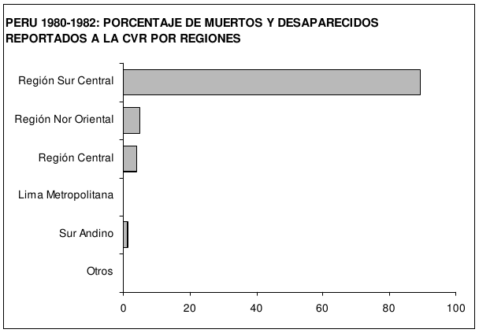
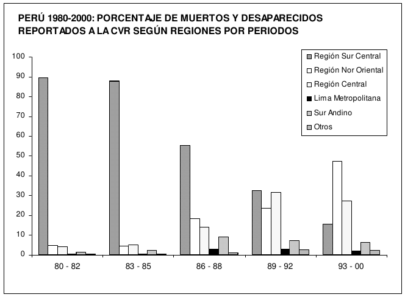
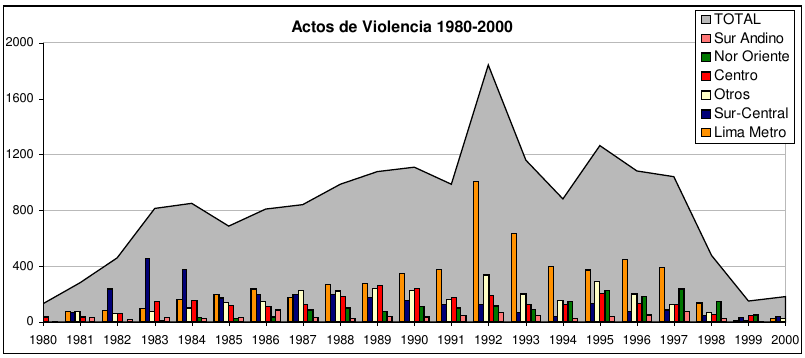
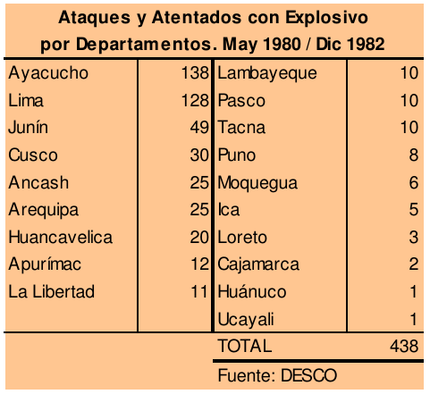
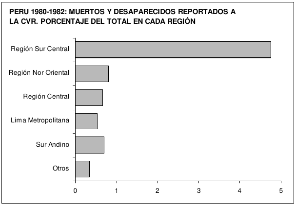
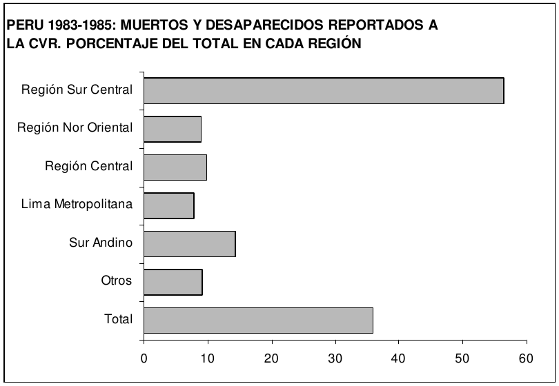

# CAPÍTULO 2

## EL DESPLIEGUE REGIONAL

El conflicto armado entre grupos alzados en armas y fuerzas contrainsurgentes que de
1980 al 2000 tuvo como escenario el territorio nacional se desarrolló de manera muy
diferente en los distintos espacios regionales que conforman el país.

Efectivamente, si bien esta historia de dos décadas de violencia fue protagonizada por
organizaciones de decisión y mando altamente centralizadas —el Partido Comunista del
Perú Sendero Luminoso (PCP-SL) y el Movimiento Revolucionario Túpac Amaru (MRTA),
por un lado, y las Fuerzas del Orden, por el otro—, la intensidad de la violencia tuvo
expresiones regionales extremadamente diferenciadas, así también sus formas y la
configuración de sus actores. Mientras en unos espacios su presencia fue puntual y
esporádica; en otros, arrasó vidas, destruyó activos, transformó la vida cotidiana de sus
pobladores e impuso largos períodos de horror, sufrimiento e incertidumbre. Además,
entre las regiones de alta incidencia de acciones violentas, el desarrollo del conflicto fue
también diferente en su cronología, en las estrategias desplegadas por los grupos
alzados en armas y las fuerzas contrainsurgentes, en la forma, así como en las
modalidades y espacios en que los pobladores se vieron involucrados, y, por último, en
las razones para que ello sucediera. Cada una de estas historias regionales configuran la
historia del conflictoen el Perú.

Esta diversidad de historias regionales golpeadas por la violencia se asocia tanto a las
particularidades de los contextos regionales, es decir, a la situación de las regiones antes
del inicio del conflicto, como al papel que les asignaron los grupos alzados en armas a lo
largo de sus estrategias territoriales.

El presente acápite describe, desde una perspectiva espacial, el conflicto armado
analizando la forma cómo se desarrolló en estas regiones donde la violencia fue intensa.
Asimismo, analizamos los elementos comunes y las diferencias que existen entre una y
otra. Las regiones que fueron objeto de estudios específicos por parte de la Comisión de
la Verdad y la Reconciliación (CVR), debido a la alta incidencia de acciones violentas en
ellas, fueron las siguientes:

1. La región Sur-Central, compuesta por el departamento de Ayacucho, las provincias de
    Acobamba y Angaraes del departamento de Huancavelica y las provincias de
    Andahuaylas y Chincheros del departamento de Apurímac; ésta es la región donde se
    inició con una violencia hasta entonces desconocida el conflicto armado y donde cobró
    la mayor cantidad de víctimas.
2. La región Nororiental, compuesta por los departamentos de Huanuco, San Martín,
    Ucayali (particularmente las provincias de Padre Abad y coronel Portillo) y Loreto; en
    esta región, el conflicto armado se prolongó por más tiempo, se cruzó con otras
    fuentes de violencia y constituyó una de las regiones con mayor número de víctimas.
3. La región Central, compuesta por los departamentos de Junín y Pasco, y las provincias
    de Huancavelica, Tayacaja, Huaytará, Churcampa y Castrovirreyna del departamento
    de Huancavelica. Ubicada entre Ayacucho y Lima, es una región estratégica para el
    abastecimiento y las comunicaciones de la capital, generadora y transmisora de
    energía para la red nacional y asentamiento de empresas mineras; funcionó también
    como refugio en la zona de selva.
4. Lima Metropolitana, sede del poder y centro de la economía, fue permanentemente
    asediada desde el inicio de la violencia concentrando, por su visibilidad nacional e
    internacional, la mayor cantidad de atentados; pero también fue el espacio de
    planificación nacional de la violencia y el foco de agitación y organización en sus
    asentamientos populares.
5. El Sur Andino, compuesto por los departamentos de Puno y Cuzco, y las provincias de
    Abancay, Grau y Cotabambas del departamento de 
    Apurímac.[[1]](#note1)
    

    
En este conjunto de regiones se produjo el 98% de las víctimas reportadas en los
testimonios recogidos por la CVR, así como la mayor destrucción de infraestructura y las
mayores pérdidas de capital social (organización, confianza, vínculos, solidaridad) de todo
el país.

Sobre la base de las historias regionales construidas por la CVR en las regiones de alta
incidencia de violencia, este capítulo desarrolla dos secciones. La primera busca analizar
los rasgos comunes que presentan estas regiones en términos de la situación previa al
desarrollo del conflicto, que explicarían el contexto en el cual las propuestas subversivas y
sus estrategias, a diferencia de otros contextos regionales, tuvieron eco en la población.
Se analizarán aquí los efectos de proyectos y políticas de modernización inacabadas que,
al mismo tiempo que minaban las tradicionales relaciones y condiciones de vida de
amplios sectores poblacionales, no terminaron de producir nuevas situaciones de
integración y desarrollo. Los abismos entre la modernidad y el progreso, instalados en el
discurso político y en las expectativas pero sólo fragmentariamente iniciados, y el atraso
y la pobreza rebasaron los términos que los habían hecho soportables y habituales por
largo tiempo. Son regiones donde un discurso de destrucción del Estado —del viejo
estado— fue inicialmente asumido con entusiasmo por sectores importantes de la
población.

La segunda sección revisa las grandes tendencias de despliegue territorial de la violencia
a lo largo de los años de conflicto. Un análisis diacrónico y espacial permitirá comprender
los diferentes momentos de concentración y despliegue territorial de los actores de la
violencia. Los estudios regionales de la CVR permiten diferenciar dos momentos muy
marcados en los cuales el conflicto se desarrolla en espacios regionales diferentes. Uno
primero (subdividido en dos períodos), de 1980 hasta septiembre de 1986, se desarrolla
en la sierra sur central, especialmente en los espacios rurales y con acciones de sabotaje
sobre la red eléctrica que crean desconcierto en las
ciudades; allí se registró, al año, el mayor número de muertos. Tras una etapa (1987-1988) en la
que las acciones y sus efectos de muerte disminuyen, un segundo ciclo se desplegó con intensidad
desde 1989 hasta fines de 1992; su espacio principal fue la selva (la cuenca del Huallaga y la selva
central principalmente) y las ciudades (Lima, Huamanga y Huancayo se convierten en territorios de
guerra). Otras historias regionales empiezan también a desarrollarse en este período; es el momento
en el que el PCP Sendero Luminoso intentó extender la lucha campesina por la tierra en Puno y que
columnas subversivas buscaron desplegar estrategias de control en el norte del país. Tras la captura
de Abimael Guzmán Reinoso en septiembre de 1992 y la desarticulación del núcleo subversivo
principal, la violencia tuvo prácticamente como único escenario la selva.

## 2.1. CONTEXTOS REGIONALES: LAS REGIONES DE LA VIOLENCIA AL INICIO DEL CONFLICTO

El PCP Sendero Luminoso y el MRTA tuvieron éxito en unas regiones y en otras no. Una parte del
país, particularmente toda la región costera (con excepción de Lima) en la que se encuentran los
departamentos más poblados del país después de la capital, constituyó el pequeño rubro de otros en
el que sólo se contabilizan el 5% de las muertes en todo el período. Allí está también gran parte de
la selva baja y de la selva norte (Amazonas, norte de Cajamarca y parte de Loreto) y sur (Madre de
Dios); exactamente lo opuesto de los anteriores, los espacios menos poblados. La mayor parte de
Ancash, Cajamarca y Arequipa, en la Sierra, pertenecieron también a la categoría de otros.

A partir de los estudios regionales realizados por la CVR, se puede sostener que las regiones
donde los grupos subversivos tuvieron éxito fueron aquéllas en las que lograron insertarse en
situaciones de conflicto abierto y sin visos de solución, sea entre sectores de la población o entre
los pobladores y el Estado. En estos estudios, se observa, además, que estos conflictos se asociaron
a la forma particular cómo los procesos de modernización que vivió la sociedad peruana desde la
década cincuenta —o más bien su realización parcial e inacabada, tanto en su versión rural (la
Reforma Agraria) como en su versión urbana y de integración vial— afectaron las diferentes
regiones del país. Las transformaciones vividas de forma diferente tuvieron también efectos en el
surgimiento o deterioro de una sociedad civil organizada, lo que incidió a su vez en las formas y los
niveles de violencia.

### 2.1.1. El procesos de modernización inacabados

Desde la década del cincuenta, diversos procesos desencadenados en la sociedad peruana llevaban
a la liquidación del orden tradicional. En el campo, particularmente serrano, la masiva emigración
rural, principalmente hacia la ciudad de Lima, y las movilizaciones campesinas contra el régimen
latifundista transformaban la demografía y las estructuras de poder. Políticas de protección a la
industria y de aliento a la inversión (banca de fomento industrial y agropecuaria, aranceles
proteccionistas, etc.) venían transformando la economía nacional y particularmente la vida, la
economía y el peso demográfico de Lima. Al mismo tiempo, grandes planes modernizadores
fueron diseñados para un Perú moderno. Así, las grandes irrigaciones de la costa en los últimos
cuarenta años han transformado el paisaje social, económico y demográfico de la región. La
carretera marginal, que empezó a construirse en la década de sesenta, ha tenido efectos semejantes.
En la Sierra, la promesa de la modernización no tuvo inversiones ni ejes viales ni gigantescas
represas; allí, la modernización, o sus pedazos, se operaron a través de la Reforma Agraria y la
ampliación de la cobertura educativa.

Todos estos programas tuvieron desiguales efectos y desiguales grados de concreción en las
regiones, aunque alteraron, por cierto, la vida de la mayoría de las personas y sus expectativas. La
violencia que se inició en 1980 encontró en los espacios de modernización inacabada, de
expectativas altas pero no logradas, un lugar privilegiado para enraizarse y desarrollarse.

### 2.1.1.1. El nororiente: integración, carretera, colonización y narcotráfico

Quizá el caso paradigmático de los procesos de modernización incompletos, que afectaron la vida
de las personas al desligarlas de sus entornos tradicionales y no terminar de integrarlas en un
contexto nuevo de desarrollo y bienestar, sea el de la Región Nororiental. Este es un espacio de
colonización, cuya población se multiplicó varias veces en medio siglo, pues recibió varias
corrientes migratorias provenientes de la sierra pobre —central y norte—. Esto produjo, a su vez,
que los servicios no pudieran abastecer a la nueva población.

El gigantesco esfuerzo por construir una carretera Marginal de la Selva en la década del
sesenta buscaba no sólo incorporar los recursos de la amazonía a la economía nacional, sino reducir
la presión sobre la tierra en la sierra y en la costa, así como reorientar las migraciones que tendían a
concentrarse excesivamente en la ciudad de Lima. Por ello, el complemento de la inversión vial fue
una intensa promoción de la colonización facilitando la entrega de tierras para la ampliación de la
frontera agrícola.

Pero eso fue todo. La creciente población colona, particularmente en la década del setenta,
proveniente de provincia, con orígenes étnicos diversos y sin mayores recursos económicos
propios, fue poblando territorios sin servicios públicos y sin comunicaciones internas que no fueran
el eje central con el empeño de salir de la pobreza de donde provenían. Los pueblos fueron
creándose como ampliación de campamentos y una sociedad desorganizada fue apareciendo, con
una muy escasa presencia de instituciones públicas garantes de la seguridad y del orden.

Dos historias paralelas se desarrollan desde este punto. Por un lado, la de la cuenca del
Huallaga, donde la ausencia del Estado y de mercados para la producción agrícola fue sustituida
por otra institución (con su economía, su cultura, sus normas): el narcotráfico. Por otro, la de las
provincias de San Martín, más vinculadas por la vía de Jaén-Chiclayo a la costa donde —si bien se
desarrolla una producción agrícola legal— esta ausencia se sustituye con una organización social y
luchas regionales.

En ambos espacios, por represión al narcotráfico o por represión a los movimientos sociales,
el conflicto con el Estado fue intenso, particularmente entre los años 1978 y 1982. Este conflicto es
el contexto inmediato en el que logra ser escuchadas y se enraízan las propuestas de los grupos
alzados en armas: el PCP Sendero Luminoso en la zona productora de coca, y el MRTA en San
Martín, con la intención de acercarse a la zona cocalera.

### 2.1.1.2. Los asháninkas y colonos en la selva central

A diferencia de la región Nororiental, la selva central —más próxima a la capital— tuvo una mayor
y más antigua articulación con la economía nacional y contó con una red urbana más consolidada,
si bien desde la década del sesenta su población creció rápidamente por la llegada de colonos
inmigrantes provenientes principalmente de la sierra central.

Es el territorio de una de las etnias amazónicas más importantes del país, la de los
asháninkas, desde el gran Pajonal en el norte hasta la provincia de la Convención, Cuzco, por el
sur. Además de asháninkas, existen comunidades de las etnias yanesha y notmasiguenga, en
proporción bastante menor. La ocupación colonizadora de esta región, si bien antigua, se vio
favorecida por la red vial en expansión y modificó sensiblemente su acceso a los recursos. Esto
generó innumerables conflictos con los colonos por el acceso y la titularidad de las tierras.

A diferencia de otras sociedades amazónicas, las comunidades nativas de la selva central no se
cuentan entre las más aisladas del país. Están vinculadas a la red urbana y comercial de la zona y se
relacionan con los poblados de colonos (aunque en conflicto por linderos) y con el sistema
educativo. Los misioneros católicos y evangélicos —el Instituto Lingüístico de Verano (ILV)—
han estado presentes desde hace tiempo a través de escuelas, de acciones de educación bilingüe, de
promotores de salud, etc. Muchas comunidades recibieron apoyo para construir escuelas o casas
comunales, obtener ganado, radios de comunicación, piladoras, podadoras, motobombas de agua,
herramientas, maquinaria de carpintería, motosierra, postas de salud equipadas, equipo dental e,
incluso, en algún caso, un aeropuerto. Las comunidades también contaban con varios miembros
capacitados como técnicos agropecuarios y promotores de salud.

A través de sectores que funcionaban como bisagra entre las comunidades nativas y la
sociedad nacional —tales como los colonos provenientes de Ayacucho, profesores bilingües,
promotores de salud y luego autoridades nativas— el PCP Sendero Luminoso va ingresando a esta
sociedad a medio camino entre una organización muy tradicional cuya reproducción es difícil por
la pérdida de recursos y territorios, así como la sociedad y la economía modernas en la que no
terminan de integrarse. Un discurso de igualdad, de justicia, y sobre todo de bienestar, va calando
entre los adultos mayores de los clanes familiares y termina enraizándose en la población y
reorganizándola en función de la guerra.

La compleja relación entre el MRTA y la población nativa asháninka en la zona de
Oxapampa, que terminó en un fuerte enfrentamiento abierto, resultó ser el único lugar de la selva
central, quizá porque la colonización y la ocupación de tierras de las comunidades había sido más
tardía, donde el conflicto asháninkas-colonos se mezcla con el conflicto armado.

### 2.1.1.3. La modernización andina: las ciudades y las universidades

A diferencia de la selva y la costa, la sierra no tuvo un gran proyecto de modernización. Sin ningún
recurso atractivo para el capital extranjero o nacional ni un polo económico dinámico —mal
integrado por una escasa y pésima infraestructura vial— hacia mediados del siglo XX, el
departamento de Ayacucho mostraba signos visibles de depresión económica con uno de los PBI
más bajos del país y altas tasas de emigración de sus diferentes provincias. Tradicional centro de
residencia de los terratenientes de la región, la ciudad de Huamanga se había constituido con los
siglos en sede indiscutible del poder regional. Pero en el entorno regional de pobreza y depresión,
los terratenientes ya no eran tampoco significativos. Movimientos campesinos, procesos de compra
de haciendas por sus feudatarios y, finalmente, la implementación de la Reforma Agraria sobre los
restos del sistema tradicional de hacienda, les habían restado poder, influencia y peso determinante
en la ciudad y la región.

Fue un proyecto educativo —la reapertura de la Universidad Nacional San Cristóbal de
Huamanga en 1959— lo que renovó la ciudad y la conectó con el movimiento de renovación y
progreso del país. Esta reapertura generó el arribo de contingentes de profesores y estudiantes
foráneos y en los años siguientes se convirtió en el foco de desarrollo cultural, político y
económico de la región; fue la difusora de ideas progresistas y estuvo distanciada de los sectores
tradicionales en momentos en que el orden terrateniente y señorial estaba casi en extinción.

En su reapertura tras cerca de medio siglo, la UNSCH fue imaginada como una organización
moderna en su estructura y su concepción académica. Sin las trabas administrativas de otras
universidades, capacitaría técnicos, investigadores y maestros que solucionarían los problemas la
región. Este plan moderno y de alta calidad sólo pudo sostenerse en el discurso debido a la rápida
masificación de la Universidad. Al principio, la UNSCH tenía 228 alumnos. En 1980, al inicio del
conflicto armado, el número de alumnos se había multiplicado por 30 (eran 6,095 estudiantes); el
crecimiento deterioró los servicios y las remuneraciones, pero permitió el ingreso de jóvenes del
interior, hijos de campesinos portadores de las expectativas de movilidad social de sus familias y
sus pueblos.

La importancia de la educación como instrumento de progreso y movilidad social y de la
Universidad como institución regional se manifestaron en el hecho de que las dos únicas
movilizaciones relevantes de la región tuvieron que ver con ellas: la lucha contra el intento del
gobierno en 1966 de recortarle el presupuesto —que da origen al Frente de Defensa del Pueblo de
Ayacucho— y la lucha en Huamanga y Huanta, violentamente reprimida, contra un decreto dado
por el gobierno militar en junio de 1969 que intentaba recortar la gratuidad de la enseñanza escolar.

La Universidad fue un centro que acogió, como en el resto de las Universidades del país, las
ideas radicales de las décadas del sesenta y setenta. Sin el contrapeso de otras instituciones u otros
focos de influencia cultural, ejerció casi un monopolio sobre la opinión pública y modeló el sentido
común local. Su influencia, como casa de estudios moderna —cuando menos en el discurso—,
llegó hasta la Universidad Nacional del Centro del Perú en Huancayo, donde profesores de
Huamanga y luego altos dirigentes del PCP Sendero Luminoso son invitados en los años setenta a
dar charlas a estudiantes y sindicatos.

Este es el espacio del surgimiento del Partido Comunista del Perú Sendero Luminoso y de su
líder, Abimael Guzmán. Su encierro en la UNSCH, tras su ruptura con el PCP Bandera Roja se da
en momentos en que precisamente la Universidad da uno de sus saltos de crecimiento pasando de
casi 1,500 estudiantes en 1968 a 3,319 en 1971. La fuerte presencia del PCP-SL en la facultad de
Educación de la UNSCH se amplía hacia los planteles de aplicación Guamán Poma de Ayala, lo
que le permitió influir en el SUTE-Huamanga y copar las nuevas plazas de maestros, asociadas al
paulatino crecimiento de la cobertura educativa en la región, particularmente en las áreas rurales.

Otras regiones de la Sierra, donde la violencia estuvo presente aunque no con la intensidad de
Ayacucho, también vivieron en los años cincuenta y sesenta procesos de cierta urbanización, sin
fuertes entornos de desarrollo económico, así como de modernización de sus universidades. La
modernización del Cuzco fue igualmente urbana. Tras el terremoto de 1950, que prácticamente
destruyó la ciudad, se creó la Corporación de Reconstrucción y Fomento (CRYF) que emprendió
una intensa obra de reconstrucción y remodelación urbana. Con ello se dio inicio a la
modernización de la ciudad que desembocó en su actual configuración de ciudad turística. La
Universidad Nacional San Antonio Abad del Cuzco, como su similar de Huamanga, también vivió
un proceso de modernización y crecimiento desde los años cincuenta. Al inicio de esa década, la
UNSAAC contaba con cinco facultades y 988 estudiantes; en 1978, ofrecía 22 carreras
profesionales en las que estaban matriculados 8,492 estudiantes; en 1980, al inicio de la violencia,
contaba con 14,000. Son también sectores rurales y urbanos pobres quienes logran acceso a la
universidad durante este crecimiento, que se desarrolla al mismo ritmo del deterioro de los
servicios. Asimismo, es semejante al fenómeno de Ayacucho también la difusión de ideas
radicales.

Pero, a diferencia de Huamanga, la antigua capital Imperial era una sociedad más compleja y
sí encontró un enlace con el dinamismo moderno por medio del turismo. Mientras en 1954 se
registró la presencia de 6,903 turistas, llegaron a la ciudad 176,000 en 1975. Como consecuencia, la
industria hotelera, la de restauración y la de artesanía se ampliaron a ese ritmo.

Cuzco también fue un caso de urbanización en pobreza y en un entorno regional deprimido.
Sin embargo, si bien la queja de dirigentes y autoridades de fue que el turismo no beneficiaba la
ciudad y sólo permitía grandes beneficios a empresas de Lima o del exterior, es probable que la
presencia de una actividad dinámica, que movilizaba las ideas y los servicios en torno a una
población foránea muy móvil, haya sido uno de los contrapesos culturales que influyeron en el
hecho de que la ciudad, su universidad y sus jóvenes estudiantes —aunque radicalizados— no
engrosaran masivamente las filas de la militancia subversiva ni colaboraran en desarrollar una
guerra.

La modernización en Puno también fue urbana. La ciudad de Puno vivió un proceso acelerado
de urbanización, al igual que Cuzco, asociado a desastres naturales. Entre 1950 y 1960, se produjo
la combinación perversa de lluvias excesivas e inundaciones y períodos de completa sequía. En ese
contexto de desastres, en diciembre de 1961, se creó la Corporación de Fomento y Promoción
Social y Económica de Puno (CORPUNO), organismo con autonomía administrativa que hasta
1972 organizó y planificó las inversiones de fomento en el departamento. Su acción, sin embargo,
sólo se reflejó en la modernización urbana de la capital del departamento.

En este afán de modernización, también en Puno la creación de una universidad apareció
como una pista de progreso. En 1961, abre sus puertas la Universidad Nacional Técnica del
Altiplano, que en los años setenta se masificó y acogió las expectativas de movilidad social de
sectores mestizos o hijos de campesinos.

Pero la ciudad de Puno, en realidad, no era ni el único ni el más dinámico espacio urbano del
departamento. Bajo la influencia del ferrocarril y, desde 1963, de la instalación de la fábrica de
cemento de Caracoto, la ciudad de Juliaca se convirtió en la expresión moderna de sectores
provincianos vinculados al mundo campesino. Esto constituyó una burguesía comercial mestiza e
indígena, que logró sustituir a la declinante clase terrateniente. Igualmente, las provincias del sur,
cuya población predominante eran los pequeños campesinos aymara organizados por medio de una
antigua red de ciudades menores hasta la frontera con Bolivia y con un mayor dinamismo
comercial, fue reacia al discurso radical. En suma, la presencia de la subversión en Puno fue
esporádica en las ciudades y se asentó básicamente en la zona rural de las antiguas grandes
haciendas ganaderas.

El caso de la región Central, entre Ayacucho y Lima, estratégica para el abastecimiento de
alimentos y de energía a la capital y su aparato industrial, era esencial pues estaba conformada por
una red urbana (las ciudades de Huancayo, La Oroya, Cerro de Pasco, Tarma, Jauja), de una
actividad minera (grandes empresas públicas, sindicatos y depósitos de explosivos) y un entorno
rural altamente diferenciado: comunidades urbanizadas y vinculadas a los mercados en el valle del
Mantaro; y, por otro lado, por zonas altas ganaderas y muy pobres —como en Pasco—, o en
conflicto con empresas asociativas. Para ambas agrupaciones subversivas, el PCP Sendero
Luminoso y el MRTA, controlar la región Central fue un objetivo estratégico. Mientras ambas
fracasan en las zonas de comunidades de valle, exitosamente integradas al mercado, ambas se
desarrollan en las zonas altas y en las ciudades, particularmente en Huancayo, cuya universidad,
fuertemente radicalizada, fue incluso escenario de enfrentamientos entre estas dos agrupaciones
subversivas.

Las ciudades mineras —La Oroya, Cerro de Pasco— fueron objeto de atentados frecuentes.
En ambos casos, buscaron aprovechar los conflictos sindicales de mineros y metalúrgicos; pero,
como sucedería en los diferentes intentos de captar organizaciones sindicales, fracasaron. Sin éxito
en el movimiento gremial, el PCP Sendero Luminoso amedrentó y asesinó a dirigentes mineros
importantes, los cuales, por otro lado, también fueron víctimas del Comando Rodrigo Franco. El
espacio minero y gremial fue asediado, golpeado, pero no capturado políticamente. En contraste, en
las universidades de la región, el discurso de confrontación tuvo éxito entre los jóvenes, muchos de
origen rural. En Cerro de Pasco, donde la presencia del PCP Sendero Luminoso se registra desde
los primeros años del conflicto armado, la Universidad Daniel Alcides Carrión (UNDAC) de Cerro
de Pasco fue un espacio político excepcional para la difusión y discusión de los lineamientos del
PCP-SL, así como el reclutamiento de futuros militantes. En La Universidad Nacional del Centro
del Perú, en Huancayo, el centro del conflicto en la ciudad, la presencia tanto del PCP-SL como del
MRTA es menos prolongada pero extremadamente violenta y duramente reprimida.

### 2.1.1.4. Lima Metropolitana: la urbanización, la industrialización y la marginalidad

Lima, la sede del poder político y económico del país, fue uno de los espacios de mayor violencia.
Muchas de las acciones subversivas desarrolladas en la zona central de la capital —como el
asesinato de altos funcionarios, oficiales del Ejército y empresarios, así como el estallido de
coches-bomba, voladura de torres, ataques a centros comerciales y financieros— se asociaron a la
alta visibilidad de la capital y a la enorme resonancia de cualquier actividad en ella; estas acciones
de asedio y visibilidad fueron, sin embargo, acciones desde fuera, no se apoyaron en la propia
población de los viejos barrios de Lima y su área de expansión de clase media y alta, menos aún
buscaron captarla.

Pero Lima Metropolitana fue al mismo tiempo la sede de la principal instalación industrial del
país y de su mayor población obrera. Fue también el destino de la gran emigración rural, la
depositaria de las esperanzas y, luego, las frustraciones de millones de peruanos pobres que
abandonaron sus comunidades de origen, así como la mayor concentración de miseria y
precariedad económica. De este modo, además de ser un lugar de asedio externo por su visibilidad,
Lima Metropolitana, en sus asentamientos populares periféricos, fue uno de los espacios de intensa
agitación y proselitismo subversivo. Captar a una población obrera (el sujeto de la revolución) y
miserable rodeando el centro del poder nacional fue un objetivo político y militarmente estratégico
de los grupos alzados en armas.

La modernización de Lima Metropolitana fue simultáneamente un proceso de
industrialización por sustitución de importaciones, alentado por políticas de protección, y un
descomunal proceso de urbanización. Es ampliamente conocido que el proceso de urbanización
desbordó la capacidad de asimilar la mano de obra en los sectores formales de la economía y fue
incapaz de integrar el rápido crecimiento poblacional a la estructura urbana y de servicios
preexistentes. Además de ello, es necesario recordar que en la década de los años 80 entró en crisis
el modelo industrial de sustitución de importaciones. Esto generó secuelas importantes de
desempleo y deterioro de la legitimidad sindical. Ese fue el contexto para el desarrollo de la
violencia en la región.

Las organizaciones alzadas en armas desarrollaron una sistemática labor de penetración entre
pobladores de asentamientos humanos populares con el objetivo de captar a los directivos (o
directamente la dirección) de las organizaciones sindicales, barriales y de subsistencia. Estos
asentamientos populares —organizados en torno a los tres grandes ejes de articulación de Lima, la
Carretera Central, la Panamericana Norte y la Panamericana Sur— constituían, en la estrategia
subversiva, el cinturón de hierro que ahogaría al centro político y económico nacional.

Es necesario señalar, más allá de los contextos específicos de los diferentes conos de
expansión de Lima popular, la importancia de la presencia de la izquierda legal, así como un hecho
político que marcó la historia de estos asentamientos desde 1980: las elecciones municipales. Por
primera vez, en 1980, se estableció que los gobiernos locales debían ser elegidos por voto
universal. Desde entonces, particularmente desde 1984 con la Ley Orgánica de Municipalidades,
los municipios electos empezaron a recibir verdaderas atribuciones de gobierno local. En estas
zonas urbanas, en proceso de construcción, con servicios insuficientes, el papel de las
municipalidades y de la lucha política por llegar al gobierno local fue muy importante. En los
distritos populares de Lima, la izquierda pasó de su tradicional espacio en el movimiento obrero y
barrial a tener funciones de gobierno. En 1980 y 1983, prácticamente todos los distritos de los
conos norte, sur y este tuvieron alcaldes de izquierda.

Tanto su estrategia de lucha contra las autoridades locales como de control del movimiento
sindical y barrial llevaron a las organizaciones subversivas a un directo enfrentamiento con la
izquierda, en la medida en que ésta se erigió como contrapeso a su influencia. Por su lado, la acción
contrasubversiva, al intentar eliminar organizaciones y potenciales focos de demandas populares,
también golpeó significativamente a la izquierda y a las organizaciones existentes.

El caso del cono este es representativo de la diversidad de conflictos que a inicios de los años
ochenta se desarrollaban en los asentamientos populares de Lima Metropolitana. Fue una de las
zonas de Lima de mayor presencia del PCP Sendero Luminoso. Allí se concentró un eje industrial
(Ate-Vitarte), un centro de enorme actividad comercial como La Parada (El Agustino) y hasta una
de las universidades con fuerte presencia del PCP Sendero Luminoso: la Universidad de Educación
Enrique Guzmán y Valle, La Cantuta. Fue fundada como una experiencia novedosa en Educación;
luego clausurada por razones políticas en 1977 y reestablecida en 1980, pero masificada y lejos del
programa renovador de su fundación y de los recursos que éste requería.

En esta zona obrera y comercial, la crisis del sector industrial se asoció a situaciones de gran
conflictividad. Desde 1976 se realizaron movilizaciones, marchas y tomas de carreteras vinculadas
a reclamos sindicales. Durante el Paro Nacional del 19 de julio de 1977 y los paros del 22 y 23 de
mayo de 1978, éste —como los otros conos de Lima— se convirtió en un verdadero campo de
batalla.

El sindicalismo y la legitimidad de la organización y la lucha sindical, sin embargo, se fueron
deteriorando en los años siguientes ante la profundización de la crisis del sector industrial, la
recesión del final del gobierno de Alan García Pérez y la imposibilidad de dar respuestas a la lucha
social, la cual era problemática pero ordenada en cauces de negociación sindical.

Al igual que en otras zonas de la capital, el problema de la vivienda y la dotación de servicios
de agua y desagüe requerían de la nueva gestión municipal. Durante la administración de Alfonso
Barrantes Lingán, alcalde de Lima por Izquierda Unida (IU), se implementó el Programa Especial
de Habilitación Urbana de la zona de Huaycán, con lo que se organizó la primera invasión y la
constitución de la segunda (la primera fue la de Villa El Salvador) Comunidad Urbana
Autogestionaria. De esta manera, la municipalidad buscaba intervenir frente al problema de la
vivienda con una experiencia de organización urbana sustentada en la participación popular.
Cuando en los años noventa se trató de replicar la experiencia en Raucana, formado por excedentes
poblacionales de otras zonas extremadamente pobres, la relación del gobierno local con la
población ya no era la misma. Mientras Huaycán se convirtió en un espacio de lucha entre el PCPSL
y la organización vecinal; en Raucana, se constituyó el primer Comité Popular abierto del PCPSL 
en un ámbito urbano. Así pues, el cono este de Lima —tanto entre sus sectores sindicalizados
como en sus organizaciones urbanas y estudiantiles— fue uno de los mayores focos de agitación y
acción del PCP Sendero Luminoso.

El cono norte, donde además se desarrolló una presencia importante del MRTA, fue otra de las
grandes zonas de expansión popular de Lima. Allí se desarrolló una de las primeras acciones
subversivas: el incendio de la municipalidad de San Martín de Porres en 1980. Con menos
presencia obrera y sindical, la organización subversiva en la zona fue más débil y tuvo un carácter
más de subsistencia: acciones de asalto a almacenes de alimentos o camiones de reparto y su
distribución entre la población figura entre las acciones de ambas organizaciones subversivas de
mayor aceptación. Al igual que lo que sucedió en San Juan de Lurigancho (ubicado en la
organización del PCP-SL dentro del Comité Zonal Norte) y, en cierto modo, en Huaycán y
Raucana en el este, la acción subversiva fue más intensa en los asentamientos nuevos, los cuales
correspondían a los sectores de población más pobre y con menos servicios de los distritos.

San Juan de Lurigancho, el distrito más poblado y de crecimiento más rápido de la capital,
tuvo la particularidad de ser el principal receptor de la población desplazada por el conflicto
armado en la sierra sur-central. Los asentamientos que mostraban este origen eran aquello que
estaban en las zonas alta e intermedia y que eran los menos consolidados como estructura urbana
—como Huanta 1, Huanta 2, Cangallo, Fajardo—. La mayoría de ellos se formaron durante la
gestión del alcalde de origen huantino Óscar Vargas. En el distrito, se ubicó también el penal de
Canto Grande, dos veces asaltado por los subversivos. Se debió probablemente a todo esto y a la
efectiva presencia del PCP Sendero Luminoso que el distrito mostró la particularidad de haber sido
objeto de sistemáticos rastrillajes por parte de las fuerzas del orden, lo que desencadenó una
secuela de descontento y conflictividad. También el Comando Paramilitar Rodrigo Franco estuvo
presente en este distrito, donde fueron asesinados Manuel Febres Flores, abogado de los presos
acusados de terroristas, y Saúl Cantoral Huamaní, secretario general de la Federación Nacional de
Trabajadores Mineros y Metalúrgicos.

La Lima producto de la modernización de los años sesenta y setenta, conformada por sus
inmigrantes, con ciudades marginales y con una economía evidentemente marginal fue un
escenario del conflicto armado menos visible que los atentados al centro de la capital; pero que
involucró la vida cotidiana de millones de personas y aportó cifras considerables a la dramática
estadística de muertos por el conflicto armado interno.

### 2.1.2. Las sociedades rurales de alta conflictividad

El conflicto armado tuvo en los ámbitos rurales un escenario privilegiado. Los grupos alzados en
armas buscaron controlar el campo y tener bases de apoyo en los poblados campesinos tanto por
razones de estrategia militar como política. El PCP Sendero Luminoso, inspirado en la tradición
maoísta, inició una guerra del campo a la ciudad. Los grandes espacios de escaso poblamiento y
débil presencia policial ocultaban sus desplazamientos. Controlarlos requería de bases de apoyo;
por ello, conquistar políticamente la población campesina fue uno de sus objetivos principales. Con
bases de apoyo rurales, el PCP Sendero Luminoso se desplazaba, en los términos de Abimael
Guzmán Reinoso, «como el pez en el agua».

Pero no todo el ámbito rural fue receptivo a la prédica y a las acciones de los grupos alzados
en armas. Las sociedades rurales con campesinos beneficiarios de la Reforma Agraria (los valles de
la costa peruana, la zona norte de Cajamarca, el Valle Sagrado en Cuzco) o espacios comunales con
recursos y alta integración al mercado (el valle del Mantaro, por ejemplo) tendieron a mantenerse al
margen de la violencia.

Las historias regionales construidas por la CVR muestran que el éxito en la inserción rural de
la principal fuerza subversiva, el PCP Sendero Luminoso, se produjo en los espacios rurales de
población campesina muy pobre —mal vinculada al mercado— donde la Reforma Agraria no había
tenido prácticamente nada qué redistribuir y no había implicado un cambio significativo debido a la
pobreza de sus recursos; o donde la estrategia empresarial de la Reforma había reproducido la
marginación de las comunidades campesinas y creado nuevos ámbitos de conflicto irresuelto.

### 2.1.2.1. Las comunidades contra las empresas asociativas: región Central, sur andino y sierra norte

El período de violencia en los espacios rurales estuvo plagado de actos de destrucción de centros de
desarrollo tecnológico en la sierra. La granja Allpachaca de la Universidad Nacional San Cristóbal
de Huamanga, centro de mejoramiento ganadero altoandino, fue destruida íntegramente por el PCP
Sendero Luminoso, incluyendo el degollamiento del ganado mejorado. Años después, las
instalaciones del IER Huaqrani de la Prelatura de Ayaviri, centro de investigación y capacitación
tecnológica, tuvieron igual suerte. La estación experimental de LLachoc, del Instituto Nacional de
Investigación Agropecuaria, cerca de la ciudad de Huancavelica, fue asaltada por el PCP Sendero
Luminoso en 1987; fueron asesinados nueve trabajadores y sacrificadas 400 alpacas. Pero este tipo
de instalaciones no eran numerosas. Las que sí aparecieron ampliamente como objetivos de
destrucción fueron las instalaciones y la ganadería fina de las empresas asociativas creadas por la
Reforma Agraria, particularmente las Sociedades Agrícolas de Interés Social (SAIS). Aquello que
resultó sorprendente fue que las acciones para destruir las SAIS contaron con un amplio consenso
y, en muchos casos, con la participación activa de las comunidades campesinas de la zona.

La sierra central, el departamento de Puno, la sierra de La Libertad y el sur de Cajamarca
habían sido escenarios de un importante desarrollo ganadero empresarial desde comienzos del siglo
XX. Las relaciones entre las haciendas ganaderas —islas de desarrollo tecnológico, de
mejoramiento de ganados y pastos, con relativamente pocos trabajadores— y las comunidades
campesinas de sus entornos —con pastizales sobre poblados y depredados— fueron conflictivas
por mucho tiempo. Desde un principio, las comunidades demandaron siempre sus derechos de
propiedad sobre los pastizales de las haciendas. La Reforma Agraria, implementada desde 1969,
reconoció esta antigua reivindicación de las comunidades; pero no fragmentó las grandes empresas
ganaderas ni devolvió las tierras que las comunidades reclamaban. Por el contrario, unificó varias
haciendas en gigantescas empresas. Así fue como surgieron las SAIS, cuyos beneficiarios directos
fueron sus trabajadores y colonos con gran cantidad de tierras, como una forma empresarial que
incorporaba las comunidades como socias sin capacidad de decisión, pero con derecho a recibir
parte de las utilidades.

El poder económico en manos de las empresas profundizó la división social en las zonas
donde se desarrollaron y, en el contexto de la crisis económica de la segunda mitad de los años
setenta, del desmontaje de los sistemas de control y movilización creados y mantenidos durante el
gobierno del general Velasco empezaron a generar situaciones de corrupción y crisis financiera.
Los socios de las Cooperativas Agrarias de Producción de la costa y de los valles interandinos, en
los años siguientes a 1980, optaron por liquidar las empresas y repartirse la tierra en parcelas
individuales. Los derechos de propiedad en las SAIS, sin embargo, eran más complejos: los
beneficiarios directos, si bien cuestionaban a sus dirigentes corruptos o ineficientes, no podían ni
deseaban eliminar las empresas por el asedio de las comunidades. Éstas demandaban sus antiguas
tierras, pues ni siquiera recibían utilidades. La situación de conflicto sin solución estaba planteada.

En Santiago de Chuco, Huamanchuco, Cajabamba y San Marcos, en el norte, el avance de la
Reforma Agraria había sido lento y conflictivo. Sin embargo, después de un período entre 1972 y
1978 en que las empresas habían funcionado relativamente bien, aunque repartiendo pocas (o
ninguna) utilidades a las comunidades campesinas socias, prácticamente todas entraron en crisis
financiera y organizativa. Los dirigentes y funcionarios de las empresas eran acusados de corruptos
y de enriquecerse a costa del trabajo de los socios, a quienes mantenían impagos durante meses,
mientras los préstamos obtenidos no eran invertidos y endeudaban al colectivo. En el contexto de
descontento de los beneficiarios y de las comunidades, la propuesta del PCP Sendero Luminoso de
destruir las SAIS, asesinar dirigentes y repartir el ganado y los bienes tuvo amplia aceptación

En las zonas altas de Junín, la situación de conflicto es semejante. En la zona de Canipaco
(Chongos Alto, Chicche, Yanacancha) se encontraban los complejos ganaderos de las SAIS más
grandes y más tecnificadas del país. Las diferentes unidades de producción de lo que se constituyó
como la SAIS Cahuide habían modernizado la actividad ganadera con la introducción de pastos
mejorados y aclimatado nuevas razas de ovinos y vacunos, además del cruce de camélidos. Con
ello, se incrementó la producción de leche y sus derivados, así como de carne y lana de alta calidad.
La prosperidad de las empresas, sin embargo, había dejado de traducirse en el bienestar de sus
beneficiarios y comunidades socias. Hacia 1987, cuando el PCP Sendero Luminoso empezó sus
actividades en la zona, el descontento era grande y la cúpula de dirigentes había sido acusada de
corrupta y de vender tierras a precios irrisorios. En este contexto de poca legitimidad de la
dirigencia de las SAIS y de cuestionamiento al manejo de las tierras, las comunidades socias
levantaron nuevamente el conflicto por linderos descontentos por la solución de la Reforma
Agraria a su reivindicación de tierras. Con un discurso de orden y justicia y el ajusticiamiento de
dirigentes corruptos y otros antisociales, el PCP-SL ganó adeptos rápidamente.

Fue semejante la situación en la cuenca del Cunas, también en Junín, frente a las unidades de
producción de las SAIS Cahuide, Heroínas Toledo y Túpac Amaru, aunque las acciones
subversivas fueron en esta zona incluso más violentas. Las SAIS fueron objeto del sistemático
ataque por parte de militantes del PCP-SL. Muchos dirigentes y técnicos fueron asesinados, los
locales incendiados y el ganado, a diferencia de lo que sucedía en el norte, no fue repartido sino
sacrificado.

En el norte del departamento de Puno, particularmente en las provincias de Azángaro y
Melgar, el conflicto armado interno se desarrolló alrededor del mismo problema sobre el control de
tierras en las áreas ganaderas; pero en un contexto diferente: el de las movilizaciones campesinas
por su reestructuración. Allí, sin embargo, el escenario social era más complejo; una organización
campesina como la Federación Departamental de Campesinos de Puno, los partidos de la izquierda
legal y las organizaciones de apoyo al campesinado de la Iglesia Católica fueron otros tantos
actores locales con los que se enfrentaron las fuerzas subversivas, además de la acción de la Policía
y las Fuerzas Armadas.

En diciembre de 1985, se produjo una primera toma de tierras cuando cerca de 4,000
campesinos recuperaron 10,000 hectáreas de una empresa de propiedad social en Melgar. El
recientemente electo presidente Alan García Pérez, en febrero de 1986, emitió dos decretos
supremos para la reestructuración y el redimensionamiento de las empresas asociativas de Puno.
Una comisión nombrada en Lima debía negociar el proceso con los directivos de las empresas. Un
año más tarde, ante la ineficiencia de la comisión, la Federación Departamental de Campesinos de
Puno convocó a sus bases de todo el departamento a recuperar las tierras; 172 comunidades
recuperaron 360,000 hectáreas. El PCP Sendero Luminoso, que había intentado desde 1980
asentarse en las comunidades campesinas del sur del departamento, en la zona aymara, con muy
poco éxito, encontró en este conflicto entre el gobierno y los directivos de las empresas, por un
lado, y las comunidades campesinas, por otro, un nuevo espacio fácil de conquistar. Bajo la
consigna «la tierra se defiende con armas», inició una serie de atentados y arrasamientos contra las
empresas asociativas —en algunos casos, con la participación de campesinos repartiendo el ganado
entre los comuneros— e invitó a dirigentes de la Federación Campesina, vinculados a la izquierda,
a integrarse a sus filas. Si bien no tuvo éxito en este intento de captar a las organizaciones
campesinas, la situación de conflicto, la represión de las fuerzas del orden de la movilización
campesina y de la propia izquierda enfrentada al PCP-SL crearon un ambiente en el que la
subversión logró conquistar bases de apoyo. En 1989, el departamento se convirtió en otro de los
escenarios de violencia, aunque de menor intensidad que en la sierra central.

Un caso particular de conflicto en torno a la Reforma Agraria fue el de Andahuaylas en el
departamento de Apurímac. Allí la cuestión de tierras estaba resuelta desde 1980, al inicio del
conflicto armado interno. Sin embargo, la solución —la tierra de las antiguas haciendas en manos
de los campesinos— había sido fruto de un fuerte conflicto entre las comunidades y el Estado. Por
razones burocráticas, de pequeñas influencias y poca resonancia política, el proceso de la Reforma
Agraria había sido extremadamente lento. Aún en 1974, luego de cinco años de promulgada la ley
de la Reforma Agraria y en un entorno de creciente descontento, los hacendados seguían en
posesión de las tierras. En 1974, la Federación Provincial de Campesinos de Andahuaylas llamó a
sus bases a aplicar directamente la Reforma, tomando las tierras y sacando a los hacendados. El
resultado fue que 68 de las 118 haciendas de la provincia fueron simultáneamente tomadas por
miles de campesinos. El intento de reprimir la movilización fracasó y se abrió un largo y
conflictivo proceso en el cual las autoridades responsables de realizar la Reforma Agraria
intentaban aplicar compulsivamente el modelo asociativo, en tanto que los campesinos presionaban
por una alternativa entre parcelaria y comunal. En 1978 —tras nuevas movilizaciones, conflictos y
dirigentes encarcelados—, se entregaron las tierras. Esta situación propició que los dirigentes de la
Federación y de las tomas de tierras, como Julio César Mezich y Lino Quintanilla, con el respaldo
de una lucha exitosa, se radicalizaran e ingresaran al PCP Sendero Luminoso a inicios de 1980 y
fueran los impulsores de su desarrollo en la zona.

### 2.1.2.2. La extrema pobreza rural. Privatización del poder y conflictos internos al mundo comunal

Pero el sector de la sociedad rural más importante en el conflicto armado —donde el PCP Sendero
Luminoso inició su expansión, conquistó conciencias y adhesiones, controló amplios espacios,
logró importantes bases de apoyo y creó numerosos Comités Populares, llevó adelante de manera
más completa su estrategia de nuevo poder y donde se cometieron los casos más cruentos de ataque
a poblaciones civiles, tanto por parte de Sendero Luminoso como de las Fuerzas Armadas— fue el
de los márgenes sociales del país. Estos sectores eran considerados irrelevantes para la economía
nacional y los planes de desarrollo, donde el Estado no estuvo presente garantizando el acceso a la
infraestructura y a los servicios públicos básicos. Asimismo, tampoco cumplieron el papel de
salvaguarda de la tranquilidad, la seguridad y la propiedad de las personas que estuvo siempre
delegado en grupos locales. Estos eran, además, contextos rurales muy pobres con mayorías de
población quechua hablante y analfabeta, por lo cual nunca habían estado integrados a través del
voto en los procesos electorales. Eran zonas mal comunicadas con los mercados, inmersas en sus
propios conflictos, desestabilizadas por antiguos conflictos de linderos o por el acceso diferenciado
a tierras y sometidas a situaciones de abuso de poder o del ejercicio ilegítimo del poder.

Fue el espacio de lo que se llamó, despectivamente, la mancha india: la sierra sur-central
(Ayacucho, Apurímac, Huancavelica) y las provincias altas del Cuzco. La sierra rural de Pasco y
algunas zonas de Junín como la cuenca del Tulumayo compartieron estas características y la
violencia que se desarrolló durante el conflicto armado.

En estos espacios de pobreza rural, si bien la población campesina estaba organizada en
comunidades (con numerosos problemas internos), las únicas expectativas de progreso fueron
individuales: la emigración y el acceso a la educación. Los maestros o los hijos que estudiaban en
las capitales provinciales, respaldados por el prestigio que esto conlleva, fueron prácticamente el
único vínculo con el progreso. Si bien cada localidad vivió una historia propia, los maestros de las
escuelas y la visita de jóvenes universitarios fueron el inicio de la presencia del PCP Sendero
Luminoso en las localidades. Con mayor o menor intensidad, esta presencia fue legitimándose a
partir de un discurso político de igualdad y ruptura de la marginación y de la puesta en práctica de
un orden extremadamente autoritario que eliminó, rápidamente, para satisfacción de la población,
las conductas antisociales, los robos y el abigeato. En estas sociedades con una gran violencia
interna y envidia por el acceso diferenciado a los recursos, el asesinato y el reparto de los bienes y
ganado de los ricos (comuneros con mayores recursos y normalmente con más poder) y de los
medianos hacendados que todavía existían contribuyeron a la adhesión de muchos campesinos a
una propuesta política que era simple. Proponía una sociedad igualitaria, en la cual debía imperar
una justicia vertical firme y debía estar conducida por personas letradas.

Pero estas sociedades no habían estado ausentes de los procesos de cambio del país desde
mediados del siglo XX. En Ayacucho, particularmente en las zonas del río Pampas (provincias de
Víctor Fajardo, Cangallo, Huancasancos y Vilcashuamán) y en las provincias del norte (Huanta,
Huamanga, La Mar), un régimen de haciendas había sido el predominante hasta mediados del siglo
XX, tanto en la organización del acceso y distribución de recursos como en el montaje de una
estructura de poder, autoridad y justicia. En la mayoría de casos, sin embargo, estas haciendas, muy
poco rentables en una economía que se modernizaba, estaban en decadencia. En los años sesenta,
en el contexto de mayor movilidad y migración temporal de los campesinos, muchas haciendas
fueron compradas por las comunidades del entorno o por sus feudatarios constituidos luego de la
compra en nuevas comunidades. En Vilcashuamán, muchas comunidades tienen este origen. En
Víctor Fajardo, la única hacienda que existía al momento de la Reforma Agraria estaba desde hacía
tiempo en manos de los campesinos. Así, desde mediados del siglo XX, se había producido un
proceso de ampliación de los recursos de las familias comuneras por adquisición de pedazos de
haciendas en decadencia. Esta ampliación, sin embargo, había sido conflictiva entre las
comunidades y desigual en su interior, dependiendo del mayor o menor acceso a recursos
monetarios y a diversas relaciones de cercanía con el antiguo hacendado. El viejo poder del
hacendado, con su consiguiente control de los cargos de autoridad y de justicia, fue precariamente
sustituido por estos nuevos campesinos acomodados.

Como antes con los hacendados, cuyo poder personal no fue sustituido por un aparato
burocrático moderno, salvo en el corto período entre 1970 y 1975 en que el Estado construyó el
Sistema Nacional de Movilización Social (SINAMOS) —una red de funcionarios que llega a todos
los pueblos del país—, el poder estatal estaba en manos de agentes locales, muchas veces utilizado
para sus propios fines.

Sobre los conflictos de esta nueva desigualdad (probablemente irrelevante para un observador
externo para el que una persona rica se ubicaría tanto como una pobre en el quintil inferior de la
distribución de ingresos) en el acceso a los recursos y en su vinculación con mecanismos locales de
poder, se insertó y se enraizó la prédica y la práctica del PCP Sendero Luminoso. La débil
presencia del Estado representada en los dispersos puestos policiales — insuficientes para combatir
los robos y el abigeato— y los cargos de autoridad —jueces de paz, tenientes gobernadores—
fueron rápidamente eliminados por la subversión con hostigamiento, amenazas y asesinatos. En el
vacío de poder fácilmente generado, se instauró el nuevo poder.

En muchos lugares se repitió este esquema: en Pasco, desde los primeros años; en el
Tulumayo, más tarde; en las provincias altas de Cuzco y Apurímac, igualmente. Así pues, el
circuito educativo como promoción y diferenciación social, el abuso de poder local y el abigeato
como legitimación abrieron estos espacios a la subversión en la segunda mitad de la década del
ochenta.

Diversas situaciones de conflicto y descontento fueron la puerta de entrada del PCP Sendero
Luminoso. Casos de antiguos conflictos entre anexos y capitales de distrito, que monopolizaban el
poder local y eran sedes de pobladores con más recursos, suscitaron ataques y asesinatos (juicios
populares) que tuvieron la adhesión de los más pobres (los anexos). Algunos casos resaltan como
contraste. En la zona del río Pampas, Huancasancos era el área de pastos naturales más ricos y
desarrollo ganadero más importante y tenía una conexión con los mercados de la costa. La poca
aceptación de los comuneros del discurso y la práctica del nuevo poder llevó a un conflicto más
bien generacional de enorme violencia: el de jóvenes con mayor educación, pero aún sin acceso a
recursos, radicalizados por la prédica del PCP-SL, contra los adultos (sus padres) reaccionarios.

Cuando este mundo de igualdad y justicia se convirtió en un territorio de guerra y se
produjeron contradicciones por el nuevo poder (que serán analizadas más adelante), estas zonas
rojas, sedes de bases de apoyo y Comités Populares, paulatinamente, conforme la estrategia
contrasubversiva, pasaron de la represión generalizada a la búsqueda del apoyo de la población
local; así se fueron constituyendo los Comités de Autodefensa que terminaron por eliminar, en
alianza con las fuerzas del orden, la presencia del PCP Sendero Luminoso en el campo andino y lo
obligaron a desplazarse hacia las ciudades y hacia la selva.

## 2.2. LOS PERÍODOS DE LA VIOLENCIA EN LAS REGIONES

La información recogida por la Comisión de la Verdad y la Reconciliación revela que los espacios
que se van involucrando en el conflicto, así como las estrategias, cambian a lo largo de los veinte
años de violencia. El presente acápite analiza la expresión territorial del conflicto en los cinco
períodos identificados como etapas del proceso nacional de violencia.

### 2.2.1. Las acciones iniciales (1980-1982)

El 18 de mayo de 1980, día de las elecciones nacionales, el PCP Sendero Luminoso inició
oficialmente su lucha armada atacando el registro electoral del poblado de Chuschi en Cangallo.
Unas semanas antes, con banderas y trajes que evocaban el Ejército rojo chino, los militantes del
PCP Sendero Luminoso habían anunciado, en la Universidad Nacional San Cristóbal de
Huamanga, que salían al campo a iniciar una guerra que destruiría al Estado y crearía una nueva
sociedad.

Entre 1980 y 1982, el PCP Sendero Luminoso desarrolló una sistemática acción de
penetración en las áreas rurales de las provincias de Cangallo y Víctor Fajardo en la zona central de
Ayacucho (la cuenca del río Pampas), y en Huanta, la Mar y Huamanga en el norte del
departamento. Está ampliamente presente en las provincias de Cerro de Pasco y Daniel A. Carrión
en Pasco; también en Huancavelica, Angaraes, Acobamba y Tayacaja. Se registra su presencia en
el corredor formado por las provincias de Santiago de Chuco y Huamachuco en La Libertad y
Cajabamba, y en San Marcos, Cajamarca. En todas estas zonas, sea a partir de la acción militante
de maestros rurales sea por la prédica de jóvenes universitarios que las visitaban, se inicia un
trabajo de concientización de la población rural. En él, se enfatiza el anuncio de una nueva
sociedad justa y sin exclusiones, la prédica contra el viejo estado que debe ser destruido y contra
los terratenientes y gamonales, personificados, según el caso, en empresas asociativas o, a falta de
otro sector, en los campesinos más acomodados. En todas estas zonas se construyen primero bases
de apoyo a la columna del PCP-SL principal que se moviliza por una zona amplia y, luego,
Comités Populares, núcleos de un nuevo estado.

En la sierra norte, en Santiago de Chuco, las acciones se inician en Angasmarca, con la
presencia de un líder nacional del PCP-SL, Osmán Morote. En su primera incursión en 1981,
Sendero Luminoso, además de destruir las instalaciones de la SAIS Angasmarca, saqueó, repartió
los bienes y asesinó a un policía En esta misma zona, posteriormente, será emboscado un convoy
del Ejército causando la muerte de cuatro soldados. Desde Angasmarca, el PCP Sendero Luminoso
irradió su accionar a todo Santiago de Chuco y logró asentarse en todas las zonas ganaderas. En
ellas, la estrategia de destruir las cooperativas y SAIS fue produciendo el apoyo de la población y
también el asesinato de directivos.

En las ciudades de Huamanga, Huancayo, Huancavelica, Cero de Pasco y Lima, se iniciaron las
acciones de alta visibilidad, atentados diversos —como ataques a locales municipales y otros
establecimientos públicos, estallido de petardos de dinamita, etc.— anunció la presencia del
PCP Sendero Luminoso y rebotaron rápidamente en la prensa. Semejante efecto
tuvieron los atentados reiterados contra torres de
transmisión de energía eléctrica que dejaron a oscuras
las ciudades alimentadas por la central hidroeléctrica
del Mantaro. En los barrios populares de Lima, los apagones provocados se combinaron con la
silenciosa aparición de enormes fogatas con el símbolo de la hoz y el martillo en las faldas de los
cerros.

Menos visibles, pero estratégicos para la preparación de una guerra, serán los ataques
reiterados a asientos mineros para proveerse de explosivos y a puestos policiales con la doble
finalidad de proveerse de armas y dejar el campo sin presencia policial.

Esta acción de propaganda y preparación sólo empezó a cobrar vidas al final de 1980. En
diciembre de 1980, fueron asesinadas tres personas en un asalto masivo, conducido por el PCP
Sendero Luminoso, contra la hacienda Ayzarca, pequeña hacienda de 48 hectáreas, prácticamente
la única de la provincia de Vilcas Huamán. La primera víctima en la ciudad de Humanga —un
pequeño comerciante— se registra en septiembre de 1981. La estadística de muerte dará,
finalmente, un salto en 1982.

Diversos acontecimientos masivos, organizados por esta agrupación, se registraron en este
período, los cuales evidenciaron, al mismo tiempo que la temprana aceptación de su discurso, su
facilidad de movimiento. Quizá el más notable es el multitudinario entierro de Edith Lagos en la
ciudad de Huamanga en septiembre de 1982; ella había huido durante el asalto al penal de
Huamanga en marzo y había muerto en un enfrentamiento con la policía en Andahuaylas. La
masiva asistencia de huamanguinos al desfile del féretro por la ciudad y la misa en la catedral
fueron muestra de la pérdida creciente de legitimidad del Estado y las fuerzas del orden. En este
período, las victorias morales en la ciudad estuvieron del lado del PCP Sendero Luminoso.

La presencia inicial de esta agrupación en las comunidades rurales durante el año 1980 no
tuvo inicialmente problemas. Los profesores que organizaron reuniones de adoctrinamiento y
visitas de jóvenes, algunos de ellos hijos de la comunidad o de la zona que estudiaban en la
universidad, con un discurso radical y gran influencia entre los estudiantes secundarios, fustigaron
al Estado y a las autoridades abusivas. Los testimonios describen a estos miembros del PCP-SL
iniciales como personas cordiales y dispuestas a escuchar los problemas locales (acaso relevando el
contraste con el mal trato que siempre han sufrido de parte de agentes urbanos y policías). En
Pasco, se habla de una relación de respeto y consideración hacia las opiniones, incluso de las
autoridades locales.

Poco a poco, durante 1981, empezó la presión por la renuncia de las autoridades locales
(jueces de paz, tenientes gobernadores, presidentes de comunidad), quienes deben dejar pasar al
nuevo poder, más joven y sin vínculos con el viejo estado. Para ese momento, aún no había
muertes, pero las adhesiones y el entusiasmo eran crecientes. La violencia se expresaba en el
hostigamiento a puestos policiales que poco a poco se fueron retirando. En las provincias del norte
de Ayacucho, fueron atacados los puestos de Luricocha, Quinua y Tambo; en las del centro, los de
Vischongos, Mollebamba y Totos. Se evidenció que, tras los ataques a puestos policiales, la fuerza
principal tenía bases de apoyo adonde replegarse. En octubre de 1981, se decretó por primera vez el
estado de emergencia en cinco de las siete provincias de Ayacucho y se encargó a los sinchis la
lucha contrasubversiva.

Hasta ese momento, la respuesta policial había sido de retiro del campo y de represión en las
ciudades. En ellas, muchas de las detenciones fueron vistas como arbitrarias y abusivas. La policía
no buscaba legitimar su acción ante la población y más bien generaba descontento. Acusaciones de
robo y abuso contra la población con la excusa de buscar a los subversivos colaboraron al
desprestigio de las fuerzas policiales. En 1981, el alcalde de Huamanga llegó a solicitar que se
decrete la ley seca para los policías ante los diversos escándalos por embriaguez. Mientras el
desprestigio crecía, las columnas del PCP Sendero Luminoso, con apariciones fugaces en las que
derribaron torres y dinamitaron locales de autoridades poco respetadas, ganaron una imagen de
limpieza, orden y cierto heroísmo romántico. El ataque a la cárcel de Huamanga en marzo de 1982,
donde el PCP-SL logró la liberación de más 200 detenidos (entre sus militantes y los presos
comunes), lo revistió de un heroísmo romántico; en tanto que la venganza de la Guardia
Republicana, al asesinar a sangre fría a tres subversivos que se hallaban en el hospital, colaboraron
al desprestigio de las fuerzas del orden.

Pero a fines de 1981 y sobre todo en 1982, la situación en el campo empezó a cambiar. El
PCP- Sendero Luminoso incrementó su presión sobre la población y se iniciaron los asesinatos de
las autoridades locales que se mantuvieron en sus cargos. Las opiniones discrepantes, tanto como
las conductas antisociales, empezaron igualmente a ser sancionadas con la muerte. Los comuneros
con mayores recursos son también objeto de violencia y muerte.

En las provincias del centro de Ayacucho, en marzo de 1982, fueron asesinados el teniente
alcalde de Lucanamarca y el subprefecto de Vilcashuamán. Entre junio y noviembre, fueron
asesinados el gobernados de Concepción, Vilcas, las autoridades y un comerciante de Huaylla, un
grupo de mineros en canarias (acusados de soplones), el gobernador de Cayara, un poblador en
Llusita, un grupo de campesinos en Chuschi (acusados de abigeos), once pobladores en Buena
Vista, los Morochucos y un profesor en Pomacocha por negarse a leer una proclama. Igualmente, el
gobernador de Alcamenca, una profesora en Huancaylla, un campesino en Taca y empleados de
correos de Huancapi, Fajardo, también fueron acusados de soplones y, luego, ajusticiados. Un
campesino acomodado fue asesinado en Lucanamarca y sus 600 ovejas fueron repartidas entre los
comuneros. Durante el primer juicio popular en Huancasancos, el 19 de noviembre de 1982, toda la
comunidad reunida escuchó los cargos contra un comunero —considerado abusivo, explotador y
mujeriego— y asistió a la ejecución de la sentencia: un disparo en la sien. La imagen se repitió por
todas partes.

En Huanta, el presidente de la comunidad de Uchuraccay y tres comuneros, así como el
presidente y el teniente gobernador de Huaychao, fueron asesinados por ser representantes del
poder. Ello provocó la reacción de las comunidades que habían sido bases de apoyo. Doce
pobladores en Pumahuasi, Santillana, también cayeron asesinados.

En Pasco, igualmente, asesinatos a tenientes gobernadores, alcaldes y presidentes de
comunidades, vacían de autoridad el área rural de Pasco y Daniel A. Carrión. Semejante fue la
situación de Churcampa, Tayacaja y Huancavelica.

Las tomas de pueblos, ataques contra ferias semanales y juicios populares fueron frecuentes y
produjeron un clima simultáneamente de adhesión en unos y de terror entre quienes discreparon.
Acusaciones mutuas de soplón para resolver rencillas entre familias se multiplicaron a la llegada de
una columna. Diversos asaltos masivos (cientos de campesinos) a diferentes formas de
concentración de recursos, privadas, comunales, estatales suscitaron adhesión de muchos, pero
también descontento. Este malestar se produjo en Huancasancos cuando el PCP-SL convocó a las
comunidades vecinas a repartirse el ganado (numeroso y de calidad) de su granja comunal de
Caracha; lo mismo ocurrió en Lucanamarca.

En agosto de 1982, el PCP-SL organizó el ataque masivo al fundo Allpachaca de la UNSCH:

> [...] por lo menos 300 a 400 campesinos [...] que destruyen la infraestructura, matan el
ganado destruyen los tractores, porque la tecnología no era una cosa que estaba en sus
esquemas y representaba a la burguesía, además de ello se justifican diciendo que el queso
y el vino que se maceraba en este fundo beneficiaban a un pequeño grupo y no al
campesinado entonces reparten los quesos y la carne a los a campesinos que habían ido.
(Ponencias del taller Universidad y conflicto armado interno)

La tienda comunal de Lucanamarca fue asaltada y los productos repartidos a colas de
comuneros. Otra tienda comunal, esta vez en Ñuñungallo, Huancavelica, también fue asaltada y
días después destruidos los almacenes de la SAIS Huancavelica. En Pasco, fue asaltada la
Cooperativa Racracancha; los pastizales de la SAIS Ramón Castilla fueron incendiados; la
maquinaria, tractores, caterpilar y equipos de Santo Tomás de Pata en Angaraes fueron destruidos
también. Cinco campesinos detenidos por los sinchis tras este asalto, tras días de tortura, fueron
dejados en libertad ante la falta de evidencias.

Angaraes fue una de las provincias que ya en 1982 fueron declaradas en estado de emergencia.
En uno de sus distritos, no pudieron realizarse las elecciones municipales de noviembre 1980. Al
igual que su vecina provincia de Acobamba, entre 1980 y 1982, se registró una intensa actividad de
propaganda; así también visitas a pueblos y anexos, asaltos a locales comerciales y reparto de
víveres y amenazas a las autoridades. En Acobambal PCP Sendero Luminoso se hace fuerte
particularmente en los distritos de Marcas y Espíritu Santo, zonas prácticamente liberadas, donde,
nuevamente, jóvenes y maestros son los agentes de influencia.

Mucho más al sur, en Azángaro, Puno, el PCP Sendero Luminoso inició muy tempranamente
su presencia. Un atentado dinamitero en la fronteriza ciudad de Desaguadero en octubre de 1980
fue una de las primeras acciones armadas. En 1981, su presencia se registró en la zona sur del
departamento, en Juli, donde unos cuarenta subversivos saquearon el Instituto de Educación Rural
(IER), muy cerca de la ciudad, y poco después cargas de dinamita estallaron en la puerta de la
Prelatura de Juli. Al norte, en la provincia de Melgar, el PCP-SL organizó en 1982 el asalto a la
ERPS Oxani de la SAIS Sollocota. Poco antes del asalto a la SAIS habían sido atacados los puestos
policiales de Orurillo y Umachiri en Melgar. Poco después del asalto, la policía detuvo a cinco
subversivos gracias a la colaboración del gobernador de Tiramaza. Dos semanas después, fue
asesinado el gobernador de Tiramaza, pero las acciones de violencia no llegarán a tener, sino
algunos años después, la intensidad de otras zonas del país.

En la selva, también se inició la actividad subversiva, aunque sin cobrar vidas en este período.
A nivel del despliegue de la presencia territorial, diversos testimonios en poblados de la margen
izquierda del río Huallaga —particularmente en el distrito de Crespo y Castillo en la provincia de
Leoncio Prado, en Huánuco, una de las provincias donde se produjo el mayor número de muertos
en los años sucesivos— refirieron que desde 1982, grupos de avanzada del PCP Sendero Luminoso
estuvieron recorriendo la zona, convocando pobladores a reuniones donde pregonaban la necesidad
de realizar acciones armadas contra el Estado para defender el cultivo de coca —cuya defensa a
través de acciones legales como las que venían haciendo era inútil—. A mediados de ese año, ya
tenían bases de apoyo; se señaló la presencia de una columna de unos sesenta subversivos que, a
diferencia de otras zonas, parecían estar todos armados. Sin embargo, algunos testimonios
refirieron que, ya desde 1980, existían vinculaciones entre el PCP Sendero Luminoso y grupos de
grandes cocaleros ilegales e incluso que parte del dinero que recaudaba la asociación de cocaleros
iba ya, desde ese año, a la organización subversiva.

A lo largo de 1982, en la sierra central y sur-central, se intensificaron también los asaltos a
locales públicos, a sistemas de transporte (ferrocarril central, puentes), al sistema de transmisión
eléctrica y, particularmente, a los puestos policiales, que terminan abandonando el campo. Por
muerte o renuncia de las autoridades, sin policías en los alrededores, las bases de apoyo se
multiplicaron y constituyeron comités populares. El PCP Sendero Luminoso se convirtió en el
nuevo estado.

Pero el período se cerró con dos tipos de acontecimientos. El descontento de sectores
crecientes de campesinos frente al PCP Sendero Luminoso y su autoridad en el campo ante la
muerte de sus autoridades comunales, el cierre de ferias, los asaltos a bienes colectivos (granjas
comunales, tiendas comunales) y el temor a que la vara de los ricos siga bajando.

El segundo, que permitirá la canalización del descontento, pero convertirá los espacios rurales
de la sierra Sur-central en un territorio de guerra, fue la entrega, en diciembre de 1982, de las
provincias bajo estado de emergencia al comando militar.

### 2.2.2. La militarización del conflicto (enero 1983- junio1986)

El período, claramente definido por el ingreso de las Fuerzas Armadas al conflicto, estuvo señalado
por dos signos en espacios diferentes. El primero fue el enfrentamiento y la derrota de Sendero
Luminoso en Ayacucho, Huancavelica y Pasco, donde había organizado bases de apoyo y Comités
Populares. Una altísima cantidad de muertes se concentraron en estas zonas, particularmente en el
norte y centro de Ayacucho, donde son arrasados poblados enteros por ambas fuerzas; cerca del
60% de las muertes o desapariciones reportadas en los testimonios recogidos por la CVR en la
región Sur-Central para los 20 años del conflicto se concentran en este período. Pero hacia el final
de éste, Comités de Autodefensa se organizaron en la mayoría de zonas y el PCP Sendero
Luminoso se replegó con un gran número de bajas.

El segundo signo fue el avance de la subversión en otras regiones fuera de su núcleo inicial: el
Nororiente, Lima Metropolitana y el Sur Andino. En este período, otro actor se sumó al conflicto,
el MRTA; asimismo, empezaron a intervenir también las fuerzas paramilitares.

### 2.2.2.1. La guerra, masacres y retroceso del PCP Sendero Luminoso: el núcleo inicial

Éste fue el período de mayor destrucción y muerte en la Sierra Sur-Central, que devino en un
territorio de guerra. Con el ingreso de las Fuerzas Armadas, las ciudades se militarizaron
haciéndose visible el cambio y el control de todos los espacios. En el campo, si bien la
desconfianza y la distancia cultural entre militares y campesinos no facilitaba las relaciones, se
evidenció que el PCP Sendero Luminoso no era la única fuerza y que la oposición a su presencia
podía tener respaldo.

Se produjeron los primeros actos de rebelión contra la autoridad del PCP Sendero Luminoso.
A menos de un mes del ingreso de las Fuerzas Armadas, los campesinos de Macabamba y
Huaychao —bases de apoyo del PCP-SL en las alturas de Huanta— rompieron con la subversión y
dieron muerte a siete de sus miembros en un acto de mucho impacto en la prensa nacional. Éste fue
saludado por el Presidente de la República, aunque tuvo terribles consecuencias. En el contexto de
temor a las represalias del PCP-SL, cinco días después, la vecina comunidad de Uchuraccay
asesinó a ocho periodistas y su guía, como también al mando local del PCP Sendero Luminoso.
Como es sabido, a pesar de la enorme resonancia del acontecimiento, que llevó a la zona a
prestigiados intelectuales nacionales, los comuneros no contaron con ninguna protección por parte
de las fuerzas armadas y en tres asaltos sucesivos —en mayo, en julio y en diciembre de 1983— el
PCP Sendero Luminoso asesinó alrededor de 135 comuneros. Ésta fue la mayor masacre cometida
contra un sólo pueblo en todo el conflicto.

Quizá la inmediatez de esta respuesta campesina y la dificultad de las Fuerzas Armadas para
imaginar una alianza con un sector del que desconfiaba impidieron que comunidades como
Uchuraccay o las de Huancasancos —como otras— contaran con un franco respaldo a su
levantamiento. Las Fuerzas Armadas comenzaron actuando autónomamente reprimiendo
fuertemente las zonas rojas sin reparar en las diferencias.

En todo caso, el ingreso de las Fuerzas Armadas a las provincias de Ayacucho, la instalación
de bases contrasubversivas y la oposición que pudo entonces manifestarse, aunque inicialmente sin
real respaldo, llevaron al PCP Sendero Luminoso a cambiar su relación con las comunidades e
incrementaron, como consecuencia, la intolerancia y la coerción. Un círculo de violencia y de
muerte empezó a cercar desde ambos bandos a las comunidades. Fue el peor momento de la guerra
en las zonas rurales de Ayacucho. El PCP-SL ya no realizaba sólo asesinatos individuales en
rituales de juicio popular, sino aniquilamientos colectivos, operaciones punitivas, arrasamientos
(muerte, asaltos, violaciones, incendio de viviendas, robos, etc.). Estas operaciones también se
realizaron contra pueblos y comunidades por la Marina de Guerra o el Ejército en las zonas bajo su
control. En muchos casos, unas u otras operaciones punitivas fueron apoyadas (por los comités
populares, en un caso, o por los Comités de Autodefensa, en el otro) por comunidades
tradicionalmente enfrentadas con la que iba a ser castigada; con ello, resolvía viejos conflictos.
Ambos buscaron apoyarse en unas comunidades para atacar a las otras; nadie ahorró vidas. En un
sólo año —1984—, se produjo el 30% de las muertes de los veinte años de conflicto recogidas en
los testimonios por la CVR.

El cuadro siguiente, realizado sobre testimonios tomados por la CVR, explica el entorno de
violencia en las áreas rurales entre 1983 y 1985.

| Atacadas por Sendero Luminoso*  	| Atacadas por Fuerzas del Orden 	|
|------------------------------------------------------------------------------------------------------------------------------------------------------------------------------------------------------------------------------------------------------------------------------	|--------------------------------------------------------------------------------------------------------------------------------------------------------------------------------------------------------------------------------------------------------	|
| 1983  	|  	|
| Enero 	|  	|
| * Vilcanchos el asesinato de 12 personas (Z2) 	|  	|
| Febrero 	|  	|
| * Sacsamarca el asesinato de comuneros (Z2) 	|  	|
| Abril 	|  	|
| - Lucanamarca: el asesinato de 67 comuneros (Z2) - Juquisa, Ocros: la muerte de 18 campesinos (Z2) - Llusita: el asesinato colectivo (Z2) 	| - Totos: la detención de varios pobladores y el asesinatode algunos de ellos (Z2) 	|
| Mayo 	|  	|
| - Huaychao: el asesinato de cuatro comuneros (Z1) - Huantaccasa: el asesinato de siete personas (Z1) - La primera incursión y asesinato de comuneros enUchuracay 	| - El arrasamiento de Matara (Accocro). Quemaroncasas, asesinaron, torturaron y desaparecieron aaproximadamente 25 personas (Z1). - La detención y desaparición en el cuartel de Canariade 17 pobladores de Hualla. 	|
| Junio 	|  	|
| - Accocro: la masacre de 14 personas en (Z1) - La segunda incursión y el asesinato de comunerosen Uchuracay 	|  	|
| Julio 	|  	|
| - Sachabamba: la muerte de veinte comuneros (Z1) 	| - Iribamba: el asesinato de 19 pobladores (Z1) 	|
| Agosto 	|  	|
| - Huaychao: el asesinato de cinco comuneros (Z1) - La Estancia de Yaquia - Lucanamarca: ocho muertosy dos heridos (Z2) - Ñununhuayco: el arrasamiento y la masacre de 13pobladores (Z2) 	|  	|
| Septiembre 	|  	|
| - Bellavista: diez comuneros asesinados (Z1) - Asesinato de cinco autoridades comunales enCayramayo (Z1) 	| - San Pedro de Pampay: 13 campesinos asesinados (Z1) 	|
| Noviembre 	|  	|
|  	| - Socos: la muerte de 32 personas (Z1) - Accomarca: el asesinato de 11 personas (Z2) 	|
| Diciembre 	|  	|
| - La tercera incursión y el asesinato de comuneros enUchuracay (Z1) 	|  	|
| 1984 	|  	|
| Enero 	|  	|
| - Mayocc, Ocros: la muerte de 15 campesinos (Z2) 	|  	|
| Febrero 	|  	|
| - Huancasancos: elñ asesinato colectivo; muerieron14 personas (Z2) 	| - La incursión y el asesinato en Carhuac; la Marinallegó al lugar a enfrentar al PCP-SL pero asesinaron aseis pobladores y saquearon sus casas. Lossubversivos escaparon (Z1). - La desaparición de 17 pobladores de Viscachayocc,Pampa Cangallo (Z2). 	|
| Abril 	|  	|
|  	| - Huarapite: El asesinato de 32 pobladores (Z1) 	|
| Junio 	|  	|
|  	| - La detención, la tortura y la desaparición depobladores de Ticllas; ocho desaparecidos y dosliberados (Z1) 	|
| Julio 	|  	|
| - Incapampa (San José de Ticllas): el asesinato dediez personas (Z1) - Pacucro (Huamanguilla): más de cuarenta personasasesinadas (Z1) - Ccanis: cuarenta personas asesinadas (Z1) - Hualla: el asesinato de 12 personas en (Z2) - San Martín de Tiopampa: ocho muertos (Z2) 	| - Huarcayocc: La detención y desaparición de diezpersonas (Z2) 	|
| Agosto 	|  	|
| - Pampacancha: el asesinato de más de 48 pobladores(Z1) - Hualla: la muerte de más de 65 personas (Z2) 	| - Seis jóvenes de la iglesia evangélica presbiterianaasesinados en el pago de Callqui (Huanta) (Z1) - Se descubrieron 49 cadáveres de detenidos por la basede la Marina de Huanta, enterrados en fosas enPucayacu, Huancavelica (Z1) 	|
| Noviembre 	|  	|
| - Hualla: 12 personas asesinadas(Z2) 	|  	|
| Diciembre 	|  	|
|  	| - La detención, las torturas y la desaparición decomuneros de Hualla: nueve víctimas (Z2) 	|
| 1985 	|  	|
|  	|  	|

En ese contexto de violencia creciente, se generaron dos respuestas. Una fue el
desplazamiento. Decenas de lugares mostraron una situación similar a la del pueblo de Acocro,

107

capital del distrito del mismo nombre en la provincia de Huamanga. Antes del comienzo de la
violencia, era un pueblo con cerca de 3,000 habitantes, una feria semanal y dos buenas escuelas.
Tras estos conflictos, era una comunidad casi abandonada de menos de 300 habitantes.
La segunda respuesta, por parte de los que quedaron, fue abandonar esa ubicación intermedia
y volver a optar, pero esta vez, constituyendo Comités de Autodefensa y sujetándose a las órdenes
de las Fuerzas Armadas. En ese momento, cuando de manera coordinada y no anárquica como al
inicio del período, las comunidades constituyeron Comités de Autodefensa y actuaron junto con las
Fuerzas Armadas; aún en medio de una violencia desmedida, el PCP Sendero Luminoso se batió en
retirada.
En las provincias del centro de Ayacucho (Cangallo, Vilcashuamán, Huancasancos y Víctor
Fajardo) los actos de violencia disminuyeron drásticamente desde 1985 y, en prácticamente toda la
zona y por diferentes vías, desapareció la presencia subversiva: por acción de los Comités de
Autodefensa en Huancasancos o Víctor Fajardo y por la directa acción militar en Cangallo y
Vilcashuamán.
También en las provincias del norte de Ayacucho (Huamanga, Huanta, La Mar) los actos de
violencia se atenuaron a partir de 1985. No obstante, la situación de relativo conflicto se mantuvo
—probablemente alimentada por la violencia urbana y por la persistente presencia del PCP Sendero
Luminoso en la selva del valle del río Apurímac—.
La zona del valle del río Apurímac, la vertiente oriental y la bajada hacia la selva del
departamento, procesó en este período una situación especial. Allí las incursiones de la Marina
fueron violentas, incluso contra la Federación de Campesinos del Valle del río Apurímac cuyo
secretario general, Julio Orozco Huamaní, fue asesinado en agosto de 1983 en la hacienda Lusiana,
base de la Marina. La federación, que había sido un actor importante y había conducido
importantes reivindicaciones agrarias, fue desarticulada y en la zona quedaron sólo las fuerzas
combatientes disputándose el apoyo del campesinado. Como en las otras provincias de alta
incidencia de violencia en Ayacucho, el ingreso de las fuerzas armadas provocó inicialmente la
reacción del PCP-SL de incrementar la intolerancia y la violencia con el asesinato de soplones: el
15 de diciembre de 1983, una de sus columnas ingresó a la comunidad de Santa Carmen, en
Chungui, y asesinó a nueve personas. Luego, en el anexo de Marco, ejecutó a un campesino
acusándolo de gamonal y repartiendo sus bienes. En el distrito de Chungui, el PCP Sendero
Luminoso asesinó a por lo menos un gamonal (campesinos con más posición que el promedio) en
cada uno de los anexos y comunidades.
En esta situación, un amplio sector de campesinos pasó decidida y entusiastamente a formar
Comités de Autodefensa, que contaron con el apoyo de las Fuerzas Armadas. En el primer semestre
de 1984, acciones combinadas de fuerzas del orden y ronderos, realizaron asesinatos masivos en la
margen derecha del río Apurímac. El poblado de Lucmahuayco fue arrasado por constituir, según
los ronderos de Inkawasi, un poblado del PCP Sendero Luminoso y quedó en abandono total hasta

108

el retorno recién el año 2000 de algunos sobrevivientes. En el mismo distrito de Chungui, casi no
hubo comunidad o anexo que no sufriera alguna incursión combinada de militares y Comités de
Autodefensa, con la secuela de robo de bienes y animales, ejecuciones y quema de casas.
Pero a diferencia de las zonas de sierra del departamento, el sector de campesinos que
mantuvo su apoyo al PCP Sendero Luminoso tuvo en la selva una opción de repliegue. Su columna
en la zona organizó una estrategia de enrolamiento masivo, particularmente en la zona denominada
Oreja de Perro, y se retiró hacia la selva. Las retiradas consistían en desalojar los centros poblados
y refugiarse en el monte, en zonas de difícil acceso. En otras palabras, el PCP-SL trasladó sus bases
de apoyo (la masa) para evitar su arrasamiento; un hecho semejante sucederá, más adelante, con las
comunidades asháninkas en Satipo.
Aún en la región Sur-central, las provincias de Angaraes y Acobamba, en Huancavelica,
vivieron también con intensidad la guerra. Durante 1983, el PCP Sendero Luminoso continúa la
estrategia de vaciamiento del campo: asesinato a autoridades que no habían renunciado y
hostigamiento a los puestos policiales. En diciembre de ese año, sin embargo, fuerzas del orden
enfrentaron más directamente a columnas del PCP Sendero Luminoso y no a poblaciones de apoyo.
En Acobamba, cerca de cien presuntos subversivos murieron en diciembre de 1983 en este tipo de
enfrentamientos.
Acosado, el PCP Sendero Luminoso repitió la misma estrategia con el fin de amedrentar a las
poblaciones asesinando a quienes son sospechosos de ser soplones, aunque no se registró el
arrasamiento de comunidades. Con menos violencia que en Ayacucho, la historia se repitió: la
oposición que generó el contexto de violencia creado por la subversión se canalizó cuando
empezaron a desplegarse las fuerzas armadas y a instalarse bases contrasubversivas con el fin de
crear Comités de Autodefensa, cuya oposición al PCP-SL se vio intensificada por los actos
punitivos de esa organización y terminaron expulsándola de la zona.
Recuperar el control de las provincias de Huancavelica más bien vinculadas a la región
Central (Huancavelica, Tayacaja, Churcampa) tuvo particular importancia para las fuerzas del
orden, tanto por la presencia de asientos mineros como por la central hidroeléctrica. A pesar de su
fuerte control en la ciudad, todavía el PCP-SL realizó acciones en 1983 (voladura de una torre de
alta tensión, estallido de petardos, etc.) de mucha visibilidad. Un temprano enfrentamiento, en
marzo de 1983, de una patrulla del Ejército con una columna subversiva en un paraje del distrito de
Vilca tuvo como saldo 24 muertos del PCP-SL. Esto contuvo temporalmente el accionar subversivo
en la zona. En junio, sin embargo, tras pasar por otros pueblos, reaparecieron en el pueblo de Vilca
—base principal de sus operaciones—convocando a la población a plegarse a la lucha armada. En
diciembre, en el mismo pueblo, fueron congregados cientos de comuneros de distritos de Vilca,
Manta y Acobambilla, para atacar como masa los fundos Tucle, Laive y Antapongo, unidades de
producción de la SAIS Cahuide, en Chongos Alto (Huancayo).

109

Las acciones del PCP-SL se intensificaron en diferentes zonas de Huancavelica en su intento
de impedir las elecciones municipales de noviembre de 1983. En la propia ciudad de Huancavelica,
durante la víspera de las elecciones, militantes del PCP-SL detonaron diez cargas explosivas en
diferentes barrios y produjeron un clima de terror. Las elecciones no pudieron realizarse en los
distritos de Manta, Vilca, Acobambilla, Pilchaca y Occoro, precisamente la zona de mayor accionar
subversivo.
El Ejército por su parte instaló bases contrasubversivas realizó desapariciones y ejecuciones
extrajudiciales de pobladores sospechosos de apoyar a los subversivos. Entre ellos, Hilario Ayuque
Zúñiga, secretario general de la Confederación Intersectorial de Trabajadores Estatales (CITE) e
integrante de la Comisión de Derechos Humanos de Huancavelica. En marzo de 1984, ante la
llegada de 18 camiones del Ejército para instalar bases contrasubversivas en Vilca, Coricocha y
Manta, la población de la zona huyó por temor a represalias; entre disparos indiscriminados del
Ejército, murieron tres pobladores en Ccollpa y seis en Manta
Se multiplicaron también los asesinatos del PCP-SL por la sospecha de colaborar con las
fuerzas del orden o suscitar la organización de rondas de autodefensa; en diversos centros poblados
de los distritos de Yauli y Acobambilla sucedieron numerosas ejecuciones de este tipo.
A lo largo de 1984, el Ejército promovió la formación de rondas contrasubversivas; en
algunos casos, la propuesta coincidió con la voluntad de la población de hacer frente a las
columnas del PCP-SL; en otros, sin embargo, no fue posible por la enraizada influencia del trabajo
político previo del PCP-SL.
En el paraje de Llanaslla, muy cerca de la comunidad de Santa Bárbara, en el distrito de
Huachocolpa, el enfrentamiento de una patrulla militar con una columna del PCP-SL deja 45
subversivos muertos —entre ellos, mandos locales del PCP-SL—. Tras este tipo de
enfrentamientos y la acción combinada del Ejército y las rondas campesinas, entre fines de 1984 e
inicios de 1985, las fuerzas subversivas se replegaron desplazándose principalmente hacia las
punas de Junín.
En las provincias de Tayacaja, la presencia militar fue también muy importante desde 1983,
especialmente por la necesidad de resguardar las instalaciones de la central hidroeléctrica del
Mantaro, en Quichuas y en Cobriza. En Churcampa, el Ejército instaló también en 1983 una base
contrasubversiva en la localidad de Millpo, en la zona alta del distrito de Paucarbamba. Las
desapariciones de personas sospechosas de integrar las filas del PCP-SL se sucedieron una tras otra
en estas zonas. El control militar y las violaciones de derechos humanos, sin embargo, no
controlaron rápidamente la situación y las torres de transmisión de energía siguieron siendo
derribadas.
Como en otras zonas, sin embargo, y en la medida en que se pudo superar el temor de
represalias del PCP-SL, los pobladores pudieron constituir rondas y detener militantes del PCP-SL

110

en las comunidades y entregarlos, luego, a las bases contrasubversivas. En la mayoría de casos,
estas personas fueron ejecutadas extrajudicialmente o desaparecidas.
En muchos casos, las rondas lograron enfrentar con éxito los intentos del PCP-SL de ingresar
a sus pueblos para ejecutar colaboradores. En el anexo de Maraypata, en Churcampa, los
pobladores se enfrentaron el 27 de diciembre con un grupo del PCP-SL que pretendía castigarlos
por haber formado rondas campesinas; murieron varios subversivos que fueron enterrados en un
lugar cercano. En Locroja, igualmente un destacamento subversivo de aproximadamente veinte
personas que portaban diversas armas ingresó una vez más a la comunidad de Maraypata; pero sus
vecinos de Paccay acudieron de inmediato y una lluvia de piedras mató a cuatro subversivos,
mientras los demás fueron detenidos y entregados a los militares de la base de Churcampa.
También en la región Central, en Pasco, particularmente en la provincia de Daniel A. Carrión,
donde el PCP-SL contaba con numerosas bases de apoyo, el proceso fue semejante y provocó el
rápido repliegue de las columnas subversivas hacia la selva. En 1983, la zona no fue aún declarada
en estado de emergencia y el PCP- SL continuó aún la estrategia del control de campo asesinando
autoridades locales y propietarios de tierras. La presencia inicial del PCP-SL en el distrito de
Yanahuanca, sobre todo en la zona denominada de los Chinches, se propagó a casi todos los
distritos durante este período.
En mayo de 1983, un contingente de 200 militantes del PCP-SL ingresó al distrito de Páucar;
arengó a la población y amenazó a las autoridades. Un mes después, en un nuevo asalto al pueblo,
fueron asesinadas las autoridades y el director del colegio por no haber renunciado. Luego, cuatro
autoridades más fueron asesinadas en el vecino caserío de San Juan de Yacán. Los testimonios
mencionaron la participación de niños y adolescentes en el contingente del PCP-SL que desfilaban
con cintas rojas y daban vivas al Presidente Gonzalo. El distrito quedó en manos del PCP-SL, cuya
fuerza principal era encabeza por Óscar Ramírez Durán, conocido como Feliciano.
En el distrito de Yanahuanca, el 24 de junio de 1983, un grupo de treinta subversivos asesinó a
Alcira Benavides Albeo acusada de gamonalista, luego de un juicio popular en Madrid, en el anexo
de Huarautambo; su hacienda fue saqueada y los enseres y animales se repartieron entre los
pobladores. Sin víctimas mortales, el ataque a la cooperativa Huarautambo terminó también con
reparto de bienes y ganado. En agosto de 1984, en diversos poblados del mismo distrito, fueron
asesinadas las autoridades. En Astobamba, militantes del PCP-SL asesinaron al teniente
gobernador y en Huarautambo al agente municipal, su hermano y su esposa; los tres cuerpos fueron
dejados en la plaza del pueblo. La acción provocó el rechazo y pobladores de las dos localidades
alertaron a una patrulla del Ejército que incursionaba en la zona. Semanas después, la columna
subversiva regresó y, tras increpar a los pobladores, detuvieron a diez de ellos que fueron atados a
postes en la plaza para fusilarlos; a diferencia de otros casos, las súplicas de los familiares les
salvaron la vida.

111

Pobladores de otras zonas intentaron reunirse también para contrarrestar el ingreso del PCPSL. En septiembre de 1984, fueron asesinados los tres pobladores que proponían generar
mecanismos de vigilancia en Chinche Tingo.
Recién en julio de 1984, la provincia de Daniel Alcides Carrión se declaró en emergencia y
pasó a control militar. Poco a poco el Ejército restableció el orden y a las autoridades a través de la
implantación de bases contrasubversivas. Ello provocó, sin mayores enfrentamientos, el repliegue
del PCP Sendero Luminoso.
De todas estas zonas, muchas de ellas zonas rojas o zonas liberadas, donde el PCP Sendero
Luminoso inició su accionar y controló sus poblados entre fines de 1984 e inicios de 1985, la
organización subversiva terminó en retirada con fuertes bajas.

2.2.2.2. Los espacios de expansión y los nuevos actores de la violencia

Un espacio de expansión fue la sierra central. La provincia de Pasco y la provincia de Ambo en
Huánuco surgieron como extensión (o repliegue) de la acción del PCP Sendero Luminoso en
Daniel Alcides Carrión. En Pasco, en 1985, se produjeron incursiones del PCP-SL (asesinato,
saqueo, incendio) en más de una oportunidad en la empresa minera Vinchos en Pallanchacra. SE
dio cuenta de incursiones también en el distrito de Huarica, con acceso a la carretera Central y en el
de Ticlayán, en el límite con Ambo, donde varios centros poblados se constituyeron como bases de
apoyo en 1985 y 1986; en ellas, se organizaron también escuelas y arengas en pueblos. Éstas fueron
acciones de implantación inicial, de recorrido de zona, de establecimiento de redes.
Cerca de Pasco, en las provincias serranas del norte de Lima (Cajatambo y Oyón) y del sur de
Ancash (Bolognesi, Ocros), la presencia más subterránea del PCP Sendero Luminoso buscando
adhesiones, empezó a convertirse en acción abierta y despliegue de estrategia de vaciamiento de
espacios y constitución de bases de apoyo en 1985 a través de una columna subversiva muy móvil.
Ese año se registró en Cajatambo el primer asesinato de una autoridad, el teniente alcalde de
Gorgor. Entre 1985 y 1986, la columna armada subversiva ejecutó en diversos poblados de
Bolognesi a profesores, campesinos y autoridades sospechosos de tener contactos con la policía. En
toda la zona, amenazas a autoridades y acciones de sabotaje a locales públicos, se intensificaron en
el contexto de la campaña electoral de 1986 con el objetivo de amedrentar a los candidatos y
abrieron camino al trabajo organizativo de formación de comités populares; en ese contexto,
muchos dirigentes antiguos y jóvenes que no quieren involucrarse en las actividades subversivas
iniciaron el éxodo de la zona.

112

Otro espacio de expansión en el período es el
Ataques y Atentados con Explosivo

valle del Mantaro, tanto por la realización de

por Departam entos. Ene 1983 / Jun 1986
Lima

335 Arequipa

27

Ayacucho

294 Huánuco

20

Junín

93 Ica

14

Huancavelica

68 Piura

13

Pasco

59 Apurímac

12

La Libertad

47 Cajamarca

10

Cusco

37 Tacna

4

Puno

34 San Martín

3

Ancash

33 Loreto

2

Lambayeque

31 Ucayali

2

Amazonas
TOTAL
Fuente: DESCO

1
1,031

acciones de sabotaje como por la penetración en la
universidad. El 20 de enero de 1983, se produjo la
primera aparición pública de militantes armados del
PCP-SL: cuatro militantes irrumpieron en el
comedor universitario, arengaron a los comensales,
distribuyeron un documento sobre el avance de la
guerra en el país y pidieron colaboración económica.
Las irrupciones de ese tipo fueron frecuentes en los
años sucesivos en el campus universitario.
El espacio municipal y de partidos políticos fue

también objeto de atentados. Saúl Muñoz Menacho, alcalde IU de Huancayo, fue asesinado el 16
de julio de 1984. En marzo y abril de 1985, se produjeron atentados dinamiteros a los locales
partidarios de Acción Popular, del Partido Popular Cristiano, del PAP y de Izquierda Unida, y al del
Registro Electoral Provincial. Las acciones siguieron en alza todo el período.
A la creciente presencia del PCP Sendero Luminoso, se agregó en el valle del Mantaro la
acción del MRTA, que anunció el inicio de su labor subversiva en octubre de 1984 con acciones de
agitación y propaganda armada en las ciudades de Jauja, Concepción y Huancayo.
Aún en Junín, pero en la selva, empezó la expansión también. Si bien los testimonios de
asháninkas del río Ene declararon que se recibieron noticias de la presencia del partido desde 1982,
fue en 1984 que se inició un trabajo sistemático de penetración y captación de líderes de
comunidades nativas y de jefes de clanes familiares. Un testimonio refirió que al comienzo era así
y que iban de casa en casa. En octubre de 1984, se produjo un atentado, el incendio de la misión
franciscana de Cutivireni (río Tambo), una granja y viviendas aledañas. En 1985, las noticias de
que el PCP-SL ajustició proxenetas y otros delincuentes levantó su simpatía en las comunidades
nativas; el ofrecimiento de el viejo poder vamos a desaparecer, nuevo poder vamos a aparecer
entusiasmó a los pobladores de las comunidades nativas.
En la cuenca del Huallaga, en la selva, empezó también en estos años la espiral de violencia
que de manera ininterrumpida se extendió hasta la segunda mitad de los años 90 con un saldo de
varios miles de muertos. Las acciones violentas se iniciaron en 1983 con la muerte de un trabajador
del Ministerio de Agricultura y un estudiante secundario acusados de apoyar a la policía. A finales
de ese año, se registró el ataque del PCP-SL al local del proyecto de Reducción y Erradicación de
la Coca en el Alto Huallaga (CORAH); al año siguiente, un nuevo ataque a CORAH, en Monzón,
dejó 19 trabajadores muertos. Poco después, en un ataque a la cooperativa Pucate del distrito de
José Crespo y Castillo, el PCP-SL asesinó al Presidente de la cooperativa y seis dirigentes y socios.
En 1984, igualmente el PCP-SL tomó dos veces la ciudad de Aucayacu atacando el puesto policial

113

con un saldo de veinte muertos. Entre uno y otro asalto, fue asesinado el alcalde de Tingo María,
Tito Jaime Fernández, el 19 de abril. El 20 de septiembre fue asesinado el Alcalde de Pumahuasi,
de las filas del PAP. Otras tres cooperativas son atacadas en 1984 en el distrito de Crespo y
Castillo. El PCP-SL incursionó en la ciudad de Tocache y atacó la estación experimental de
Tulumayo, el puesto de la Guardia Civil en Santa Lucia y a las instalaciones de la empresa Palma
del Espino, en Uchiza. En ese contexto, se decretó el estado de emergencia en el departamento de
Huánuco primero y, luego, en San Martín.
En el valle del Monzón, donde la presencia del PCP-SL se registró desde 1984, su presencia se
tornó especialmente violenta con la aparición de sectores discrepantes con el dominio del partido.
El primero de enero de 1986 un grupo de sesenta subversivos incursionaron en el caserío Agua
Blanca, donde se había organizado un Comité de Autodefensa bajo el liderazgo del campesino
Andrés Cornelio Castañeda; en un juicio popular, él fue asesinado junto con otras 15 personas; tras
ser torturado y brutalmente asesinado, el cuerpo fue decapitado a la vista del pueblo. La propia
ciudad de Monzón fue tomada por el PCP-SL en febrero de 1986; se realizó una asamblea; se
arengó a la población y se destruyeron los enseres y documentos de la Municipalidad, conducida
desde entonces sólo por sus trabajadores.
En la zona rural durante 1985, el PCP-SL amedrentó y asesinó autoridades. Los jóvenes se
entusiasmaron con el discurso y la violencia subversiva, así como crecieron las bases de apoyo. A
pesar de ello, el estado de emergencia se retiró. Las acciones como el asesinato de diez
homosexuales y prostitutas en Aucayacu o la emboscada a una patrulla de la Unidad Móvil de
Patrullaje Rural (UMOPAR) donde fallecieron siete policías y el fiscal de Leoncio Prado,
colaboran a su prestigio entre los campesinos cocaleros. El hostigamiento a las fuerzas del orden
permitieron mayor libertad a la economía ilegal de la coca; en 1986, por ejemplo, salieron hasta
cinco y seis vuelos diarios con coca del aeropuerto de Tocache.
Ese año el PCP-SL estuvo desarrollando Comités de poder popular paralelo (CPPP) en
pueblos mayores con la finalidad de mantener una red de información, asesinar a los malos
elementos y cobrar los cupos y colaboraciones. El dinero del narcotráfico circuló hacia el PCP
Sendero Luminoso que empezó a dominar la región.
En Puno, la inicial presencia del PCP-SL empezó a desarrollarse vinculada a la lucha por la
tierra de las comunidades campesinas contra las empresas asociativas en las provincias ganaderas
del norte del departamento. Ésta se desencadenó en diciembre de 1985.
Aquí, sin embargo, el PCP Sendero Luminoso no actuó en el vacío. Las organizaciones
campesinas, organismos de promoción de la Iglesia Católica y la Izquierda Unida, venían desde
antes apoyando las reivindicaciones campesinas. Según dirigentes del PCP-SL, en el departamento
era necesario arrancar a las masas de la influencia política del revisionismo, lo que define una
situación de conflicto político por la conducción del movimiento campesino. En oposición a las
acciones de lucha y negociación por la reestructuración de empresas asociativas que impulsan las

114

demás organizaciones, el PCP-SL buscó radicalizar el movimiento y en 1986 inició una serie de
ataques y el arrasamiento sistemático de las principales empresas asociativas. Al incendio de las
instalaciones, prosiguió el saqueo y el robo de ganado. En ocasiones, la acción es sólo de sus
militantes; en otras, participaron sectores importantes de comunidades. Junto con ello, se
produjeron atentados a locales públicos, toma de pueblos con asalto a locales comerciales, saqueos
y repartos de víveres, así como ajusticiamiento de autoridades, aunque aún el número de víctimas
era reducido en comparación con los años siguientes.
Las provincias cuzqueñas vieron también el inicio de las acciones de hostigamiento a puestos
policiales por el PCP Sendero Luminoso. El 25 de enero de 1985 ocurrió en San Sebastián, en las
cercanías de la ciudad de Cuzco, el primer asalto a un puesto policial donde murieron dos policías.
En febrero, un sargento de la Guardia Republicana murió asesinado en Chiaraje, en las zonas altas
de Canas, en tanto en abril fue atacado el puesto policial de Urcos. En la misma ciudad de Cuzco,
en el barrio de Zarzuela, tres encapuchados atacaron el pequeño puesto policial y mataron a un
miembro de la Guardia Civil. Era evidente la presencia de la organización subversiva en el
departamento.

2.2.3.

Despliegue nacional (julio 1986- marzo 1989)

Fue un período de creciente control de las fuerzas contrasubversivas en las áreas rurales de la
región Sur Central del país donde la intensidad de la violencia disminuyó considerablemente, en
tanto se desplegó el conflicto en la región Central, en el Nororiente y en el Sur Andino, y los
asentamientos humanos de Lima devinieron en objeto de una intensa labor proselitista por parte de
las organizaciones alzadas en armas. Tanto en Lima como en la Sierra Central, éste sería uno de los
períodos más duros para el movimiento sindical.
En la sierra sur-central, el paulatino control de las fuerzas armadas se asoció tanto al
establecimiento de bases contrasubversivas como a la consolidación de los Comités de
Autodefensa, que terminaron por constituirse bajo la intensa presión militar, incluso en zonas que
habían sido reacias como las provincias de Vilcashuamán y Cangallo.

115

En contraste con la alta violencia contra la población civil del período anterior, los casos de
ataque a las poblaciones por las fuerzas en conflicto fueron menos frecuentes. Pero no del todo
ausentes.
El 14 de septiembre de 1987, el PCP-SL incursionó en Putaqasa, parte del distrito de

PERU 1986-1988: MUERTOS Y DESAPARECIDOS REPORTADOS A
LA CVR. PORCENTAJE DEL TOTAL EN CADA REGIÓN
Región Sur Central
Región Nor Oriental
Región Central
Lima Metropolitana
Sur Andino
Otros
Total
0

5

10

15

20

25

30

Sacsamarca, asesinando a nueve comuneros e incendiando viviendas. El 10 de febrero de 1989, el
PCP-SL volvió a incursionar en Putaqasa asesinando a dos comuneros. Pero el caso más notorio de
ataque a un poblado civil en la región sucedió en la Comunidad de Cayara en Víctor Fajardo. En
represalia por la emboscada de una columna del PCP Sendero Luminoso a un convoy del Ejército
en las inmediaciones de la comunidad el 13 de mayo de 1988, una patrulla de las fuerzas del orden
incursionó en Cayara; reunió a la población y dio muerte a 28 campesinos a sangre fría.
Pero estos casos no son frecuentes como en el período anterior y, más bien, ambos bandos
optaron por asesinatos selectivos. Así, en manos de la Marina de Guerra, murió violentamente, por
ejemplo, Hugo Bustios Saavedra en Huanta (noviembre de 1988); en manos del PCP Sendero
Luminoso, el Alcalde provincial de Huanta en diciembre de 1987 y a un sacerdote en plena misa en
Huamanga. Por otro lado, La ciudad de Huamanga empezó a sentir la presencia de grupos
paramilitares en marzo de 1988, cuando estalló un artefacto explosivo en la Universidad, aunque
fue más tarde cuando los docentes y los trabajadores se convirtieron en sus víctimas.
En la selva de Ayacucho, en el Valle del Río Apurímac, las retiradas del PCP Sendero
Luminoso no estuvieron exentas de violencia, por la presión de los subversivos por enrolar a la
masa que requiere para enfrentar el permanente asedio de los Comités de Autodefensa. En el
poblado de Pichiwilca, por ejemplo, base de Comités de Autodefensa del Valle, donde el PCP
Sendero Luminoso atacó en abril de 1988 apoyado por un numeroso contingente de campesinos de
la fuerza local; los pobladores lograron alertar a los ronderos de Anchiway que fueron en su apoyo,

116

así como una patrulla del Ejército. Una larga batalla logró repeler el ataque quedando 12
subversivos muertos según los testimonios.
Menos fortuna corrieron los pobladores de San Gerardo, en Sivia, en junio del mismo año
cuando el PCP-SL asesinó 17 personas; o, en febrero de 1989, los de Canayre en Llochegua, donde
un numeroso grupo de subversivos, llegados por el río desde el Ene, según los testimonios,
atacaron el poblado y asesinaron a 37 personas. Poco después las rondas de Llochegua enfrentaron
a la columna subversiva.
Crecientemente las rondas contrasubversivas, lograron controlar el valle del Río Apurímac.
En este período y en esta zona se produjeron las primeras entregas de armas a los ronderos; el
propio presidente Alan García asistió personalmente a una entrega de 100 armas a los ronderos de
Rinconada.
En las provincias de Huancavelica que se ubicaban en el área sur-central, la relativa
pacificación lograda con la instalación de bases contrasubversivas en el área rural, se interrumpió,
sobre todo en Angaraes, cuando una de las principales, la base de Santo Tomás de Pata, es retirada.
En junio y octubre de 1988, una columna del PCP Sendero Luminoso atacó los pueblos de Cuticsa
y Puyhuán y asesinó a 11 y 15 campesinos respectivamente. En 1989, enfrentamientos del PCP-SL
con campesinos organizados de las comunidades de Chupaca y Santo Tomás de Paca dejaron
saldos de treinta y veinticinco comuneros muertos. Ese año, en un tercer intento por restablecer el
orden, se volvió a encargar al Comando Político Militar la administración de la provincia. Pero la
guerra ya no tenía como escenario principal la región sur-central, sino que habían sido involucrados
otros espacios.
La región Central (Junín, Huancavelica) es uno de ellos. Dos zonas de Junín ingresaron en este
período a una situación de guerra: las zonas altoandinas del Canipaco y el Cunas, y la cuenca del
Tulumayo en la vertiente oriental (hacia Satipo). En ésta última, actuaron también el MRTA que,
en una fugaz presencia en esta guerra, tuvo la mayor cantidad de acciones y sufrió también sus
principales derrotas.
Los militantes del PCP-SL llegaron a las zonas altas ganaderas de Junín en 1987, provenientes
del Vilcas en Huancavelica; en ese tiempo llegó también al Tulumayo, aunque probablemente
desde Satipo. Como en otras zonas rurales andinas, los contactos iniciales con los pobladores
fueron cordiales y receptivos a sus demandas. Éstas, en las zonas ganaderas, además del abandono
del Estado, los conflictos locales y el abuso de autoridades, incluyeron sus reivindicaciones de
tierras frente a las SAIS (de las más grandes del país) Cahuide, Heroínas de Toledo y Túpac
Amaru. Nuevamente, como en otras zonas, el PCP- SL se ganó la adhesión de las comunidades con
un discurso de igualdad y nuevo estado; asimismo, agregó el discurso y la práctica de la
destrucción de las empresas asociativas: ataque a instalaciones y mobiliario, y degollación o reparto
de ganado fino.

117

En la zona del Tulumayo, también se hizo presente el MRTA cuya actitud contrasta, según los
comuneros, con el accionar del PCP-SL. Testimonios recogidos en la zona informaron sobre
incursiones a finales de 1987 de militantes del MRTA, que fueron uniformados, armados con
fusiles y pertrechos militares; no amenazaron a las autoridades locales sino las instaron a trabajar
por el desarrollo y, sorprendentemente, cuando menos en los contactos iniciales, compraron
(pagaron) alimentos en las tiendas del pueblo. Pero esta esporádica presencia no cambió la
estrategia del PCP-SL, semejante a las otras zonas.
La estrategia inicial de destrucción del viejo estado por hostigamiento de puestos policiales y
amenaza a autoridades para lograr su renuncia (y luego asesinato) obtuvo triunfos fáciles para el
PCP-SL que se convirtió rápidamente en el nuevo poder en el campo. En enero de 1988, instaló el
primer Comité Popular en Chongos Altos (Canipaco) y nombró nuevas autoridades que muy pronto
empezaron a supervisar la vida de la población, a atender sus solicitudes de resolución de
conflictos, sancionar a los adúlteros y castigar a los abigeos. La situación se repitió por todas
partes. En el Alto Cunas, se sumó a la destrucción de SAIS y locales públicos, la de la única ONG
en la zona: el PROCAD en San Juan de Jarpa. En esta zona, el asesinato de autoridades,
funcionarios, ricos, abusivos, entre otros, fue bastante más frecuente que en el Canipaco.
También el Tulumayo se formaron a lo largo de 1988 Comités Populares en los tres distritos.
La presencia del PCP-SL en la zona parecía no dar problemas ni causar recelos según lo que se
explica en algunos testimonios, en los cuales se dice que antes, muchos de los que estaban en la
Fuerza Principal andaban con pasamontañas; pero, luego, ya no; y tampoco tenían ningún problema
en caminar con el rostro descubierto; porque todos —la gente de la fuerza principal y los de la
fuerza local— eran compañeros y jugaban fulbito. Pero esta cotidianeidad, este equilibrio se
resquebraja aún antes de la entrada del Ejército. A inicios de 1989, los retornos de la fuerza
principal dejaron de ser cordiales y se volvieron cada vez más violentos y prepotentes; sus
exigencias de alimentos más frecuentes y la imposición de disciplina más drástica. Una situación
de conflicto y la pérdida de hegemonía del PCP Sendero Luminoso empezó a esbozarse.
En el valle del Mantaro, donde se encuentran las principales ciudades, y en la zona minera del
departamento de Junín, el conflicto tiene en este período una fuerte expansión, aunque su signo es
diferente: no se instalan Comités Populares, ni se tiene referencia siquiera de bases de apoyo, en las
zonas rurales, de campesinos altamente integrados a los mercados. El espacio de la violencia son
más bien las ciudades, los asientos mineros y el sabotaje a la red eléctrica.
La ciudad de Huancayo fue sistemáticamente objeto de atentados en locales públicos y de
organizaciones políticas. En la Universidad Nacional del Centro, el trabajo proselitista tanto del
PCP-SL como del MRTA fue intenso y abiertamente se desarrollaron acciones de agitación y
propaganda armada. En octubre de 1988, ocurrió el primer asesinato reivindicado por el Comando
Rodrigo Franco de un docente universitario. Evidentemente, la violencia va en aumento.

118

Los asentamientos humanos populares fueron también espacio de proselitismo y propaganda
armada donde se encontraron (y se enfrentaron) el PCP-SL y el MRTA. Los operativos de
rastrillaje de fuerzas combinadas del Ejército y la policía se desarrollan frecuentemente también. La
convocatoria a paros armados empezó también. En diciembre de 1988, la ciudad y el departamento
se declararon en estado de emergencia.
Este año —1988—, fue también un tiempo de conflictos sindicales mineros en torno a los
cuales el PCP-SL y la policía nacional incrementaron la violencia. Ese año, los sindicatos de la
Federación de Mineros, Metalúrgicos y Siderúrgicos del Perú (FNTMMSP) realizaron una serie de
movilizaciones y huelgas demandando la solución a sus reivindicaciones recogidas en el pliego
nacional único minero de la FNTMMSP. Buscando captar el movimiento obrero en desarrollo, el
PCP-SL asesinó dirigentes que se le oponían. El día de inicio de la huela nacional minera, el 17 de
octubre, asesinó a un ex-dirigente del sindicato de Morococha, Alejandro Patiño de filiación aprista
(el partido de gobierno), que había manifestado su posición contraria a la huelga. Al día siguiente,
fue asesinado Fidencio Coronel, dirigente del sindicato de La Oroya, militante del PC-Unidad.
También los paramilitares aprovecharon la violencia para frenar el movimiento minero
eliminando dirigentes del gremio: el 13 de febrero, poco antes de la segunda huelga convocada para
inicios de marzo, fue secuestrado y asesinado por encapuchados el propio secretario general de la
FNTMMSP, Saúl Cantoral. Grupos de encapuchados fuertemente armados asesinaron también al
secretario general del sindicato de Morococha (5 de abril) y de Cerro de Pasco (16 de abril).
A diferencia del campo, en los espacios urbanos o campamentos, no fue posible implementar
estrategias de movilización de la población contra la subversión; de manera que la violencia
continuó incrementándose.
También en Lima Metropolitana, especialmente
Ataques y Atentados con Explosivo

en la zona industrial de la Carretera Central, una

por Departam entos. Jul 1986 / Mar 1989
Lima

315 Lambayeque

26

intensa actividad del PCP-SL buscó captar el

Ayacucho

153 Huancavelica

25

movimiento sindical. El período estuvo marcado por

Junín

98 Apurímac

25

Ancash

69 Cajamarca

21

el intento del PCP-SL de ganar elecciones en los

Huánuco

40 Cusco

17

Puno

39 Ica

15

gremios a través de organismos de fachada

San Martín

36 Piura

11

(autogenerados en la terminología subversiva) y su

Pasco

36 Tumbes

5

Arequipa

36 Amazonas

4

derrota en ese terreno. Desde mediados de 1987, tras

La Libertad

31 Ucayali

2

una fase de captación de militantes a través de un

Loreto

2

TOTAL

1,006

discurso que les restó legitimidad a las dirigencias

Fuente: DESCO

sindicales,

tildadas

defender

un

revisionismo

conciliador, el PCP Sendero Luminoso desarrolló acciones más directas, desde la intensificación de
la propagación de volantes y propaganda en las puertas de las fábricas hasta el sabotaje a las
instalaciones de las fábricas (casos de Nylon, Rayón, Bata, Nissan, y otras localizadas en la
Carretera Central), asesinato de empresarios y de dirigentes, considerados traidores por el

119

movimiento. Igualmente, buscó desarrollar la confrontación del movimiento sindical con las
fuerzas del orden infiltrando las marchas de sindicatos en huelgas y realizando acciones violentas.
Simultáneamente, buscó crear su propia base gremial e intentó captar dirigencias tanto de los
sindicatos como de los comandos de lucha de acciones conjuntas. El 19 de enero, el PCP Sendero
Luminoso convocó el primer paro armado en la Carretera Central. A abril de 1989, el PCP- SL
había infiltrado diversos sindicatos (Nylon, FAM, Atlas, COPE, Tabacalera Nacional, Bata,
Tejidos La Unión y Pelikan); sin embargo, sus organizaciones de fachada fueron derrotadas
sistemáticamente cuando compitieron en las elecciones gremiales.
Paralelamente, la presencia del PCP-SL se hizo sentir en los asentamientos populares con un
incremento de las acciones de propaganda (desfiles de jóvenes militantes, fogatas en los cerros,
entrega de volantes en los mercados) y la conformación de grupos (círculos de estudios) para captar
jóvenes con más éxito que en el espacio sindical.
El espacio central de Lima también percibió la presencia más directa del PCP Sendero
Luminoso. Un primer paro armado fue convocado en toda la ciudad el 2 de febrero del 1989. Esto
provocó el cierre de locales comerciales. La ciudad fue atacada y empezó a sentirse cercada. En el
período, entre julio de 1986 y marzo de 1989, se produjeron en la ciudad de Lima 261 ataques y
atentados con explosivos.
Al mismo tiempo en el que se activaba la violencia en la ciudad de Lima, en las provincias de
la sierra norte de Lima (Cajatambo, Oyón) y del sur de Ancash (Ocros, Bolognesi), las iniciales
incursiones, reconocimiento y tomas de contacto precedentes se convirtieron en estos años en una
acción directa de control de territorios y vaciamiento de poder por medio de asesinatos de
autoridades locales y ataques a puestos policiales. Desde los inicios de 1986, el PCP Sendero
Luminoso asesinó en Bolognesi y Ocros a diversas personas en diferentes localidades acusándolas
de colaborar con el Estado; poco a poco, sobre todo en 1987 y 1988, se convirtió en el gran
protector de los poblados, asesinando abigeos, ladrones, mujeriegos en sangrientos juicios
populares: los hermanos Maza, abigeos, fueron asesinados en Nunumia, uno desnucado con un
bozal de caballo en presencia de los asambleístas y el otro víctima de múltiples puñaladas
realizadas por miembros de la columna subversiva y algunos asistentes a la asamblea según relata
el informe especial preparado para la zona por la CVR. La cotidianeidad del trato de la columna
principal con la población campesina en estas provincias y su grado de aceptación se evidenciaron
en que, según los testimonios, sus integrantes transitaron por los pueblos con el rostro descubierto.
Sin embargo, el período se cerró en la zona con el inicio, como en muchas otras, de conflictos de
los comuneros, en especial con los mandos locales cuando la fuerza principal se retiró.
Mucho más al sur, en el altiplano puneño, se abrió otro espacio de guerra. En el contexto de la
tensión entre las comunidades y las empresas asociativas, la acción de destrucción de empresas,
toma de pueblos, estrategias para amedrentar y el asesinato de autoridades continuó durante todo
1986. Desde inicios de 1987, sin embargo, empezaron conflictos entre el PCP Sendero Luminoso y

120

la población. En San Juan de Salinas, Azángaro, el 8 de abril de ese año, Zenón Huarsaya, líder
local, fundador de la Federación Campesina y alcalde recién electo, fue arrastrado desde su
domicilio hasta la plaza del pueblo donde el PCP-SL había reunido a la población. Un testigo
señaló que lo obligaron a arrodillarse ante 200 personas y preguntaron a la gente si lo mataban y
ésta clamó que no lo hicieran pidiendo que le den tiempo para que renunciara. Huarsaya, sin
embargo, fue asesinado. Los campesinos en los días siguientes apoyaron a la policía en la búsqueda
de la columna que, poco después, fue encontrada y diezmada.
Tras casi un año de calma en la zona, el PCP Sendero Luminoso reapareció con un ataque
feroz al puesto policial de Crucero, en la provincia de Sandia, el 5 de mayo de 1988 Ahí,
asesinaron a seis miembros de las fuerzas del orden y al juez de paz. En la vecina SAIS Picotani,
destrozaron sus instalaciones. Un mes después, en plena plaza de Azángaro, fue asesinado el
sucesor de Zenón Huarsaya en la alcaldía de San Juan de Salinas, Jaime Centeno Jove. El 30 de
junio, dos subversivos asesinaron al propio alcalde provincial de Puno, Luis Dueñas Peralta. A
pesar de los reveses sufridos, la columna subversiva se había reconstituido en Puno desplegando
una gran capacidad militar. San Juan de las Salinas fue objeto de otro ataque subversivo en enero
de 1989, cuando asesinaron a siete autoridades.
Pero también empezaron a actuar en el departamento fuerzas paramilitares. Se presume que
fueron ellos quienes atacaron las instalaciones de Radio Onda Azul en dos oportunidades, el 3 de
agosto de 1986 y los días 3 y 5 de julio de 1988. Estas instalaciones eran del Obispado de Puno, que, al
mismo tiempo que apoyaba la generación de una conciencia ciudadana contra el PCP Sendero
Luminoso, apoyaba también la reivindicación de tierras de los campesinos contra las empresas
asociativas.
En el sur andino, Apurímac observa también el despliegue de la organización y el control
subversivo. Las primeras acciones violentas continuas del PCP-SL sucedieron entre febrero y abril
de 1986 con una serie de asesinatos en diversas comunidades de la provincia de Aymaraes. En los
meses siguientes hasta julio, los ataques y enfrentamientos se extendieron a la provincia de
Antabamba. El 7 de julio de aquel año, el PCP-SL tuvo su primer enfrentamiento con el Ejército en
Soccos y el 11 lanzó su primer ataque a un puesto policial en Chucapuente; ambos en la provincia
de Aymaraes. Allí, el PCP-SL luchó por el control de carreteras y puentes y se produjeron varios
ataques a poblados y comunidades campesinas. Los tres puentes principales de la carretera a
Aimaraes fueron dinamitados y, durante más de un año, los pobladores quedaron obligados a
transitar por oroyas. El PCP Sendero Luminoso trató de establecer zonas liberadas en las partes
altas y, así, controlar el tránsito de población. Según el estudio realizado por la CVR en la zona, los
testigos señalaron la existencia de miles de simpatizantes en Aimaraes en 1988.
En Cotabambas, en límite con Cuzco, el PCP Sendero Luminoso avanzó constituyendo
Comités Populares. El 13 de junio, ésta fue la primera provincia del sur andino en ser declarada en
emergencia buscando contrarrestar el control del PCP Sendero Luminoso. El 5 de diciembre de

121

1988, una columna del PCP-SL tomó el pueblo de Haquira y asesinó a dos pobladores y a dos
cooperantes franceses y un técnico peruano que laboraban en la ONG CICDA. Dentro de sus
acciones de promoción, apoyaban a las rondas que la población había organizado para protegerse
de los ladrones de ganado. El PCP Sendero Luminoso no permitió la competencia: él controló la
delincuencia.
En los siguientes tres meses asolaron las provincias de Cotabambas y Chumbivilcas (Cuzco) y
asesinaron tenientes gobernadores, dirigentes campesinos y abigeos. En Tambobamba, se inició la
emigración por terror de los pobladores hacia Cuzco y Abancay.
En el contexto del estado de emergencia, el Ejército instaló hasta 13 bases contrasubversivas
en 1988. No fue, sin embargo, hasta el año siguiente, que logró el apoyo de la población y la
constitución de Comités de Autodefensa.
En el vecino departamento de Cuzco, la acción subversiva continuó el hostigamiento de los
puestos policiales, pero empezó también la estrategia de vaciar el campo de autoridades y
constituirse en el nuevo poder. En junio de 1986 fueron asesinados un regidor y un dirigente
comunal en Layo (Canas). Entre febrero y junio de 1987, fueron atacados diferentes puestos
policiales y comunidades en Canas, Acomayo y Chumbivilcas; todas provincias altas. Allí, como
en las vecinas provincias altas de Apurímac, las acciones contra la policía se complementaron con
el ataque a las bandas de abigeos y se constituyó el PCP Sendero Luminoso en la autoridad que
protegía a los campesinos. Según testigos de la zona, en 1987, ya era visible la reducción drástica
del abigeato y la creciente aceptación (adhesión sería excesivo) de la población.
En el valle sagrado, el puesto policial de Písac fue atacado en mayo de 1997 y murió un
policía. En agosto de ese año, la propia Comandancia de la Guardia Civil en el centro mismo de la
ciudad de Cuzco sufrió un ataque subversivo. En 1988, el comité regional del sur del PCP Sendero
Luminoso que integró Cuzco y Puno se consolidó bajo el liderazgo de Maria Pantoja Sánchez, hoy
en prisión, que impulsó la constitución de Comités Populares en las provincias altas. A fines de
1988, su acción se extendió al límite con Arequipa; en octubre de ese año, una columna subversiva
se enfrentó a la policía en Condesuyos.
Entre tanto, las acciones de propaganda armada, tomas del comedor universitario y disputa por
el liderazgo estudiantil se desarrollaron en la Universidad Nacional San Antonio Abad de Cuzco.
Pero el gran espacio de despliegue subversivo, que cambió el carácter del conflicto y dio nuevo aire
al PCP Sendero Luminoso tras su creciente repliegue de su zona de origen en la región sur central,
fue la Selva.
Una de las zonas de importante desarrollo organizativo de los alzados en armas en este
período es la Selva Central. Para octubre de 1988, en que todo el departamento de Junín y la
provincia de Oxapampa fueron declarados en estado de emergencia, había ya organizado
numerosos Comités Populares en el valle del Ene, los cuales eran dispuestos como bases de apoyo
para sus incursiones. A pesar del estado de emergencia, la influencia subversiva avanzó desde el

122

Ene hacia los distritos de Río Tambo, Pangoa y Mazamari, donde, el PCP-SL dominó los espacios,
sobre todo fuera de las ciudades, y se convirtió en el nuevo poder tras el asesinato de autoridades y
de delincuentes. Asimismo, estableció puntos de control y registro en lugares clave del tráfico
fluvial; a partir de esa lógica de control territorial, el PCP Sendero Luminoso llegó a establecerse
en las inmediaciones de Puerto Ocopa, capital del distrito de Río Tambo, punto estratégico de
entrada a los tres grandes valles: Ene, Tambo y Perené. Su presencia involucró prácticamente toda
la provincia de Satipo.
Si bien los inicios de su presencia en la zona se asociaron a la población colona, durante este
período, el PCP Sendero Luminoso se hizo fuerte en las comunidades nativas, donde enroló
población, a veces compulsivamente, y arrasó poblados donde no era aceptado.
Paralelamente se desarrolló también la presencia del Movimiento Revolucionario Túpac
Amaru en dos zonas de la selva central: en Oxapampa y en La Merced. En la primera, una columna
inicialmente con pocos militantes (unos diez), bien armados y uniformados como fue característico
de esa organización, se instaló en la margen izquierda del río Palcazu a mediados de 1988, cerca de
Ciudad Constitución. Desde allí, incursionó en lo poblados de Puerto Bermúdez y Palcazu con
acciones de propaganda armada y concientización, en especial entre la población de colonos, cobro
de cupos a ganaderos y hasta secuestros. En julio de ese año atacaron el puesto policial de Pozuzo y
asesinaron a cuatro policías. Ese mismo mes, tomaron el pueblo de Puerto Bermúdez donde
reunieron a la población en asamblea. Tras estas acciones, la policía abandonó los puestos de los
diferentes pueblos y dejó el espacio para la actuación libre del MRTA, que asumió la función de
seguridad. En este período, iniciaron también contactos con la población y los líderes de las
comunidades nativas.
La otra columna inició un trabajo de proselitismo y propaganda más bien urbano en La
Merced y Pichanaki. A mediados de 1988, logró tener un grupo importante de milicianos que
actuaron en todo el ámbito de La Merced. A fines de 1988, fueron frecuentes las acciones de
propaganda armada a ambos lados de la Marginal entre La Merced y Satipo.
En el Nororiente ambas organizaciones estuvieron también en desarrollo, aunque inicialmente
con algunos reveses. La noche del 21 de agosto de 1986, un destacamento del PCP-SL intentó
tomar la ciudad de Uchiza, pero la población lo enfrentó obligándolo a retirarse. Un año después,
con el apoyo de narcotraficantes, los subversivos lograron asumir el control no sólo de Uchiza, sino
además de Tocache. Esto les permitió dominar la zona, lo que se evidenció en la instalación de
Comités Populares abiertos.
La relación con los narcotraficantes fue compleja; la alianza funcionó en tanto el PCP-SL
avanzó expulsando a la policía de los diferentes puestos durante 1987. Esto dejó abierto el espacio
a la economía ilegal, pero impuso a los narcotraficantes la condición de disolver sus bandas de
sicarios. En un enfrentamiento con una de ellas —la banda de Cejitas que se oponía a la

123

disolución—, el PCP-SL asesinó a 13 de sus 18 miembros; los cinco sobrevivientes se incorporaron
al PCP Sendero Luminoso.
El 31 de mayo de 1987 un destacamento de 200 subversivos volvió a atacar el puesto policial
de Uchiza y dejó un saldo de seis policías muertos; en marzo, habían vuelto a tomar Tocache. El 15
de julio se decretó el Estado de emergencia. El 17 de julio, en un impresionante operativo, las
fuerzas combinadas de la policía, el Ejército y la Fuerza Aérea llegadas en helicópteros recuperaron
la ciudad de Tocache. Tras la instalación de las fuerzas del orden, el PCP-SL abandonó su
presencia abierta en la ciudad y se concentró en los espacios rurales.
El puesto policial de Uchiza fue atacado otra vez el 27 de marzo de 1989. El caso tuvo
impacto en la prensa en la medida en que en las varias horas de combate, el comandante del puesto
mantuvo comunicación pidiendo ayuda (que fue difundida luego) con el destacamento del Ejército
en Tingo María. La ayuda nunca llegó y los diez policías que no lograron huir y debieron rendirse,
junto con tres civiles, fueron sometidos a juicio popular y públicamente asesinados.
Un operativo con helicópteros artillados fue también lo que sacó al PCP-SL —con un alto
saldo de muertos según el estudio realizado en la zona del Huallaga por la CVR— de otro de los
pueblos asiento de narcotraficantes: Paraíso. El 15 de octubre de 1987, el ataque del Ejército se
habría originado esta vez en el pedido de auxilio de un narcotraficante, «Machi», atacado en su
refugio por el PCP Sendero Luminoso, luego que éste rompió su alianza por considerar excesivos
los cupos que cobraba la organización subversiva.
En Naranjillo, cerca de Tingo María, el PCP Sendero Luminoso ganó también espacio, asesinó
autoridades y estableció en la zona un Comité Popular. En febrero de 1987, por ejemplo, fue
asesinado el alcalde del distrito, Eugenio Camasca de las filas del PAP. En el distrito de Hermilio
Valdizán, se registraron asesinatos de pobladores, emboscadas a patrullas del Ejército que tenían su
base en el pueblo de San Isidro, atentados al batallón de ingeniería del Ejército y respuestas
brutales como el ataque desde helicópteros artillados a la cooperativa Jardines de Té, destruyendo
casas e instalaciones. Otra cooperativa, Té Café, fue más bien blanco de los subversivos, cuyas
exigencias de cupos terminaron llevándola a la quiebra. Semejante situación vivió Las Palmas,
cuyo local municipal fue dinamitado. En Pumahuasi, más cerca de Tingo María, un candidato a
alcalde fue asesinado en el pueblo durante la campaña electoral municipal de finales de 1986 y 11
pobladores fueron asesinados sin que los testimonios esclarezcan quienes fueron los perpetradores;
uno de las víctimas, Oswaldo Ruíz de la Vega, fue espantosamente asesinada a machetazos;
semejante muerte sufrió su esposa, en estado de gestación, luego de ser violada.
El PCP-SL convocó el primer paro armado en el Alto Huallaga en junio de 1987 y obligó a la
población rural a participar en el bloqueo de la carretera Marginal. Con los paros armados, el PCPSL logró cortar las comunicaciones entre Tingo María y el resto del Alto Huallaga.

124

En el valle del Monzón, la escalada de violencia continuó. En julio de 1988, fue emboscada
una patrulla militar y asesinados 13 soldados. En represalia, fueron asesinados veinte presuntos
subversivos.
A fines de 1986, el PCP-SL buscó expandir su control al norte de Tocache, hacia el Huallaga
Central, organizando bases en los poblados de Bambamarca, Nuevo Horizonte, Escote y Santa
Rosa de Mishollo, entre otros. El área, sin embargo, era también un espacio de expansión del
MRTA que había empezado a operar en el departamento de San Martín. Al norte de Campanilla, en
Juanjuí, el MRTA detuvo el avance del PCP-SL y estableció una suerte de división del área
cocalera y quedó el Huallaga Central y el Bajo Huallaga como zonas de control del MRTA, quien,
en una estrategia diferente, buscaba tejer sus vínculos con la población sobre la base de la defensa
de los cultivos de coca y la formación de rondas, que defendían a los campesinos del abuso de
policías y narcotraficantes por igual. Sin embargo, al igual que el PCP-SL, el MRTA estableció con
los narcotraficantes una convivencia que le permitió —a través de cupos— captar recursos
financieros. En las zonas limítrofes, ambas estrategias competían por el control de los campesinos.
En esa oscura zona límite, el poder del narcotraficante Demetrio Chávez Peñaherrera Vaticano
logró que ninguna de las dos organizaciones subversivas entrara a Campanilla, su centro de
operaciones.
El MRTA inició sus acciones militares públicas en 1987 con la conformación del Frente
Nororiental. La zona de control considerada estratégica por el MRTA fue el Valle del Sisa, lugar de
acceso a las zonas del Alto Mayo, Mayo Medio, el valle del Huayabamba y el Huallaga Central.
Allí inició el MRTA su primera campaña militar de tomas e incursiones de pueblos y ciudades con
el objetivo de establecer dominio territorial y de agenciarse de armas y dinero. La primera
incursión, muy breve, ocurrió el 13 de julio de 1987 en el pueblo de Campanilla, centro del
narcotráfico de la zona; la segunda, igualmente fugaz, fue el 30 de agosto en el poblado Pajarillo.
El 8 de octubre, en homenaje al día de la muerte del Che Guevara, el MRTA incursionó en el
pueblo de Tabalosos (como homenaje, esta vez, a los campesinos muertos en el lugar durante la
huelga de 1982). El puesto policial del pueblo fue rápidamente tomado; de sus escasos y
sorprendidos diez policías, ocho huyeron y dos fueron capturados y llevados a una asamblea en la
plaza del pueblo donde, para sorpresa de la población no se desarrolló un juicio popular ni fueron
asesinados ni se realizaron saqueos; el ritual subversivo de muerte era sustituido por uno militar
(izamiento de bandera) y asamblea popular. Desde sus primeras incursiones, el MRTA buscaba
dejar claras sus diferencias con el PCP Sendero Luminoso como una forma de ganar la confianza y
la adhesión de la población a su causa.
El 6 de noviembre de 1987, el MRTA realizó su primera incursión en Juanjui, y al día
siguiente ocupó San José de Sisa con gran impacto mediático nacional.
Pocos días después, una nueva conmemoración, el fallecimiento de Luis de la Puente, marcó
el día de la incursión del MRTA en Soritor. Lo sucedido en Tabalosos se repitió. La operación más

125

grande, sin embargo, fue la toma de Juanjui, cuyo objetivo, además de desafiar políticamente a
Alan García y amedrentar jueces y fiscales corruptos aliados al narcotráfico, era detener el avance
del PCP Sendero Luminoso. El operativo realizado el 6 de noviembre por sesenta miembros del
MRTA que consistió en la toma de los tres puestos policiales de la ciudad, el aeropuerto y el
saqueo de un banco costó la vida a un policía y permitió al MRTA apropiarse de un verdadero
arsenal de armas. Al igual que en los casos anteriores, el nuevo ritual de rendición de policías
capturados en la plaza, izamiento de bandera y asamblea se repitió en medio del entusiasmo de una
población poco identificada con policías abusivos y eventualmente corruptos. El mismo grupo
tomó el pueblo de San José de Sisa el 7 de noviembre sin disparar un tiro. En ese contexto, se
declaró el estado de emergencia en el departamento.
Ambas organizaciones disputaron también espacios en Ucayali, área de expansión de sus
actividades, al mismo ritmo de la expansión de los cultivos de coca en la zona o impulsándola
directamente. La capital de la provincia de Padre Abad, Aguaytía, fue tomada por el PCP Sendero
Luminoso en uno de sus primeros actos en la región en junio de 1987; el local municipal fue
quemado con todos sus enseres, al igual que los archivos del Banco Agrario y un volquete;
quedaron afectados los locales de la Subprefectura y el Juzgado de Paz. Al año siguiente se produjo
un nuevo ataque del PCP Sendero Luminoso; esta vez al puesto policial. La siguiente toma fue
protagonizada por el MRTA ese mismo año; Aguaytía se volvió el espacio de una sangrienta
competencia entre ambas organizaciones.
En las inmediaciones de Pucallpa, el PCP Sendero Luminoso ingresó con un discurso de
defensa de la hoja de coca y de limpieza de indeseables. El 12 de septiembre, incluso anunció a la
prensa sobre una operación que se realizaría. En el sector La Hoyada en la ciudad, apareció un
grupo de subversivos conduciendo a ocho prisioneros hombres y mujeres, entre drogadictos,
prostitutas y homosexuales. Luego de ser puestos en fila, tres subversivos, ante el asombro de los
testigos, los ametrallaron; un sector de los pobladores aceptó como oportunos estos
ajusticiamientos; más aún, algunos núcleos poblaciones llegaron a demandar la presencia de los
subversivos para realizar campañas de limpieza.

2.2.4.

La crisis extrema (abril 1989- septiembre 1992)

Así como en el período que se abrió en 1983 y que definió un primer pico en la estadística de
víctimas estuvo marcado por una decisión militar, el ingreso de las Fuerzas Armadas al conflicto —
donde se ubicó el segundo pico de muerte— se inició con otra: la decisión del Congreso del PCP
Sendero Luminoso de llevar el conflicto al nivel de equilibrio estratégico, el paso previo a la
ofensiva que lo llevaría al poder. Ahora por decisión propia y no como reacción a la presencia de
un actor nuevo como en 1983, las columnas del PCP Sendero Luminoso forzaron su relación con la
población rural en las zonas que habían sido de expansión, sobre todo en la región Central y Sur

126

andina, haciéndose más exigentes, más intolerantes y más violentas. En las comunidades de la
sierra, ello favoreció –al igual que en la región Sur-central en 1984 y 1985- la conformación de
Comités de Autodefensa y rondas contrasubversivas, ahora con decidido apoyo del Ejército tras la
decisión política del Presidente en ese sentido. El ciclo se repitió con un alto saldo de muerte
(aunque menor que en 1984-85). El PCP Sendero Luminoso es expulsado.

PERU 1989-1992: MUERTOS Y DESAPARECIDOS REPORTADOS A
LA CVR. PORCENTAJE DEL TOTAL EN CADA REGIÓN
Región Sur Central
Región Nor Oriental
Región Central
Lima Metropolitana
Sur Andino
Otros
Total
0

10

20

30

40

50

60

70

Porcentaje de Víctimas en Ciudades y Selva
80%

60%

1992
1990
1991

40%

1989
20%

2000

1998

1996

1994

1992

1990

1988

1986

1984

1982

1980

0%

La estrategia subversiva forzó también la violencia en la Selva y movilizó sus bases
urbanas hacia la realización de ataques y atentados más violentos, más frecuentes y más visibles y
buscó generar la imagen de cerco y la inseguridad en las ciudades, sobre todo en Lima.2 Un tipo de
acción recurrente en estos años, más bien esporádica en el período anterior e inusual en los
2

En el gráfico: ciudades es la suma de víctimas reportadas a la CVR en Lima Metropolitana y los distritos urbanos de las
provincias de Huamanga y Huancayo; selva: las provincias de la región Nororiental de la CVR (ver página 2) y las
provincias de Satipo, Chanchamayo (Junín) y Oxapampa (Pasco)

127

primeros, fue claramente urbana: el paro armado. Cabe resaltar que en este período se produjo
también la primera reacción amplia de la sociedad civil contra la violencia con la conformación de
Perú Vida y Paz y la masiva marcha por la paz en la capital en noviembre de 1989. Crecientemente,
el conflicto abandonó los espacios rurales de la sierra para concentrarse en las ciudades y en la
Selva. Incluso el acontecimiento que cerró el período, la captura de Abimael Guzmán, se realizó en
Lima, la ciudad que nunca abandonó durante todo el conflicto.

2.2.4.1. El repliegue final de la sierra rural

En las provincias centrales de Ayacucho, el PCP Sendero Luminoso se encontró al acecho
realizando algunas acciones de sanción a comunidades organizadas en Comités de Autodefensa. La
comunidad de Putaqasa en Sacasamarca, arrasada en 1987, fue nuevamente atacada dos veces por
el PCP Sendero Luminoso en septiembre de 1989 y en febrero del año siguiente; dejó un saldo de
nueve y dos comuneros asesinados, además del incendio de las viviendas y locales. Igualmente, en
cuanto se retiraron en 1990 los puestos policiales de los distritos de Huambalpa, Carhuanca y
Vischongo, inmediatamente las columnas subversivas organizaron incursiones en estos poblados.
En marzo de 1991, cerca de 100 subversivos tomaron los pueblos de Ñuñuhuayco y Patahuasi en
Cangallo y asesinaron a ocho y seis comuneros.
Pero el PCP-SL perdió buena parte del apoyo de la población local y no fue capaz de enfrentar
la capacidad de fuego de las Fuerzas Armadas. Aún, sin embargo, logró realizar algunas acciones
como la emboscada en el paraje de Challhuamayo el 19 de junio de 1992, cuando fue dinamitado
un vehículo de la Municipalidad de Huancasancos, donde perecieron 17 personas: el Alcalde
provincial, el Subprefecto, el Fiscal provincial, el Juez de paz, el gerente de la micro-región,
además del conductor, un capitán EP y diez soldados que brindaban seguridad a las autoridades.
Este fue uno de los últimos eventos de violencia, junto con el asesinato realizado por el PCP-SL de
ocho personas en la comunidad de Pallcca el mes siguiente.
En las zonas rurales del norte (Huanta, Huamanga, La Mar), el PCP Sendero Luminoso intentó
nuevamente recuperar espacios y las rondas vivirían una segunda experiencia de enfrentamientos
sostenidos entre 1989 y 1990, años que coincidieron con pésimas cosechas, acentuando el rechazo
a las columnas del PCP-SL que pretendían obtener alimentos de los campesinos. En junio de 1989
se produjo a manos del PCP Sendero Luminoso el asesinato colectivo de siete personas en Isccana
(Luricocha); en Mutuycocha (Iguaín) son asesinados veinte pobladores el mes siguiente. En
octubre, se produjo una masacre en Sallalli (Vinchos): mueren diez personas y 12 más en Huayllay
(Luricocha). También en Vinchos, en el pueblo de Paccha, fueron asesinadas 22 personas entre
comuneros y autoridades en el mes de noviembre. En enero de 1990, se produjo una de las peores
masacres: 48 comunero asesinados por el PCP Sendero Luminoso en Acosvinchos. Dos masacres
se registraron producidas por incursiones del Ejército: en mayo de 1990, arrasó la localidad de

128

Yahuar Machay (Ayahuanco) con un saldo de 47 personas muertas; y, en enero de 1991, se
encontraron 18 cadáveres su incursión en San Pedro de Cachi. Pero esos fueron ya los últimos
arrasamientos en la región. La violencia en el norte de Ayacucho fue luego más bien urbana.
En la Sierra Central, en las zonas altas de Cunas y Canipaco, así como en el Tulumayo, se
desarrolló el mismo ciclo que en Ayacucho rural en 1984: comunidades en conflicto con el control
del PCP Sendero Luminoso, que inicialmente acogieron con entusiasmo, crecientemente se
adhirieron a las Fuerzas Armadas. Es 1989 el año con mayor número de muertos o desaparecidos
en la historia del conflicto. La convivencia lograda por el PCP Sendero Luminoso en las
comunidades de esta zona se resquebrajó aún antes de la entrada del Ejército. A inicios de 1989, la
Fuerza Principal del PCP Sendero Luminoso presionó por lograr un control absoluto asociado al
equilibrio estratégico acordado por sus dirigentes. Los juicios populares y asesinatos se
incrementaron y con mayores dosis de violencia (degollaciones, apedreamientos; aparentemente
era necesario ahorrar municiones). Los mandos locales tuvieron frecuentes conflictos con la
población por la violencia o por la prohibición de vender en los mercados. Algunos huyeron; esto
acrecentó la agresividad de la fuerza principal.
Ya en abril de 1989, el PCP-SL empezó a arrasar pueblos y asesinar colectivos sospechosos de
reunirse para buscar alternativas. El 12 de abril, ante la población reunida en la plaza de Congos
Alto, asesinó a 12 personas entre autoridades, profesores, presidente de la comunidad y comuneros,
que habían participado en una reunión para organizar la oposición al PCP Sendero Luminoso. A
partir de entonces, entró en las opciones de los comuneros organizar rondas contrasubversivas y
buscar el apoyo de los militares que sólo de manera esporádica ingresaron a la zona. Luego del
asesinato, una comitiva se dirigió al cuartel del Ejército en Huancayo para manifestar su voluntad
de luchar contra el PCP-SL. Los comuneros de la vecina comunidad de Llamapsillon constituyeron
también una ronda y pidieron el 24 de junio su reconocimiento por el Ejército.
En la cuenca del Cunas, la misma exacerbación de la violencia condujo al mismo resultado. El
5 de abril de 1989 una columna subversiva asesinó en la plaza del pueblo de Chaquicocha a un
agente municipal y un vigilante de la unidad de producción de la SAIS Túpac Amaru y mató 150
ovejas finas. Un mes después, volvió al pueblo y asesinó además a diez personas, entre ellas varias
autoridades. Ese mismo día, otro grupo estuvo atacando el Anexo Accac Bellavista de San Juan de
Jarpa; en juicio popular, asesinó a tres personas. Pero el mes de noviembre fue el más sangriento: el
4 de noviembre, en Misquipata, asesinó a la esposa de un policía y en Accac Bellavista a la esposa,
la suegra y la hijita de tres años de otro policía. El 9 de noviembre, el PCP-SL tomó el pueblo de
Quero y asesinó por degollación a cinco personas, entre ellas dos mujeres familiares de
autoridades. Dos días después, cuatro dirigentes del anexo San Blas en Chambará (Bajo Cunas)
fueron secuestrados por el PCP-SL y ultimados a tiros fuera del pueblo. El anexo Chaquicocha fue
nuevamente asaltado y asesinada una persona, en tanto que en una emboscada fueron asesinadas
tres de sus autoridades. En Usibamba fueron asesinados seis comuneros; en el anexo San Blas,

129

asesinó al presidente de la comunidad en juicio popular. La ola de asesinatos y destrucción de
infraestructura pública y unidades de producción de las SAIS fue enorme. En la comunidad de
Quero, de 210 comuneros en 1990 quedaron 25: la zona se despobló por temor.
En ese contexto, se desarrollaron Comités de Autodefensa. Al igual que en el Canipaco,
comuneros de estas zonas consideradas rojas, visitaron el cuartel del Ejército solicitando apoyo
para formar Comités de Autodefensa. En enero de 1990, comuneros del anexo de Quero, Santa
Rosa de Huarmitá, San Roque de Huarmitá, Chaquicocha y Usibamba se reunieron el 8 de enero de
1990 para acordar formar un Comité de Autodefensa y pedir apoyo al Ejército. En una segunda
reunión, se incorporaron representantes de los anexos de Chala AIta y San Pedro de Sulcán.
Los iniciales intentos de organización aún no coordinada con el Ejército ni entre las
comunidades en el Tulumayo fueron respondidos con asesinatos por el PCP Sendero Luminoso; así
en Cochas y Runatullo. En diciembre de 1989, comuneros de Talhuis, Runatullo, Torolumi, Todos
los Santos, Marayniyoq y Villa Muchca se reunieron y acordaron defenderse de las incursiones
subversivos y encargaron a un grupo pequeño de comuneros la tarea de visitar el Fuerte Cáceres,
ubicado en la ciudad de Concepción, para solicitar apoyo militar.
En todos los casos, los comuneros debieron enfrentar la desconfianza inicial del Ejército –
todas eran zonas rojas— hasta que empezaron a recibir apoyo en sus incursiones. La relación —a
juzgar por los estudios realizados en estas zonas por la CVR— no llegó a ser nunca armoniosa; fue
tensa (maltratos) y costosa (colaboraron con el rancho). En 1991, empezaron a recibir escopetas, a
tener entrenamiento y estar sometidos a una dura disciplina militar, por momentos humillante, pero
asumida, según los testimonios, como necesaria y como castigo por su anterior adhesión a la
subversión.
En cualquier caso, los Comités de Autodefensa poco a poco empezaron a dominar la zona y a
expulsar al PCP-SL. Para 1992, el Ejército tenía registrado 1,568 ronderos sólo en el Alto Canipaco
con organización y disciplina militar. El orden social se restableció poco a poco y nuevamente las
comunidades eligieron autoridades propias. La guerra había terminado.
La retirada del PCP-SL de las zonas rurales de la provincia de Pasco, donde se había
replegado tras ser expulsado de la provincia de Daniel A. Carrión, fue también producto de la
acción organizada de comuneros, muchos de los cuales habían sido bases de apoyo (masa). La
desactivación de la principal columna subversiva comandada por el camarada Hernán, responsable
de muchas muertes en la zona, (julio 1989) se produjo luego que éste es asesinado por una
comunidad, base de apoyo, que simuló un agasajo.
Salvo en la ciudad de Cerro de Pasco (particularmente su universidad y zonas aledañas), el
PCP-SL fue expulsado de la sierra del departamento. En algunos puntos, sin embargo, los
conflictos finales fueron especialmente violentos por su carácter estratégico. Fue el caso del distrito
de Tambillo parte de un corredor que los militantes del PCP-SL tenían para movilizarse desde
Carhuamayo y Ulcumayo, hacia Pasco, donde contaban con bases locales de apoyo. En 1992,

130

buscando asegurarse en este espacio estratégico, el PCP-SL realizó una verdadera caravana de la
muerte en la zona asesinando autoridades y pobladores opuestos a su causa. El 2 de febrero, un
contingente del PCP-SL de aproximadamente cincuenta hombres, ingresó a las estancias de
Chinchiaco y Marcapata, del centro poblado de Tama, distrito de Ulcumayo, en Junín. Obligó a los
pobladores de Tama a caminar hasta Tambillo, donde asesinaron al alcalde de Tama, a tres de sus
familiares y a tres miembros de la familia Castro. Ese mismo domingo 2 de febrero, en
Huallamayo, fueron asesinados Juan Córdova y tres de sus hijos por promover la organización de
una ronda campesina. En la noche, los militantes del PCP-SL ingresaron a Auquimarca y
convocaron a los pobladores a la plaza principal, donde asesinaron a seis autoridades de la
comunidad y a dos comuneros encargados de obras comunales. Unos meses después, en mayo, esta
acción se repitió en los distritos de Paucartambo, Huachón y Ulcumayo. En Chupaca (distrito de
Paucartambo), el alcalde accidental de centro poblado menor, había anunciado por radio su
renuncia al cargo para evitar ser asesinado; el 13 de mayo, sin embargo, fue degollado, junto con
otros dos comuneros. El 14 de mayo fueron asaltados tres anexos de Ulcumayo (provincia y
departamento de Junín); el 17 del mismo mes en Quiparacra, en el distrito de Huachón, el PCP-SL
asesinó en presencia de los pobladores a siete autoridades que habían decidido enfrentar las
amenazas y mantenerse en sus cargos.
Pero, con excepción de puntos específicos, en general, el área rural de Pasco tendió a
pacificarse. Lo mismo sucedió en las provincias del Centro de Huancavelica (Tayacaja, Churcampa
y Huancavelica), cuyos espacios rurales, tras un ciclo semejante (intento de recaptura por el PCPSL y exclusión final), terminaron bajo el control de las rondas contrasubversivas y las Fuerzas
Armadas.
En el Sur Andino, el conflicto tuvo otro desarrollo. En las provincias altas de Cuzco (Canas,
Canchis, Chumbivilcas) y Apurímac, luego de que el número de víctimas reportadas alcanzó un
pico en 1988, durante estos años empezó a disminuir; el PCP Sendero Luminoso tendió a
replegarse, sobre todo después de la instalación de bases contrasubversivas en Antabamba y
Haquira.
Los ataques selectivos del PCP-SL (a rondas que originalmente fueron contra abigeos, pero
igualmente consideradas enemigos) continuaron, así como el asesinato de autoridades locales;
simultáneamente, sigue la creación de Comités Populares abiertos, autoridades del nuevo estado.
Esta estrategia, como en otras zonas, necesaria por el vaciamiento de autoridad producido, fue su
principal debilidad. El 12 abril y hasta el primero de mayo de 1990, una patrulla militar de la base
de Antabamba, salió en un recorrido de muerte por los distritos de Antabamba, Oropesa, Quiñota,
Llusco y Santo Tomás (provincias de Antabamba y Chumbivilcas) e incursionó en comunidades
campesinas sospechosas de conformar bases de apoyo del PCP Sendero Luminoso. A lo largo del
recorrido, 13 personas fueron ejecutadas extrajudicialmente y ocho quedaron desaparecidas tras ser
arrestadas. Otros actos de abuso se cometieron también. El 24 de septiembre de 1990, un grupo de

131

policías ebrios, según los testimonios recogidos, detuvieron en Chumbivilcas al abogado Marcelino
Valencia, asesor de la Liga Agraria y defensor de las comunidades campesinas. El día 29, su
cadáver fue encontrado en las afueras del pueblo junto con el de un estudiante.
Junto con el ataque del Ejército, el PCP Sendero Luminoso debió enfrentar a las nacientes
rondas en la zona. Si bien al momento de la captura de Guzmán en Lima aún había actividad
subversiva en la zona (en mayo de 1992, por ejemplo, aún se registraban acciones como el
asesinato de cuatro autoridades, incendio del municipio y destrucción de dos ómnibus en San
Pedro, Canchis), fue claro que se encontraba en declive.
En Puno la actividad subversiva sí fue creciente. En el período, se produjeron el 65% de las
muertes de los 20 años de conflicto armado. La fuerza principal del PCP-SL se ubicó en el centro
de la provincia de Azángaro y desde allí se desplazó hacia Melgar, Carabaya y Lampa. Pero, como
se señaló antes, en Puno, el PCP Sendero Luminoso no controló el ámbito rural a pesar de asesinar
o amedrentar autoridades y debió competir políticamente con la federación de Campesinos, los
paridos de izquierda y la acción de promoción de la Iglesia Católica. Ello le impidió sustentarse,
como en otras zonas, en Comités Populares, que no se crearon en Puno y, como apoyo contó sólo
con una red de simpatizantes que si bien definieron un amplio territorio, manifestaron la misma
debilidad que la estructura central: caído el mando principal, la red desapareció.

PUNO 1980-2000: CANTIDAD DE MUERTOS Y DESAPARECIDOS
REPORTADOS A LA CVR SEGÚN AÑO
100
90
80
70
60
50
40
30
20
10
0
80

81

82

83

84

85

86

87

88

89

90

91

92

93

94

95

96

97

98

99

00

Esta red de apoyo, sin embargo, fue suficientemente útil para sustentar una seguidilla de
atentados como la que realizó el PCP Sendero Luminoso en mayo de 1989. El viernes 19 de mayo
1989, un grupo del PCP-SL asesinó a Marcelino Pachari Roselló, alcalde provincial de Azángaro,
quien se encontraba inspeccionando la reconstrucción del puente que días atrás había sido volado
por un destacamento del PCP Sendero Luminoso. Dos días después, la columna del PCP-SL
destruyó en la noche del 21 de mayo las instalaciones del IER Waqrani, en las afueras de Ayaviri.

132

El 26, en el distrito de Ñuñoa, arrasaron la Empresa Rural de Propiedad Social Alianza y
asesinaron a dos técnicos. Dos días después, el Ejército ingresó a Azángaro con la finalidad de
asumir el control político militar para hacer frente a la subversión. Al día siguiente, sin embargo, el
PCP Sendero Luminoso tomó el distrito de Ayrampuni y asesinó al alcalde Daniel Curro Chambi,
incendiando el local del colegio. Entre enero y julio de 1989, el PCP-SL causó 23 bajas en las
fuerzas policiales y 14 autoridades fueron ajusticiadas. Al menos veinte personas más sumaron las
víctimas por robar a nombre del partido e incurrir en soplos, abigeato o deserción.
En Puno, entretanto, activó un grupo paramilitar cuyos objetivos fueron no subversivos, sino
opositores al régimen de Alan García: se realizaron atentados contra la Federación de Campesinos,
la ONG TECIRA, Radio Onda Azul y los domicilios de ex diputados de Izquierda Unida por Puno.
En enero de 1990 la columna principal del PCP Sendero Luminoso sufrió un revés decisivo.
Comandada por su responsable militar, Juan Carlos Olivares, la columna intentó atacar las
instalaciones de la SAIS Sollocota. El destacamento policial destacado allí logró repelerlos; la
columna se replegó; pero los policías, junto con los campesinos del lugar, fueron en su búsqueda.
Los alcanzaron y en el enfrentamiento murieron cinco subversivos, entre ellos, su mando militar.
Esta acción marcó el principio del fin, pues con la muerte de Olivares, se desbarató la columna
principal pero, sobre todo, la red de contactos de apoyo. A este tipo de reveses militares, se sumó la
acción policial de inteligencia que colaboró a desarticular redes, deteniendo a los simpatizantes que
apoyaron al PCP-SL.
La resolución final de la lucha por las tierras a favor de las comunidades campesinas colaboró
al aislamiento del PCP Sendero Luminoso: 1,274 comunidades de Puno recibieron cerca de dos
millones de hectáreas de pastos: las comunidades estuvieron más ocupadas en inscribir en los
registros públicos las tierras, que en disputas políticas. Paralelamente, la influencia de la
Federación, una vez logrado el objetivo de la lucha, decayó también.
A pesar de todo ello, un cierto repunte se observó en 1991, sobre todo de comandos de
aniquilamiento urbanos y, luego, nuevamente en el campo. El 14 de mayo de 1991 fue asesinado
por el PCP-SL en Juliaca, Porfirio Suni, dirigente campesino reconocido y representante de IU en
el gobierno de la Región. El 17 de julio, fue asesinado el alcalde provincial de San Antonio de
Putina. Al mes siguiente, el 18 de agosto, cayó asesinado el jefe del Instituto Nacional de Defensa
Civil en Juliaca y el día 30 murió abaleado por el PCP-SL el periodista y dirigente de Cambio 90,
Gustavo Zúñiga.
Una columna subversiva atacó el 6 de septiembre el pueblo de Pucará, en la provincia de
Lampa, y mató a cinco policías y quemó la municipalidad, el local de ENTEL Perú y varias casas.
Otro grupo armado emboscó una patrulla del Ejército en la provincia de Melgar, donde murieron
un oficial y cinco soldados, cuatro subversivos y el administrador de la mina San Rafael. En el
distrito de Inchupalla, en Huancané, el domingo 29 de julio de 1992 un destacamento del PCP-SL
asesinó a cuatro autoridades y un niño. El 12 de septiembre, los ronderos de Asillo se enfrentaron

133

al PCP-SL y mataron a siete de ellos. Cinco días después, el PCP-SL respondió atacando el puesto
policial de Asillo, donde murieron dos civiles. El rechazo a los grupos subversivos fue claro. Sin
embargo, el final de la violencia debió esperar aún la captura de Guzmán y la desactivación del
aparato central subversivo.
2.2.4.2. La máxima violencia urbana

Las ciudades de Huancayo, Huamanga y Lima vivieron en estos años el peor momento de la
guerra. La muerte podía llegar de cualquier parte: del PCP Sendero Luminoso, de un paramilitar,
del azar ciego de un coche-bomba.
En la ciudad de Huamanga, el accionar del PCP Sendero Luminoso fue intenso, especialmente
entre finales de 1989 e inicios de 1990; la coyuntura de elecciones nacionales da especial
visibilidad a sus acciones armadas urbanas. Un espacio privilegiado de la violencia siguió siendo,
como en el período anterior, la Universidad Nacional San Cristóbal de Huamanga que entre 1989 y
1991 registró el mayor saldo de víctimas en sus tres estamentos. En pleno dictado de clases, el 29
de mayo fue asesinado por el PCP Sendero Luminoso, el catedrático Marcelo Capeletti, militante
aprista, ex presidente de la Corporación de Desarrollo de Ayacucho y, el 28 de enero de 1990, el
trabajador no docente Tomás Evangelista Carranza también del PAP.
Los comandos paramilitares, por su parte, fueron responsables de la desaparición de los
hermanos estudiantes José Carlos Mansilla (Ingeniería de Minas) y Alexander Mansilla
(Educación), hijos de un docente de la UNSCH el 26 de junio de 1990; del asesinato, el 21 de julio,
de Fernando Colonio, abogado que trabajaba para la Universidad, quien había realizado denuncias
sobre violaciones a los derechos fundamentales; tres días después, el 24 de julio, fue asesinado Ciro
Aramburú, jefe de Bienestar Universitario de la UNSCH. Se les consideró los perpetradores de los
atentados con dinamita el 28 de octubre contra los locales de la residencia, el comedor
universitario, el tópico de salud universitario, once unidades de transporte y los equipos de la
imprenta; así como del asesinato el 27 de noviembre del abogado Hugo Luna Ballón, ex asesor
legal y docente de la UNSCH.
La lista de asesinatos perpetrados por paramilitares o agentes del orden vestidos de civil contra
personas vinculadas a la Universidad fue aún larga en 1991: el 19 de julio realizaron una operación
encubierta en el domicilio del docente universitario Francisco Solier García, asesinado junto con su
esposa y su hijo con armas con silenciadores. A los dos días, aparecieron sin vida los cuerpos de
Mariscote Santa Cruz y Leoncio Espinoza, ambos estudiantes de la especialidad de Obstetricia,
secuestrados una semana antes; el 12 de octubre desconocidos asesinaron al estudiante Antonio
Huacache Chávez; el 19 de octubre es asesinado Camilo Fernández Flores, estudiante de la
Facultad de Educación; el día 23 se produjo un atentado contra Juan Luis Pérez Coronado, profesor
de la Facultad de Ciencias Sociales; y el 21 de diciembre de 1991, fue asesinada en la puerta de un

134

centro educativo, la ex alcaldesa de Huamanga, Leonor Zamora Concha, docente en la especialidad
de Servicio Social de la UNSCH.
Pero no sólo fueron asesinados universitarios. Uno de los crímenes de mayor impacto es el
asesinato perpetrado por el PCP Sendero Luminoso del alcalde provincial de Huamanga, Fermín
Asparrent, en septiembre de 1989; el alcalde de Ocros fue asesinado poco después. De
responsabilidad de paramilitares fue el asesinato del periodista Luis Morales Ortega en julio de
1991.
En el período que corresponde a este acápite, la base de datos de DESCO registró 11 paros
armados en la ciudad de Huamanga; en ellos, el PCP Sendero Luminoso realizaron otros atentados
y detonación de explosivos; normalmente fueron acompañados de apagones provocados. En un
paro armado convocado para el 17 y 18 de agosto de 1991, el PCP Sendero Luminoso arrojó
explosivos contra vendedores ambulantes que no acataron el paro; murieron dos. La violencia en la
ciudad sólo se detuvo con la captura de Abimael Guzmán y la ulterior firma del Acuerdo de Paz.
En la red urbana del valle del Mantaro, especialmente en la ciudad de Huancayo, el período
fue extremadamente violento: el 82% de las muertes reportadas a la CVR en el ámbito del valle del
Mantaro, se produjeron en estos años. Las columnas subversivas expulsadas de las zonas altas
incrementaron el contingente en las ciudades.
Evolución del número de Víctimas
reportadas en la Zona del Mantaro

Durante el segundo semestre de 1989, se
multiplicaron las acciones de sabotaje y

30%

1989

25%
20%
15%
10%

propaganda armada. El 16 de junio, en el ataque
al puesto policial de Huaripampa, murieron dos
policías y el párroco. El 7 de noviembre, fue
atacado el puesto policial de La Oroya y
resultaron tres policías heridos. Acciones de

5%

sabotaje se realizaron en diversos lugares. En
19
80
19
82
19
84
19
86
19
88
19
90
19
92
19
94
19
96
19
98
20
00

0%

1989, fueron particularmente destructivos los
ataques a instalaciones y locomotoras de la

empresa minera Centromin Perú. En el ámbito del Mantaro, se registraron 223 acciones, sólo entre
atentados con explosivos, acciones de destrucción de infraestructura o instalaciones y ataques a
instituciones públicas y privadas.
En los Asentamientos Humanos de Huancayo, hubo una intensa labor de propaganda y
proselitismo del PCP Sendero Luminoso y del MRTA, aunque ésta organización bajó su accionar
luego de su derrota en Molinos (se analizará más adelante). En julio de 1989 un dirigente barrial y
profesor universitario, Luis Aguilar Romaní fue asesinado por el PCP-SL.
La base de datos de DESCO sólo registró cuatro convocatorias a Paros Armados en Huancayo,
una de ellas, escalonada: el 1 y 2, paro de consumidores; el 3 y 4, paro de transportistas; el 7 y 8,
paro armado general. El paro armado del 26 de julio fue especialmente violento: acatado en toda la

135

ciudad (sin transporte, cierra puertas general). El PCP Sendero Luminoso detonó explosivos en un
surtidor de gasolina, dos compactadores y las casas de diversas autoridades; derribó torres de alta
tensión y provocó un apagón general.
Pero la Universidad Nacional del Centro siguió siendo el centro del accionar de la violencia
con todos sus actores. Las muertes de estudiantes las inició el PCP Sendero Luminoso: el 28 de
abril de 1989 asesinó tres universitarios en el mismo campus. Pero también integrantes de la
comunidad universitaria presuntamente vinculados al PCP Sendero Luminoso empezaron a ser
objeto de desapariciones y ejecuciones extrajudiciales perpetradas por paramilitares; éstas sumaron
algunas decenas: sólo en junio de 1991 se dio cuenta de la desaparición de 35 estudiantes. El caso
más conocido fue la detención del propio vicerrector de la UNC, Jaime Cerrón Palomino, el 8 de
junio de 1990; el 19 de junio su cuerpo, junto con el de su chofer, fue encontrado sin vida y con
visibles huellas de tortura. El Ejército y la policía intervinieron hasta en dos oportunidades en el
campus en mayo de 1989 en busca de elementos subversivos.
En 1992, la violencia estuvo en auge. El 31 de enero de 1992 murió acribillada Florentina
Rivera Távara, dirigente del asentamiento humano Juan Parra del Riego; en marzo, el PCP-SL
asesinó a ocho personas de un colegio secundario de Huancayo; policías fueron asesinados y hasta
apareció un subversivo muerto, presuntamente por militantes del MRTA. El cartel indicaba que
había sido muerto por subversivo y que el MRTA no era subversivo, sino revolucionario. Aún
después de la captura de Guzmán, la región Central

Ataques y Atentados con Explosivo
por Departam entos. Abr 1989 / Dic 1992

siguió siendo un espacio de violencia.

Lima

907 Pasco

30

Junín

256 Cajamarca

22

Pero, para el equilibrio estratégico, el asedio y

Ayacucho

205 Lambayeque

20

la generalización del clima de terror en Lima, el

Ancash

134 Arequipa

19

Huancavelica

55 Piura

14

centro del poder económico y político, el punto más

La Libertad

52 Ica

13

visible del territorio nacional fue crucial: asedio

Puno

49 Ucayali

10

San Martín

47 Loreto

9

desde el cordón de hierro de los asentamientos

Huánuco

43 Tacna

2

humanos marginales; terror en el centro y sus barrios

Cusco

36 Amazonas

1

Tumbes

1
1,925

Fuente: DESCO

medios y comerciales.
Entre abril de 1989 y diciembre de 1992, se
produjeron el Lima 907 ataques y atentados; el 47%

de los atentados producidos en todo el país; aproximadamente un promedio de un atentado por día.
En el período, fueron convocados por lo menos diez paros armados y conjunto orquestado de
acciones armadas en la capital. Los paros armados fueron creciendo en violencia. En 1992, hubo
paros armados en los que se asesinaba a taxistas para sembrar terror en ese sector de transportistas.
En una ocasión, varios taxistas fueron quemados con sus vehículos. Durante el paro armado del 14
de febrero, se llevaron a cabo 25 atentados, entre ellos, la voladura de un camión portatropas. 1992
es también un año de alta violencia del grupo Colima. Ese año se produjeron en Lima dos de sus
actos más brutales: el ataque a un grupo de personas en Barrios Altos mientras celebraban una

136

pollada; la desaparición el 18 de julio y el ulterior asesinato y descuartizamiento de los cuerpos de
nueve estudiantes y un profesor de la Universidad Enrique Guzmán y Valle «La Cantuta».
En los barrios de los conos de expansión de Lima, el PCP Sendero Luminoso no sólo
incrementó sus acciones de propaganda y ataque de lugares públicos, sino desarrolló una fuerte
presión sobre las dirigencias barriales (acciones con la finalidad de amedrentar y asesinatos)
buscando lo que no logró antes con las organizaciones gremiales: copar las organizaciones
barriales. Los estudios de los tres conos de Lima realizados por la Comisión de la Verdad y la
Reconciliación mencionaron la presencia nueva del PCP Sendero Luminoso, o de sus
organizaciones de fachada, en las asambleas de los barrios con el fin de incidir en conciencias y
dirigir acciones con su discurso de extrema radicalidad. En el cono norte, buscaron infiltrar los
nuevos asentamientos presentándose como parejas o familias en los repartos de lotes. La mayor
presencia subversiva en las organizaciones barriales, combinando la prédica con acciones violentas
y asesinato de dirigentes opuestos, tenía un contexto favorable: la hiperinflación de los últimos
años del gobierno de García y el ajuste impuesto por el nuevo presidente Alberto Fujimori
Fujimori.
Como infiltración en las organizaciones barriales, tuvieron más éxito en Villa El Salvador que,
por ejemplo, en Huaycán las dos comunidades autogestionarias de intensa dinámica organizativa.
En Villa El Salvador, el PCP-SL incrementó su accionar a lo largo de 1989 y 1990 con actos
de sabotaje y de propaganda: quema de buses, atentados contra infraestructura de luz y agua, la
comisaría, el local del partido de gobierno, intensa entrega de volantes en mercados y colegios,
intercepción de camiones con comestibles y su reparto, etc. En 1991, las acciones fueron más
violentas. El 23 de junio el PCP-SL asesinó a Alejandro Magno Gómez, prefecto del distrito; en
septiembre, una bomba destrozó uno de los centros de acopio de alimentos de los comedores
populares de la FEPOMUVES, presidida por María Elena Moyano. el PCP Sendero Luminoso
estuvo intentando restar espacio a los dirigentes. Ese año, un sector de dirigentes simpatizantes del
PCP-SL logró una alianza para destituir al Secretario General de la Comunidad Urbana
Autogestionaria (CUAVES). En contra de estas acciones, el alcalde, Johny Rodríguez, buscó
generar un espacio social alternativo y promovió a finales de 1991 una Mesa por la Paz y el
Desarrollo, pero no logró consolidarse y más bien el PCP-SL respondió incrementando la
violencia. El 13 de enero de 1992, un obrero del primer sector fue baleado en la puerta de su
domicilio; el 10 de febrero, un anciano vigilante fue asesinado y se le colocó un cartel: «Así
mueren los soplones». El 12 febrero un dirigente vecinal fue abaleado en la puerta de su casa. El 9
de febrero, en las elecciones de la APEMIVES (la asociación de pequeños y micro empresarios),
fue elegido presidente un micro empresarios con respaldo del PCP Sendero Luminoso.
Nuevamente los dirigentes opositores buscaron frenar el avance del PCP-SL. El 14 de febrero,
día en que el PCP Sendero Luminoso había convocado un paro armado, María Elena Moyano,
presidente de la federación de mujeres, convocó una Marcha por la Paz. Asistieron pocas personas,

137

pero el PCP Sendero Luminoso respondió: esa noche, hizo estallar 500 gramos de dinamita en la
casa del ex alcalde Michel Azcueta. Al día siguiente, un comando de aniquilamiento asesinó a
balazos a María Elena Moyano; su cuerpo luego fue dinamitado. Las demás dirigentas de
FEPOMUVES se replegaron por presión de sus familias o por temor. Frente a ese repliegue,
dirigentas aparentemente cercanas al PCP-SL tomaron las riendas de la organización femenina. Las
principales organizaciones terminaron controladas por el PCP-SL. Así, la Sexta Convención de la
CUAVES realizada en agosto, resultó copada por la organización subversiva.
En el asentamiento humano de Huaycán, en el Cono Este —creado como una comunidad
autogestionaria durante el gobierno municipal de la Izquierda Unida—, el PCP Sendero Luminoso
tuvo inmensas dificultades para establecerse con la población y legitimar su presencia, a pesar de
su permanente presión con acciones, sobre todo de propaganda y con la intención de generar temor
y sensación de fuerza: marchas relámpagos, entrega de volantes y, esporádicamente, captura y uso
de los altoparlantes para propagar sus consignas. En este asentamiento, se desarrolló una disputa
política por la organización vecinal que, a diferencia de Villa El Salvador, fue reciente y mantuvo
un carácter altamente participativo en la medida en que los pobladores estaban construyendo su
espacio con servicios urbanos; además, era poco burocratizada; y, por lo tanto, difícil de envolver
mediante sus estrategias para amedrentar e incluso el asesinato de algunos dirigentes.
A finales de los años ochenta e inicios de la década del noventa, Huaycán se había convertido
en uno de los espacios de localización de población desplazada de las zonas de violencia,
particularmente en sus zonas altas, de menor habilitación urbana y población más pobre;
aparentemente, junto con los desplazados se habrían infiltrado simpatizantes y militantes del PCP
Sendero Luminoso. Allí también se localizaron los propios excedentes poblacionales de las zonas
media y baja: jóvenes muy pobres. Estos nuevos asentamientos dieron en estos años nuevo impulso
a la presencia del PCP Sendero Luminoso. A principios de los años noventa, el PCP-SL incrementó
su presencia en estas zonas altas y sus columnas fueron vistas desplazándose por allí
continuamente. Intensificaron también campañas propagandísticas y trataron de legitimarse ante la
población ejerciendo funciones de seguridad ante la absoluta ausencia de los aparatos del Estado.
A pesar de ello, en abril de 1991, durante el Segundo Congreso Estatutario de la Comunidad
Urbana Autogestionaria de Huaycán, el PCP Sendero Luminoso sufrió una derrota política; los
delegados acordaron no confiar su seguridad al PCP-SL, sino organizarse en la autodefensa de
masas frente a la drogadicción, la delincuencia y la violencia. Como respuesta, el PCP-SL convocó
a un paro armado para los días 29 y 30 de abril de 1991 e intentó sabotear las elecciones de mayo.
Éstas fueron desarrolladas al fin con el apoyo mayoritario de la población, que solicitó garantías a
la Policía Nacional. El 7 de julio se creó el Cuerpo de Autodefensa que fue atacado también por el
PCP-SL. En septiembre de ese año, se instaló en la zona una base militar y se incrementaron
programas de asistencia social. Si bien el PCP Sendero Luminoso se mantuvo al acecho (en marzo

138

de 1992, asesinó por ejemplo a Zacarías Magallanes, dirigente y más tarde a otros, entre ellos
Pascuala Rosado quien fuera presidenta de la CUAH), su intento de control político fracasó.
Sí tuvo éxito en Raucana, pequeño asentamiento humano también del Cono Este. A diferencia
de Huaycán que fue planificada, Raucana fue producto de una invasión sobre terrenos privados. El
PCP Sendero Luminoso estuvo presente desde su fundación en julio de 1990 organizando la
defensa

Atentados en los Conos de Lima

vecinal

contra

el

desalojo

y

amedrentando a los propietarios. Su control

500
1992

político y territorial fue casi completo, al punto

375

de que allí se instaló el primer Comité Popular

1991

abierto de Lima (y el único). Entre coerción y
250

convencimiento, el PCP Sendero Luminoso

1990

terminó organizando incluso la vida cotidiana en
125

Raucana: desde cómo enfrentar el problema del

1989

agua, organizar las faenas agrarias y los
0
1980 1982 1984 1986 1988 1990 1992 1994

comedores comunales, hasta el control de los

mercados y del botiquín comunal. Para mantener el orden interno, el PCP-SL impuso un severo

código de sanciones y castigos que fueron percibidos positivamente por los pobladores. Este
control abierto duró hasta la instalación, en septiembre de 1991, de una base militar que se mantuvo
en el lugar hasta el 2000. Durante nueve años, el control del Ejército fue férreo; redadas y
rastrillajes fueron cotidianos.
Los diferentes barrios populares de Lima vivieron todos situaciones de presencia violenta e
intentos de copamientos de sus organizaciones por parte del PCP Sendero Luminoso, dentro de
éstas oscilaron entre el control total (cuyo caso extremo es Raucana) y la disputa política, al par de
una creciente ola de atentados y asesinatos. Sólo
Lima. Promedio de actos de violencia por
mes
100

en

1992,

fueron

asesinados

27

dirigentes

vecinales.

En los barrios comerciales y de clases

83

medias y altas, sin disputa política ni el objetivo
75

de captar adhesiones, la única relación del PCP
50
25

29

Sendero Luminoso con la población fue la

31

violencia y el único objetivo, el terror. Fue el

25

espacio en el que el único lenguaje era el de los
comandos de aniquilamiento, los coches bomba y

0
1989

1990

1991

1992

los paros armados.

Las acciones subversivas en la capital parecieron ordenarse por el ritmo de la coyuntura
política en secuencias de reducción y brusca ofensiva. Entre agosto y septiembre de 1989, por
ejemplo, se observó un repliegue del accionar subversivo, aparentemente preparatorio de una

139

ofensiva en torno a las elecciones municipales de noviembre. En efecto, a partir de octubre las
acciones subversivas se incrementaron notablemente. Un nuevo repliegue se observó en diciembre
hasta marzo de 1990 en que repuntó en plena campaña de elecciones presidenciales en mayo. Este
ascenso se mantuvo hasta agosto; sus principales objetivos fueron los centros comerciales y las
unidades de transporte en la capital, que sufrieron varios atentados. Tras una relativa calma entre
diciembre y abril, la violencia repuntó para seguir un ascenso continuo. El año 1992 fue el año de
mayor violencia en Lima. El coche bomba que estalló en la calle Tarata el 16 de julio de 1992 con
la secuela de incendio, destrucción y muerte de personas que se encontraban tranquilamente en la
aparente seguridad de sus casas, fue el acontecimiento más visible y dramático. Asimismo, fue el
atentado que caracterizo una violencia que no buscó captar allí adeptos y, menos aún, asentarse
como territorio de control, sino sembrar el terror.
Pero en este clímax de violencia, en Lima, también sucedió un acontecimiento que condujo
hacia el fin del conflicto armado: la captura, tras un minucioso trabajo de inteligencia por parte de
la Dirección Contra el Terrorismo (DIRCOTE), de Abimael Guzmán Reinoso el 12 de septiembre
de 1992.

2.2.4.3. La guerra asháninka y la espiral violencia en la selva: la guerra continúa

En la selva central, el período empezó con un grave revés del MRTA, cuyo aparato se encontraba
ya resentido desde la captura de su líder Víctor Polay en Huancayo el 31 de febrero de 1989. Tras
atacar al puesto policial de Pichanaki, una columna de treinta subversivos fuertemente armados que
actuaba en la zona de Satipo y Chanchamayo, inició un desplazamiento hacia la sierra para unirse
con otra columna que bajaba del Tulumayo, en la parte alta de Junín, con el objetivo de tomar
conjuntamente la ciudad de Tarma. Ambas columnas se encontraron, sin embargo, el 28 de abril de
1989 con fuerzas del Ejército Peruano en el distrito de Molinos (Jauja) y fueron prácticamente
aniquiladas en el combate. Ello detuvo el avance del MRTA en esta parte de la selva central y dejó
el camino a la expansión del PCP Sendero Luminoso.
En el sector de Oxapampa, el MRTA sufrió incluso otro revés. A fines de 1989 la zona, donde
se había asentado el MRTA, empezó a ser disputada por el PCP Sendero Luminoso. En los meses
de octubre y noviembre, los pobladores se percataron de la presencia de subversivos del PCP-SL
por los alrededores de los distritos de Puerto Bermúdez y Palcazu. El 19 de noviembre, un grupo
armado del PCP-SL atacó en Puerto Bermúdez las instalaciones del Proyecto Especial Pichis
Palcazu (PEPP); saqueó algunas tiendas del lugar y robó el dinero depositado en el Banco Agrario.
Pero fue una acción del MRTA —el asesinato de un dirigente asháninka y un enfrentamiento con el
Ejército sucedidos con muy pocos días de diferencia— lo que expulsó al MRTA de la zona.
El 17 de diciembre de 1989 cerca de Puerto Victoria en el distrito de Puerto Bermúdez, en
territorio de la etnia yanesha, una patrulla del Ejército ubicó y atacó un campamento del MRTA.

140

Según el parte oficial, resultaron muertos 43 subversivos y un militar. Pero el acontecimiento más
importante para la zona había sucedido unos días antes, cuando militantes del MRTA asesinaron a
Alejandro Calderón, dirigente nativo de prestigio y presidente de la ANAP (organización que
representaba a 52 comunidades nativas del río Pichis y sus afluentes). Ante su muerte, su hijo,
Alcides Calderón, convocó el levantamiento de un ejército asháninka. Dos asháninkas miembros
del MRTA enviados para que dialogaran con sus pares fueron asesinados por el ejército asháninka
en clara señal de que no harían concesiones. El MRTA se retiró de la zona sin entablar combates.
Pero el ejército asháninka continuó movilizado y terminó controlando toda la provincia de
Oxapampa y se extendió por medio de la alianza con los sinchis de Mazamari hasta Pichanaki en
Satipo.
En los primeros días de enero de 1990, un número indeterminado de asháninkas, que según el
informe de la CVR podrían haber llegado a los 2,500 nativos, armados en su mayoría con arcos,
flechas, y algunas escopetas de caza, tomó la ciudad de Puerto Bermúdez y sacó a los pobladores
de sus viviendas buscando a quienes presumieron tenían contacto o relación con los subversivos del
MRTA. El propio cuñado del líder del ejército asháninka, Marcos Muñoz que trabajaba en el
proyecto especial Pichis Palcazu, sospechoso de haber colaborado con el MRTA en la captura y
muerte de su suegro Alejandro Calderón, fue asesinado y sus restos echados al río Pichis. Desde
entonces, Puerto Bermúdez se convirtió en el centro de operaciones del ejército asháninka.
Semanas después de la ocupación, un helicóptero del Ejército peruano aterrizó en Puerto
Bermúdez. El oficial a cargo felicitó a Alcides Calderón y le entregó armas para su defensa.
Actuaron desde ese momento casi oficialmente.
Los asháninkas de Oxapampa realizaron una guerra particular. Controlaron las cuencas del
Pichis y el Palcazu, realizando controles e interviniendo a cualquier viajero. Para ellos, los colonos,
que antes les habían arrebatado territorios, eran también genéricamente subversivos. En una suerte
de ajuste de antiguas cuentas, el levantamiento Ashaninka produjo el secuestro, tortura, violación,
detención y desaparición o asesinato de muchos pobladores colonos; por lo que muchas familias
huyeron. Las víctimas no denunciaron estos hechos por temor a las represalias. El 29 de enero de
1990, un numeroso contingente de asháninkas ingresó a Ciudad Constitución, armado con arcos,
flechas y escopetas, siempre en búsqueda de presuntos miembros del MRTA. Asesinaron allí a
Rogato Córdova por esa razón y a otro poblador que intentó defenderlo. En los días siguientes,
otros pobladores colonos fueron asesinados por los asháninkas. Otra de las zonas que sufrió la
arremetida del ejército asháninka fue Iscozacín, en el distrito de Palcazu. El avance del ejército
ashaninka fue detenido, en parte, por la protesta y movilización de los gremios cafetaleros del
distrito de Pichanaki, en la margen derecha del río Perené.
Otras eran la suerte y las opciones de los asháninkas de los ríos Ene y Tambo, zona de
expansión del PCP Sendero Luminoso. A lo largo de 1989, el control que venía desarrollando el
PCP Sendero Luminoso en esta zona se convirtió en una intensa violencia con el arrasamiento de

141

comunidades nativas y pueblos de colonos, sobre todo después que la instalación de una base
contrasubversiva en el Km. 4 de la carretera marginal en Satipo a fines de 1989 animó la reacción
de los nativos y colonos contra el PCP-SL. Entre 1989 y 1992, se produjo el 62% del total de
muertos o desparecidos reportados a la CVR en la Selva Central.
Algunas comunidades opuestas al PCP Sendero Luminoso se desplazaron hacia zonas seguras;
así, las comunidades del valle de Tsiriari, que fueron a Mazamari buscando protección: el PCP
Sendero Luminoso había asesinado a 15 de sus ronderos en Dos de Mayo.
También aquí el asesinato de tres líderes indígenas desató la reacción de un sector de
asháninkas, la que se denominó Ronda de Poyeni formada por nativos del río Tambo, aunque no de
las magnitudes del ejército asháninka de Oxapampa. El asesinato ocurrió tras la realización del
congreso ordinario de la central Ashaninka del Río Tambo del 18 al 20 de julio de 1990. Al
finalizar el congreso, una columna armada del PCP Sendero Luminoso, integrada por más de
sesenta personas, entre colonos y nativos, secuestró a Pablo Santoma Santos, presidente de la
CART, Óscar Chimanca Chamqueti, presidente del Consejo Nomatsiguenga del Pangoa, y Dante
Martínez, secretario de defensa de la CONAP. Los dirigentes murieron decapitados tras ser
torturados por oponerse a los métodos con los cuales el PCP Sendero Luminoso intentaba captar el
apoyo de las comunidades.
Desde 1990, la ronda de Poyeni se enfrentó a la Fuerza Principal del PCP-SL. Ésta igualmente
sufrió también la presión de la Marina. El 25 de septiembre de 1990, se produjo un enfrentamiento
entre sinchis y el PCP-SL en la Roca en el Km. 14 de la carretera Mazamari, Puerto Ocopa,
enfrentamiento interpretado por los nativos desplazados como una derrota del PCP-SL, lo cual
animó a muchos pobladores del valle de
Tsiriari a retornar a sus respectivas

Evolución del número de Víctimas
reportadas en la Selva Central

comunidades desde junio de 1991.

30%

En 1991 el Ejército instó a la

1990
25%

población
20%
15%

organizarse

contrasubversivas,

1989

en

estableció

rondas
algunas

bases en zonas estratégicas e intensificó
1992
1991

sus patrullajes e incursiones en zonas

5%

consideradas rojas; además, las rondas

0%

nativas, que venían haciendo frente al

19
80
19
82
19
84
19
86
19
88
19
90
19
92
19
94
19
96
19
98
20
00

10%

a

PCP-SL por iniciativa propia, recibieron el
apoyo del Ejército. Desde 1991, por lo

tanto, los asháninkas de los ríos Ene y Tambo se organizaron en Comités de Autodefensa para
enfrentar al PCP Sendero Luminoso. En 1991, se instaló otra base contrasubversiva en Cutivireni,
distrito de río Tambo. Después el Ejército hizo lo mismo en Valle Esmeralda y Natalio Sánchez,
también en el distrito de río Tambo, todas ubicadas en la margen derecha del río Ene.

142

Pero el rechazo no fue la única opción de las comunidades nativas. Muchas de ellas también se
constituyeron en Bases de Apoyo. Fue con ellas que las columnas del PCP Sendero Luminoso, ante
el avance de las rondas y las fuerzas del orden, iniciaron, como lo habían hecho en el valle del río
Apurímac, masivos desplazamientos hacia el monte, iniciando un capítulo de la guerra confuso y
sumamente prolongado. En el monte, las columnas subversivos protegidas y alimentadas por la
masa, fueron difícilmente ubicadas por el Ejército; pero al mismo tiempo, los recursos del monte
no soportaron, sino con mucho esfuerzo y enormes sacrificios y dificultades, poblaciones
numerosas. La permanencia de los asháninkas junto con los subversivos se convirtió en una
relación cada vez menos voluntaria.
El MRTA, por su parte, tras las derrotas sufridas, reinició sus acciones en el río Perené, cuyas
columnas se vieron reforzadas por otras traídas del Nororiente. Esta prioridad de la selva central
para la dirección nacional del MRTA se asoció probablemente a las dificultades de las fuerzas
contrasubversivas de controlar el monte. En cualquier caso, el MRTA se reconstituyó y decidió
ejecutar acciones de envergadura: el primero de diciembre de 1991 intentó tomar el pueblo de
Pichanaki pero fracasó. En enero de 1992, uno de sus campamentos fue ubicado en el distrito de
Mazamari y fue destruido por el Ejército y donde murieron nueve subversivos.
Ante estos reveces, el MRTA reevaluó su estrategia de movilidad geográfica, que le impedía
organizar y crear conciencias poblaciones. A mediados de enero de 1992, decidieron establecer dos
frentes secundarios con cierta estabilidad que les permitió realizar un trabajo de concientización
política a las poblaciones, sobre todo de colonos. En este contexto, planificaron –esta vez con
éxito— un nuevo ataque contra Pichanaki en el aniversario de su derrota en Molinos. El éxito los
animó a acciones de mayor envergadura. El primero de mayo de 1992, alrededor de 100
subversivos atacaron y destruyeron la base contrasubversiva de Villa Rica en Oxapampa. El
Ejército respondió y en las semanas siguientes se produjeron una serie de enfrentamientos. Pero el
MRTA empezó también a resentir el avance de las rondas. La guerra, al final de 1992, continuó en
la región.
En el Nororiente, las mismas tendencias y modalidades observadas en el período anterior se
mantuvieron. Se registraron ataques a bases y puestos militares, aunque generaron un mayor número
víctimas. Con bases sólidas en el Alto Huallaga, el PCP Sendero Luminoso intentó en estos años
afirmar su dominio avanzando hacia el Huallaga Central. En 1991, fueron asesinados el alcalde de
Tocache, Fredy Aliaga, y un dirigente cocalero. La constitución de los comités populares avanzó en
diferentes poblados de las provincias de Bellavista y Mariscal Cáceres con la estrategia de dar
seguridad a los agricultores de esta área de expansión del cultivo de coca, así como garantizar a los
narcotraficantes un espacio libre de las fuerzas del orden.
Tras dominar la parte sur de las provincias de Bellavista y Mariscal Cáceres y ante la
necesidad de reafirmar su hegemonía territorial, el PCP-SL prosiguió con su avance teniendo como
objetivos los valles del Ponaza y Miskiyacu, en el Huallaga Central, aunque según los testimonios

143

se dieron aquí enfrentamientos con el MRTA por el control del territorio, por el apoyo popular y
por manejar las pistas de aterrizaje utilizadas por el narcotráfico.
Donde el PCP Sendero Luminoso tuvo un importante revés fue en Tingo María. El 16 de julio
de 1991, preparó un ataque a la ciudad. Aparentemente, un rondero había logrado dar cuenta al
Ejército y sus miembros lograron prepararse y enfrentar el ataque. En el enfrentamiento quedaron
cuarenta cuerpos sin vida entre un gran número subversivos, algunos civiles y cinco soldados.
REGIÓN NOR ORIENTAL 1980-2000: CANTIDAD DE MUERTOS Y
DESAPARECIDOS REPORTADOS A LA CVR SEGÚN AÑO
500
450
400
350
300
250
200
150
100
50
0
80

81

82

83

84

85

86

87

88

89

90

91

92

93

94

95

96

97

98

99

00

El caso ilustró lo que venía sucediendo desde 1989 con la creación del Comando Político
Militar del Huallaga: un mayor control militar a través del establecimiento de bases militares en
Uchiza, Santa Lucía, Tocache, Madre Mía, Tulumayo, Nuevo Progreso, Pizana, Punta Arenas y otros
lugares y una nueva estrategia de conciliación del Ejército con la población, que dio prioridad al
combate de la subversión en alianza con los campesinos, más que la eliminación del cultivo de coca.
Así, avanzó la constitución de los Comités de Autodefensa. En 1992, la estrategia de apoyarse en la
población para combatir el contó con un elemento más: la ley de arrepentimiento, que no sólo restó
contingentes a la subversión, sino amplió la información de la que disponían los órganos de
inteligencia.
Como en otras regiones, este avance conjunto del Ejército y los Comités de Autodefensa restó
espacio al PCP Sendero Luminoso, pero incrementó también su violencia contra la población y el
número de muertes. Decenas de cadáveres aparecieron el río Huallaga: más de cuarenta sólo en el mes
de septiembre de 1989. Los pueblos de Huaraz, Chaglla Nueva, Tahuantinsuyo, Cayumba, Tambillo
Grande, Quesada, San Antonio y otros en la zona de Las Palmas pagaron un alto costo de vidas en
sus enfrentamientos con el PCP Sendero Luminoso al constituirse en pueblos de ronderos,
apoyados con armas por el Ejército.
En estos años, en Ucayali, fue la Marina quien enfrentó también con apoyo de los Comités de
Autodefensa a la subversión, principalmente a columnas del MRTA, desde la instalación de la base

144

de Aguaytía. Desde 1989, otra zona de selva, Yurimaguas en la provincia de Alto Amazonas, se
tornó espacio de violencia por corto tiempo debido a la acción del MRTA. Al igual que en la zona
de Aguaytía, la Marina de Guerra y las operaciones de inteligencia policial desbarataron sus
intentos de organización.
En San Martín, el MRTA inició en 1989 una nueva ofensiva con la toma de las localidades de
Pilluana, Shapaja, San José de Sisa, Peleje, Papalaya y Pacaypasa. En el marco de la Campaña
Militar Fernando Valladares realizada por el MRTA con el objetivo de criticar las condiciones
económicas y políticas impuestas por el gobierno de Alberto Fujimori, se realizaron la toma de
Juanjuí e incursiones simultáneas en Tarapoto, Saposoa, Moyobamba y Rioja el 24 de diciembre.
La instalación de bases contrasubversivas por el Ejército buscó aquí también no sólo reforzar
el control militar, sino establecer una alianza con los campesinos con el fin de restar apoyo a la
subversión. Este período se terminó con una guerra aún abierta a nuevos conflictos y con el mayor
número de muertos en San Martín.

2.2.5.

El declive de la acción subversiva (octubre 1992-2000)

La captura de la cúpula subversiva, los otros golpes a la organización por parte de las fuerzas del
orden y la subsiguiente descomposición de la estructura del PCP Sendero Luminoso y el Acuerdo
de Paz suscrito por Guzmán en prisión y la ley de arrepentimiento frenaron considerablemente el
accionar subversivo. Pero no se frenaron en la selva, donde las acciones de Inteligencia fueron
poco significativas; porque el ambiente boscoso dificultaba la intervención del Ejército y era
posible una larga resistencia. Las columnas bajo el mando de Óscar Ramírez Durán, alias

PERU 1993-2000: MUERTOS Y DESAPARECIDOS REPORTADOS A
LA CVR. PORCENTAJE DEL TOTAL EN CADA REGIÓN

Región Sur Central
Región Nor Oriental
Región Central
Lima Metropolitana
Sur Andino
Otros
Total
0

5

10

15

20

25

30

Feliciano, se declararon en rebeldía contra el Acuerdo de Paz. Sólo en el Nororiente y en la selva
central, la violencia siguió una lógica regional; las columnas fueron numerosas, eventualmente
incrementadas por quienes en otras regiones decidieron no acatar el Acuerdo ni arrepentirse. El

145

resto de acciones armadas en otros lugares del país fueron dispersas, residuales o en retirada. El
71% de las víctimas que en el gráfico aparecieron en el centro del país correspondieron a la selva
central.
Allí, la violencia siguió cobrando vidas, particularmente entre 1993 y 1995. En 1993 se
incrementó la presencia del Ejército a través de la instalación de nuevas bases contrasubversivas en
ambas márgenes del Río Perené, zona de presencia del MRTA. El hostigamiento a sus
campamentos y los enfrentamientos directos fueron incrementándose. Según el estudio realizado
por la CVR en la zona, se registraron 94 bajas en el MRTA en los sucesivos enfrentamientos, así
como la muerte de siete militares.
En el Ene y el Tambo, donde los subversivos del PCP-SL se habían retirado al monte con las
comunidades nativas, las condiciones de vida se volvieron difíciles de soportar. Algunos asaltos a
pueblos nativos, realizados por subversivos y la masa (de todas las edades, colonos y nativos) se
asociaron tanto a venganzas o ataques a pueblos que coordinaron con el Ejército, como a la
búsqueda de medios de vida. En agosto de 1993, tres grupos con estas características, de entre 100
y 300 personas, atacó siete comunidades del valle de Tsiriari; asesinaron 36 colonos y 21 nativos y
se llevaron alimentos, enseres, medicinas y animales menores.
Hechos de horror sucedieron en la zona, como el asalto a las comunidades de Santa Isabel,
Monte Rico, Jerusalén, San isidro, Tahuantinsuyo, e Irriari también en agosto de 1993, donde unos
200 subversivos, entre ellos, nativos, además de asesinar a las autoridades y los profesores,
mutilaron las orejas de 14 niños entre cinco y diez años.
Pero, hostigados por la Marina y las rondas, estos grupos debieron permanentemente
internarse en el monte, donde los recursos eran escasos; muchas personas se enfermaron o
murieron. En esas condiciones, hay varias salidas. En unos casos, los subversivos permitieron que
las poblaciones que los acompañaban se marchen: fue el caso de la comunidad Selva de Oro que,
ante la situación lamentable en que se encontraban, sus mandos los autorizaron a volver en 1994.
Pero también hubo casos de horror y extrema violencia contra la propia masa convertida en
cautiva: entre junio y julio de 1994, el PCP Sendero Luminoso asesinó alrededor de setenta nativos
de la comunidad de Quenteroni que no eran útiles ni para trabajo ni para la guerra: niños, enfermos,
ancianos. Algunos testimonios refieren que esa cifra podría ascender a 200. Por acción del Ejército
se realizaron también rescates de estas poblaciones.
Los subversivos nos tenían separados de los sanos —relata a la CVR un hombre que estuvo
enfermo— nos tenían en una chocita, donde pocas veces llegaba la luz del día y la gente
que estaba sana nos alcanzaba nuestros alimentos. Había días que no comíamos y los sanos
eran los encargados de buscar alimentos para los enfermos. En mayo de 1996, al mediodía,
los militares nos rodearon, llegaron caminando y en un helicóptero. La gente se asustó por
esto. Pero luego de unas horas, los militares se acercaron y nos dieron a entender que no
nos iba a pasar nada, unos treinta enfermos fuimos llevados por los soldados al Hospital de
la ciudad de Satipo

146

Gradualmente, el PCP-SL sufrió golpes consecutivos en diferentes zonas y deserciones que
anularon totalmente su capacidad de reagruparse en las ciudades; su presencia se redujo a la
margen izquierda de la cuenca del río Ene, desde donde esporádicamente incursionó en
comunidades de los distritos de Pangoa y Río

Ataques y Atentados con Explosivo
por Departam entos. Ene 1993 / Dic 2000

Tambo. Se desplazó a la sierra por Andamarca y

Lima

558 Pasco

35

Huánuco

231 Cusco

22

Ayacucho

204 Cajamarca

22

Junín

178 Lambayeque

20

San Martín

167 Apurímac

17

La Libertad

83 Loreto

Huancavelica

77 Amazonas

17
7

Ancash

72 Ica

5

Piura

45 Tacna

4

Puno

37 Arequipa

2

Ucayali

35 Moquegua

2
1,687

Fuente: DESCO

Santo Domingo de Acobamba y a la selva de
Ayacucho. Esta movilidad también se perdió cuando
en julio de 1999 fue capturado el líder subversivo
Óscar Ramírez Durán Feliciano.
Grupos

pequeños

del

PCP-SL

todavía

mantuvieron presencia en comunidades alejadas en
la cuenca del Ene, provincia de Satipo, desde donde
incursionaron ocasionalmente en algunos poblados
sin causar muertos,.

La dirección nacional del MRTA, por su parte, decidió que un grupo de integrantes de sus
fuerzas en la selva central, debilitadas por enfrentamientos con el Ejército, realizaran un gran
operativo nacional destinado a liberar a sus presos. Tras varios meses de intensa preparación, el 17
de diciembre de 1996, 14 de estos militantes tomaron por asalto la residencia del embajador del
Japón en Lima y varias decenas de rehenes. Luego de varios días, la residencia fue retomada por
las fuerzas del orden y fueron muertos los asaltantes. Ése fue el golpe definitivo al MRTA.
También en San Martín, si bien las acciones de violencia siguieron por un tiempo, el período
en realidad estuvo marcado por la paulatina derrota el MRTA, tanto por la deserción de sus
militantes que se acogieron a la ley del arrepentimiento como por los continuos enfrentamientos
con el Ejército y hasta por sus propias pugnas internas derivadas del reparto de los fondos que
obtuvieron del narcotráfico.
La violencia continuó también en las regiones cocaleras del Nororiente, aunque el Ejército
obtuvo puntos importantes. Uno de los elementos más significativos a nivel del avance de las
fuerzas contrasubversivas fue el creciente éxito de la ley de arrepentimiento entre 1993 y 1994. En
junio de 1994, el Ministerio Público informó que, en lo que iba de ese año, se contaron 3,127
personas que se habían acogido a la ley de arrepentimiento sólo en la provincia de Leoncio Prado.
En los padrones de las municipalidades, la cifra llegó a los 10,000:

Se registraron largas colas —refiere en informe preparado por la CVR en la zona del
Huallaga— para recibir una contraseña del propio alcalde quien hacía las veces de
empadronador, justificando esta acción porque a su entender todos los agricultores, en
forma directa o indirecta, participaron de las acciones subversivas. Los campesinos se
empadronaron como arrepentidos en forma masiva para evitar ser objeto de la represión y
acogerse a los programas de ayuda social.

147

En cualquier caso, las cifras mostraron la intención de los pobladores de mostrar su distancia
con las propuestas subversivas. La estrategia más política del Gobierno dio resultados. Algunos
arrepentidos, sin embargo, fueron asesinados luego por las propias rondas: ronderos de Las Palmas
asesinaron a dos arrepentidos en febrero de 1994; ronderos de Naranjillo en Shamiro, a ocho
arrepentidos en noviembre de 1995.
Un segundo componente importante de la estrategia contrasubversiva, o cuando menos de
conquistar los espacios de apoyo al PCP Sendero Luminoso, fue incorporar la progresiva atención
de las necesidades de la población a través de programas sociales y no de la represión dura al
cultivo de coca con programas de impacto productivo como el Programa Nacional de Desarrollo
Alternativo, conducido desde 1994 por CONTRADROGAS, especialmente importante por la
tendencia a la baja, desde 1989, del precio de la droga.
Finalmente, también se tuvo éxito a través de operativos militares de gran envergadura, más
concentrados en la región en la medida en que el resto de país se encontraba crecientemente
pacificado, como el Operativo Aries, lanzado en abril de 1994. Así, fueron movilizados cerca de
200 miembros de las fuerzas del orden para tender un cerco en los bolsones de presencia de
columnas subversivas. Sin embargo, el Operativo Aries se detuvo en mayo del mismo año ante las
denuncias confirmadas en la zona por la Coordinadora Nacional de Derechos Humanos de graves
violaciones de los derechos humanos contra las poblaciones civiles asentadas en las zonas del
operativo.
El PCP Sendero Luminoso, sin embargo, mantuvo capacidad operativa. En julio de 1993,
logró emboscar un convoy militar en Yanajanca y asesinó a cinco soldados y dejó 15 heridos; en
agosto, asesinó a un regidor de Naranjillo, muy cerca de Tingo María, y destruyó tractores de una
empresa privada. En septiembre, más de 200 subversivos tomaron varios poblados en la valle del
Monzón, ubicaron a presuntos soplones, delincuentes e intermediarios de coca —unas 24
personas— y las asesinaron en un sangriento acto público. En mayo de 1994, llegaron a atacar el
aeropuerto de Tocache, donde murió un soldado. En febrero de 1995, se registraron incursiones
subversivos en Julio C. Tello y José Crespo y Castillo donde asesinaron a siete ronderos y 12
arrepentidos. Además de ataques a convoyes y asesinatos selectivos a diversas autoridades, en
1996, el PCP Sendero Luminoso tuvo aún capacidad de movilizar amplios contingentes: en junio,
cuarenta subversivos tomaron el pueblo de Marona; en agosto, noventa, el pueblo de Aucayacu y
atacaron el puesto policial. En 1997, se registró incluso un nuevo ataque a Aucayacu, aunque en él
murieron o quedaron heridos más de veinte subversivos.
Pero sus acciones tendieron a decaer. Algunos asesinatos selectivos (autoridades, ronderos,
arrepentidos, ataques a convoyes), con menos intensidad, se siguieron produciendo hasta el 2000.
En la medida en que los grupos armados no se acogieron al Acuerdo de Paz, mantuvieron, como en
la selva central sus acciones con baja intensidad.

148

2.3. CONCLUSIONES
1. La primera parte de este informe sobre la violencia en las regiones buscó poner en evidencia
qué rasgos particulares de algunas regiones, especialmente su conflictiva relación con
fragmentos de proyectos de modernización inacabados, las volvieron más permeables que otras
al mensaje y las estrategias de los grupos alzados en armas. Ante la ausencia de otras
propuestas al interior del sistema político, sus conflictos y sus búsquedas de acción política
fueron utilizados y canalizados por la subversión, lo que tuvo como consecuencia que sus
poblaciones se convirtieran en bases de apoyo a sus acciones.
2. La segunda sección ha mostrado que el conflicto fue involucrando regiones en períodos
diferentes. En una primera etapa (en los años 1980-1982 y 1983-junio 1986), las acciones de
violencia y de contrainsurgencia se centraron en la Sierra Sur Central (departamentos de
Ayacucho y algunas provincias de Huancavelica y Apurímac), principalmente en el área rural;
también en la provincia de Daniel Alcides Carrión en Pasco. Atentados contra el sistema de
transmisión eléctrica que afectaron la red de ciudades interconectadas (Lima entre ellas), así
como acciones de propaganda armada y atentados contra locales públicos en espacios urbanos
(Lima, y la red de ciudades del Centro), colaboraron para la visibilidad del conflicto.
Un período intermedio se produjo entre julio 1986 y marzo 1989 en el cual los grupos
subversivos estuvieron en retirada del área inicial, pero desplegando acciones en nuevas áreas:
la selva (tanto el Nororiente como la selva central), la región Central (en sus zonas ganaderas y
en los espacios de lucha gremial minera), en el sur andino y en Lima metropolitana: la
violencia se difundió.
Un segundo clímax de violencia se produjo entre abril de 1989 y septiembre de 1992; fue el
período en que la dirección nacional del PCP Sendero Luminoso forzó un equilibrio
estratégico; en realidad, fue un conflicto que se desarrolló con muy alta violencia en las dos
zonas de selva y en las ciudades (Lima, Huancayo, Huamanga, principalmente). La violencia
urbana, por su alta visibilidad y el desarrollo de acciones que involucraron a todos los
pobladores (paros armados, por ejemplo, y no sólo atentados puntuales), particularmente en
Lima, le dio la apariencia de conflicto nacional y guerra total.
Finalmente, tras la captura de Abimael Guzmán y la cúpula subversiva, un período final
empezó en octubre de 1992. Si bien se registraron atentados en diversos lugares del país,
fueron puntuales y dispersos; sólo la selva apareció como región de concentración de acciones
de violencia.
3. En términos del despliegue de las estrategias y hasta de los objetivos de los grupos alzados en
armas en las diferentes regiones, se observaron diferencias asociadas a las características del

149

territorio y su poblamiento. Es posible observar estrategias diferentes en tres tipos de espacios
y poblaciones distintos: la sierra rural, las áreas urbanas y la selva.
4. En las áreas rurales pobres de la sierra, caracterizadas por su baja densidad poblacional,
asentamiento disperso y malas comunicaciones, la presencia subversiva buscó dominar
territorios, vaciarlos de toda autoridad estatal y construir un nuevo poder. Un ciclo de adhesión
a las fuerzas subversivas, formación de comités populares, conflicto y formación de Comités de
Autodefensa. La derrota de las fuerzas subversivas se repitió en estos espacios. Su recurrencia
en diferentes momentos sugeriría que a pesar de los aprendizajes que produjeron las primeras
experiencias una lógica de guerra en la zona los hizo inevitables.
5. En diferentes lugares, en momentos diferentes que pueden ubicarse, según el caso, entre 1980 y
1987, se apreció una primera relación con tendencia hacia el diálogo, los testimonios la
calificaron de cordial, entre militantes del PCP Sendero Luminoso y comunidades campesinas.
Mostraron una actitud de escucha a sus problemas para cuya solución levantaron la consigna de
la destrucción del viejo estado. Destruir el viejo estado en las áreas rurales de la sierra resultó
extremadamente fácil. Algunas acciones de hostigamiento a puestos policiales mal armados —
militar y anímicamente— para repeler un ataque y estrategias para amedrentar o asesinar a las
autoridades —poco legítimas en muchos casos—, lograron efectivamente batir el campo.
Ataques a símbolos de acumulación y diferenciación (SAIS, campesinos ricos) y el reparto de
enseres y ganado permitieron además redistribuir algunos recursos y reforzaron la adhesión. La
estrategia tuvo éxito.
6. Pero destruido el viejo estado, fue necesario construir una nueva autoridad. La columna
principal delegó entonces el poder en un Comité Popular (normalmente entre jóvenes) que se
encargó de las funciones de seguridad contra la delincuencia, de aplicación de una justicia
expeditiva y eficiente y de dirimir con verticalidad conflictos internos. Esto tuvo éxito
nuevamente.
7. Pero este mundo reordenado, en el cual hubo también disidencias no explicitadas por temor (o
rápidamente acalladas por violencia) no fue ajeno a unas estrategias de conflicto nacionales e
intervinieron decisiones estratégicas de mandos más altos que terminaron induciendo la
siguiente fase: el conflicto.
8. En unos casos, fue la decisión del Estado que la fuerza del Ejército intervenga. Cuando esto
sucedió, los Comités Populares, órganos del nuevo poder, se volvieron frágiles: por su función,
fueron públicos (no clandestinos) y la columna principal (el grupo subversivo en armas) que no
pudo quedar fijada en cada pequeño caserío, sino debió desplazarse por un territorio amplio; no
pudo sostenerlos militarmente. Con las primeras visitas del Ejército, presionando a la población
o dando confianza a los disidentes, los miembros de los comités fueron identificados y

150

desaparecidos. El Ejército restableció el orden (incluso cuando no tenía consenso). Pero
tampoco pudo estabilizarse en cada pequeño caserío y se fue. Cuando la columna principal
volvió, había perdido la cordialidad; regresó con violencia; buscó y asesinó soplones;
incrementó su presión; buscó aterrorizando a la población que no volvió a relacionarse con el
Ejército (lo que fue imposible). El trato igualitario y dialógico se perdió; la columna no confió
en la población. Se incrementó el número de descontentos o de los que se consideraron en
riesgo de muerte. Quedó planteado el conflicto, la ruptura.
9. Sucedió un hecho semejante cuando la decisión estratégica no fue del Estado, sino del alto
mando subversivo. Al ordenar el equilibrio estratégico, las columnas estuvieron más
presionadas; debieron controlar más a la población, exigir más recursos, intensificar
reclutamiento de jóvenes y castigar más brutalmente disidencias. Hubo más inconformes, más
violencia, más intolerancia y más sospechas de contactos con las fuerzas del orden. Creció el
descontento y el riesgo. Quedó planteada otra vez la ruptura. En este clima, apareció las fuerzas
del orden.
10. Las entradas y salidas de la columna principal y del Ejército, cada quien buscando soplones o
subversivos volvieron su vida insostenible. Se produjo entonces, no antes, la situación de estar
entre dos fuegos. Allí se definieron los picos de la estadística de muerte. En medio de la
incertidumbre, de la inseguridad total, de la muerte llegando por ambos lados, las comunidades
abandonaron este punto intermedio, pasivo y optaron por el único camino seguro, lo único
identificable, con una sede, un lugar físico claro: el Ejército que tenía cuarteles y, luego, bases
contrasubversivas, donde se podía acudir, pactar, asegurar una alianza. Se formaron las rondas
o Comités de Autodefensa.
11. Con mayor o menor violencia, con más o menos actos de venganza del PCP Sendero Luminoso
o de arrasamiento de pueblos que no terminaron por optar, la acción conjunta del Ejército y los
Comités de Autodefensa derrotó a los subversivos. En todos los casos, en las diferentes
regiones, sucedió lo mismo: la exclusión final del PCP-SL.
12. Fueron diferentes la acción, los objetivos, las estrategias en las ciudades. Los objetivos de las
acciones urbanas fueron de visibilidad; las ciudades fueron cajas de resonancia, de
multiplicación de los efectos por ser conocidos directamente, o sufridos, por multitudes. La
estrategia en las ciudades no fue de dominio territorial, sino de asedio; de fuera hacia dentro y
el objetivo fue el control por el terror; no hay interlocución. La acción que con más claridad
expresó este asedio externo fueron los apagones, incontables en las ciudades. Incluso acciones
momentáneas de control, como los paros armados, fueron de un autoritarismo extremo; no
buscaron legitimidad; no produjeron —ni lo pretendieron— un orden. Asesinar autoridades

151

tuvo el único objetivo de sembrar terror, no de construir una autoridad alternativa, imposible de
sostener abiertamente en una ciudad (salvo el caso particular de Raucana).
13. Esto fue válido para las ciudades en tanto conjuntos de decenas de miles (o millones) de
personas. No para tres instituciones típicamente urbanas: las universidades, los barrios
populares y los sindicatos. En las tres, sí se buscó una influencia política, captar adeptos y
copar dirigencias. Con los gremios no funcionó prácticamente ninguno de estos tres objetivos;
en los barrios populares los éxitos fueron diferenciados; en las Universidades por lo menos la
influencia política y la captación de militantes funcionaron relativamente bien. Pero en ninguno
lograron el control completo; a diferencia del campo, los espacios urbanos fueron espacios de
confrontación política y el PCP-SL no fue la única opción.
14. En las ciudades, la multitud volvió inviables estrategias contrasubversivas basadas en la
autodefensa, porque requirieron consensos totales. Al mismo tiempo, la subversión sí pudo ser
objeto de acciones de seguimiento y de inteligencia. El fin de las acciones armadas se dio por
los éxitos de las fuerzas del orden en capturar militantes y, sobre todo cúpulas.
15. La Selva tuvo dos ventajas para los subversivos: la posibilidad de financiamiento a través de su
vinculación con el comercio ilícito de la droga y la dificultad de las fuerzas del orden, incluso
apoyadas por Comités de Autodefensa, de controlar territorios casi despoblados y de selvas
espesas. Para el financiamiento, fue funcional también la estrategia de batir el campo (hostigar
puestos policiales, obligar a la renuncia de las autoridades por la amenaza de muerte), pues
dejó el espacio libre para el comercio ilícito, cuyo incremento benefició por cupos a los
subversivos. La estrategia se mostró frágil, sin embargo, frente a la intervención militar de las
fuerzas armadas atacando los puntos centrales del narcotráfico. Las Fuerzas Armadas, además,
tuvieron la capacidad de restar la base social de la subversión al eliminar de sus prioridades el
problema que les generaba conflicto con la población: la erradicación de la hoja de coca.
16. El monte, sin embargo, sí resultó una fortaleza para una larga resistencia. En una primera etapa,
permitió las retiradas de los subversivos junto con las comunidades adeptas (la masa). Cuando
los recursos de la selva no sostuvieron a una población numerosa o fueron presionados por el
Ejército, abandonaron la masa y se mantuvieron ocultos en el monte, al acecho. Allí, si bien
con muchas bajas y recortada capacidad de acción, no fueron derrotados.3
17. Consideramos que lo expuesto permite apreciar cómo la diversidad regional de nuestro país
construyó muchas historias dentro de un gran proceso de conflicto armado.

3

Son las columnas del valle del río Apurímac y el Ene que aún se mantienen activas.

152

---

* <a id="note1">[1]</a>  Las fuentes de los gráficos que siguen fueron las 
   siguientes: *Víctimas del conflicto armado interno*: Base de Datos de la CVR que
   registró el número de personas reportadas como muertos o desaparecidos en los
   testimonios tomados por la CVR. *Acciones Violentas*: Base de Datos de DESCO que
   registró todas las acciones de violencia reportadas en prensa (no hemos incluido los
   siguientes tipos: capitulaciones, capturas, hallazgo de cadáveres).
 
